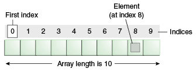
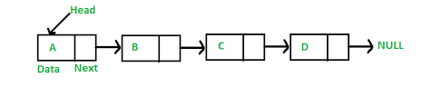
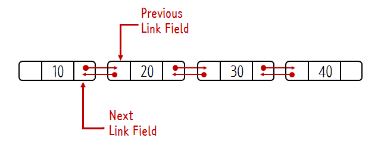
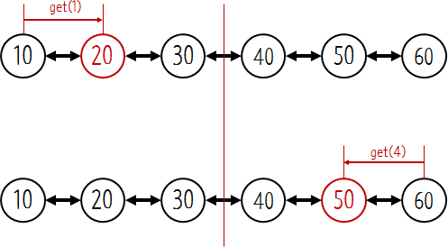
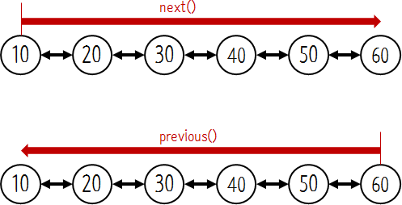
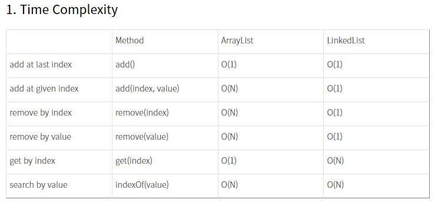

# Array & ArrayList & LinkedList

# Array



- **배열 기본 개념**
    
    
    
    자료형 : 빈 배열 생성 시 자료형에 따라 내용 초기화 
    
    **일정한 자료형**의 **변수들**을 **하나의 이름**으로 **열거**하여 사용하는 자료구조 (연속적으로 배치)
    
    ```java
    int arr[] = {1,2,3,4,5,6,7};
    int n = arr.length; // 7 (java)
    ```
    
    - **요소**(element) : 생성된 배열의 각 저장 공간
    - **인덱스**(index) : 배열의 요소마다 붙여진 일련번호 (각 요소를 구별하는데 사용)
    - 인덱스의 범위 : **0 ~ '배열길이 - 1'**
    - 배열은 크기를 지정하여 생성해야 하며, **크기 변경 불가능** (길이가 0인 배열 생성 가능)
    - '배열이름.length' : 배열의 길이 (Java에서는 JVM이 모든 배열의 길이를 별도로 관리한다)
    - 참조형 배열의 경우 배열에는 **객체의 주소**가 저장됨
    
    **배열의 초기화** 
    
    - 생성과 동시에 자동적으로 자신의 타입에 해당하는 값으로 초기화됨
    - 배열의 요소에 원하는 값을 지정하려면 각 요소마다 값을 지정해야 함(규칙적인 값일 경우 for문 사용이 효율적)
    
    ```java
    int[] score = {50, 60, 70, 80 ,90};  // new int[] 생략 가능
    
    int[] score;
    score = new int[] {50, 60, 70, 80 ,90}; // 배열의 선언과 생성을 따로 하는 경우 생략 불가능
    
    int add(int[] arr) {/*내용생략*/} // add() 메소드 사용하여 선언 시 'new 타입[]' 생략 불가능
    int result = add(new int[] {100, 90, 80, 70, 60});
    ```
    
    **배열의 출력**
    
    ```java
    // for문
    int[] arr = {100, 90, 80, 70, 60};
    for(int i = 0; i< arr.length; i++){
    		System.out.println(arr[i]);
    }
    
    //Arrays.toString(배열이름) 메소드 사용
    int[] arr = {100, 90, 80, 70, 60};
    System.out.println(Arrays.toString(arr));
    ```
    
    - 배열을 바로 출력할 경우 '타입@주소'가 출력된다
    - char 배열을 println메소드로 출력할 경우 각 요소가 구분자 없이 출력된다
    
    **배열의 복사**
    
    - 배열 생성 시 추후 길이 변경 불가능
    - 추가 공간 필요시 보다 큰 배열 생성 후 이전 배열 복사
    - 복사하려는 배열의 위치가 복사하려는 내용보다 여유 공간이 적을 경우 **ArrayIndexOutOfBoundsException** 에러 발생
    - 배열 복사 방법
        
        ```java
        // for문
        int[] arr = new int[5];
        int[] tmp = new int[arr.length * 2];  // 기존 배열보다 길이가 2배인 배열 생성
        for(int i = 0; i < arr.length; i){
        		tmp[i] = arr[i]; // arr[i]의 값을 tmp[i]에 저장
        }
        arr = tmp; // 참조변수 arr이 새로운 배열(tmp)을 가리키게 함(기존 arr가 가리키던 배열은 더이상 사용 X)
        
        // System.arraycopy()
        System.arraycopy(num, 0, newNum, 0, num.length);
        
        // num[0]에서 newNum[0]으로 num.length개의 데이터를 복사
        // for문 보다 효율적
        ```
        
- **다차원 배열**
    
    2차원 이상(다차원, multi-dimensional)의 배열 
    
    **2차원 배열의 선언과 인덱스**
    
    - 테이블 형태의 데이터를 담는데 주로 사용
    - index 범위 : '행index' = '0 &#126; 행의길이-1' / '열index' = '0 &#126; 열의길이-1' ('배열이름[행index][열index]')
    
    ```java
     int[][] score = new int[4][3];
    // 4행(row) 3열(column)의 데이터를 담기 위한 배열
    ```
    
    **2차원 배열의 초기화**
    
    ```java
    int[] arr = new int[][] {{1, 2, 3}, {4, 5, 6}};
    int[] arr = {{1, 2, 3}, {4, 5, 6}};
    
    int[] arr = {{1, 2, 3}, {4, 5, 6}};
    
    // 이중 for문을 통해 초기화 (2차원 배열 arr의 모든 요소 10으로 초기화)
    for(int i = 0; i < arr.length; i++) {
    	for(int j = 0; j < arr[i].length; j++) {
        	arr[i][j] = 10;
        }
    }
    ```
    
    **가변 배열**
    
    - Java에서는 2차원 이상의 배열을 '**배열의 배열**' 형태로 처리하기 때문에 보다 자유로운 형태의 배열 구성이 가능
    - 전체 배열 차수 중 마지막 차수의 길이를 지정하지 않고 추후에 각기 다른 길이의 배열 생성 가능(유동적 형태)
    
    ```java
    int[][] score = new int[5][3];
    // ==
    int[][] score = new int[5][];
    score[0] = new int[3];
    score[1] = new int[3];
    score[2] = new int[3];
    score[3] = new int[3];
    score[4] = new int[3];
    
    // 가변 배열int[][] score = new int[5][];
    score[0] = new int[4];
    score[1] = new int[3];
    score[2] = new int[2];
    score[3] = new int[2];
    score[4] = new int[3];
    ```
    

# ArrayList


- **List (Collection Framework (Interface))**
    - 순서가 있는 데이터의 집합 (데이터 중복 허용, 저장 순서 유지)
    - 객체를 인덱스로 관리, 객체 삽입 시 인덱스가 자동으로 부여됨
    - 인덱스로 객체에서 검색, 삭제 가능
    - 객체를 직접 저장하고 있지 않고 객체의 주소를 가짐 (null 저장 가능 : 아무것도 참조하지 않은 상태)
    - 구현체 : ArrayList, LinkedList, Vector
- **ArrayList 기본 개념**
    
    배열을 이용해서 List를 구현한 것 
    
    - 배열을 이용하기 때문에 인덱스를 사용한 접근이 빠름
    - 데이터 추가/삭제 느림 (데이터를 리스트의 처음이나 중간에 저장할 경우 이후의 데이터들이 한칸씩 뒤로 밀려야 함, 삭제의 경우 앞으로)
    - 가장 많이 사용하는 List 구현체
    
    ```java
    import java.util.ArrayList;
    import java.util.Iterator;
     
    public class Main {
     
        public static void main(String[] args) {
     
            ArrayList<Integer> numbers = new ArrayList<>();
     
    				// 추가
            numbers.add(10);
            numbers.add(20);
            numbers.add(30);
            numbers.add(40);
            System.out.println("add(값)");
            System.out.println(numbers);
     
            numbers.add(1, 50);
            System.out.println("\nadd(인덱스, 값)");
            System.out.println(numbers);
     
    				// 삭제
            numbers.remove(2);
            System.out.println("\nremove(인덱스)");
            System.out.println(numbers);
     
            System.out.println("\nget(인덱스)");
            System.out.println(numbers.get(2));
     
            System.out.println("\nsize()");
            System.out.println(numbers.size());
     
            System.out.println("\nindexOf()");
            System.out.println(numbers.indexOf(30));
     
    		// 반복 
    		// 1. Iterator - 객체지향 프로그래밍에서 주로 사용
            Iterator it = numbers.iterator();  // Iterator 객체 생성
    		// iterator : numbers의 객체 내부에 저장된 값을 하나씩 순회하면서 탐색하도록 함       
    				
    		while (it.hasNext()) {  
                int value = (int) it.next();
    						// 순회 과정에서 필요에 따라 요소 추가/삭제
                if (value == 30) {
                    it.remove();
                }
                System.out.println(value);
            }
            System.out.println(numbers);
     
    		// 2. for each
            for (int value : numbers) {
                System.out.println(value);
            }
    
    		// 3. for
            for (int i = 0; i < numbers.size(); i++) {
                System.out.println(numbers.get(i));
            }
     
        }
     
    }
    ```
    

# LinkedList



- **LinkedList 기본 개념**
    
    불연속적으로 존재하는 데이터를 서로 연결한 형태로 구성 (포인터를 사용해 연결)
    
    - 요소(node) : **데이터 필드** 노드 + **다음 노드에 대한 참조** 노드 로 구성
    - 배열의 단점(크기 변경 불가 / 비순차적 데이터의 추가&삭제에 많은 시간 소요됨)을 보완하기 위해 고안된 자료구조 → **동적크기, 삽입/삭제 용이**
    - 단점 : 불연속적으로 위치한 요소들이 서로 연결된 것이라 n번째 데이터까지 차례대로 따라가야 함(임의 액세스 허용 X), 저장해야하는 데이터의 개수가 많아질수록 접근시간(access time)이 길어짐
    
    - 데이터 추가 :
        
        1. 새로운 요소 생성
        
        2. 추가하고자 하는 위치의 이전 요소의 참조를 새로운 요소에 대한 참조로 변경
        
        3. 새로운 요소가 그 다음 요소를 참조하도록 변경
        
    - 데이터 삭제 : 삭제하고자 하는 요소(B)의 이전요소(A)가 삭제하고자 하는 요소(B)의 다음요소(C)를 참조하도록 변경 (A -> C 참조)
    
- **LinkedList 구현**
    - 노드 3개를 잇는 LinkedList
    
    ```java
    public class LinkedList {
       
    		// 첫번째 노드를 가리키는 필드
        private Node head;  
        private Node tail;  
        private int size = 0;
    
        private class Node{
            
            private Object data; // 데이터가 저장될 필드
            private Node next; // 다음 노드를 가리키는 필드
    
            public Node(Object input) {
                this.data = input;
                this.next = null;
            }
        }
    }
    ```
    
    - 노드 추가
    
    ```java
    // 앞쪽에 노드 추가
    public void addFirst(Object input){
       
        Node newNode = new Node(input);   // 노드를 생성합니다.
        newNode.next = head;  // 새로운 노드의 다음 노드로 해드를 지정합니다.
        head = newNode;   // 헤드로 새로운 노드를 지정합니다.
    
        size++;
    
        if(head.next == null){
            tail = head;
        }
    }
    
    // 특정 노드 다음에 추가 
    public void add(int k, Object input){
       
        if(k == 0){   // 만약 k가 0이라면 첫번째 노드에 추가하는 것이기 때문에 addFirst를 사용합니다.
            addFirst(input);
        } else {
            Node temp1 = node(k-1);
            Node temp2 = temp1.next;   // k 번째 노드를 temp2로 지정합니다.
            Node newNode = new Node(input);   // 새로운 노드를 생성합니다.
    
            temp1.next = newNode;  // temp1의 다음 노드로 새로운 노드를 지정합니다.
            newNode.next = temp2;  // 새로운 노드의 다음 노드로 temp2를 지정합니다.
            size++;
    
            // 새로운 노드의 다음 노드가 없다면 새로운 노드가 마지막 노드이기 때문에 tail로 지정합니다.
            if(newNode.next == null){
                tail = newNode;
            }
        }
    }
    
    // 끝쪽에 노드 추가
    public void addLast(Object input){
        
        Node newNode = new Node(input);  // 노드를 생성합니다.
    
        if(size == 0){  // 리스트의 노드가 없다면 첫번째 노드를 추가하는 메소드를 사용합니다.
            addFirst(input);
        } else {
            tail.next = newNode;   // 마지막 노드의 다음 노드로 생성한 노드를 지정합니다.
            tail = newNode;   // 마지막 노드를 갱신합니다.
            size++;  // 엘리먼트의 개수를 1 증가 시킵니다.
        } 
    }
    ```
    

- **Doubly linked list (이중 연결 리스트)**
    
    
    
    노드가 앞/뒤로 연결되어 있는 LinkedList
    
    - 장점
        - 이진탐색 가능
        
        
        
        - 상황에 따라 탐색의 바뀌어야 하는 경우
        
        
        
    - 단점
        - LinkedList 보다 변수를 하나 더 사용해야 함 (메모리 많이 사용)
        - 구현 복잡
        - 탐색하다가 되돌아오기는 불가능(방향을 정하면 쭉 탐색해야 함)
        
- **Doubly linked list 구현**
    
    ```java
    public class DoublyLinkedList {
        // 첫번째 노드를 가리키는 필드
        private Node head;
        private Node tail;
        private int size = 0;
     
        private class Node {
            // 데이터가 저장될 필드
            private Object data;
            // 다음 노드를 가리키는 필드
            private Node next;
    				// 이전 노드를 가리키는 필드
            private Node prev;
     
            public Node(Object input) {
                this.data = input;
                this.next = null;
                this.prev = null;
            }
     
            // 노드의 내용을 쉽게 출력해서 확인해볼 수 있는 기능
            public String toString() {
                return String.valueOf(this.data);
            }
        }
     
    		// 첫번째 인덱스에 추가
        public void addFirst(Object input) {
            // 노드를 생성합니다.
            Node newNode = new Node(input);
            // 새로운 노드의 다음 노드로 헤드를 지정합니다.
            newNode.next = head;
            // 기존에 노드가 있었다면 현재 헤드의 이전 노드로 새로운 노드를 지정합니다.
            if (head != null)
                head.prev = newNode;
            // 헤드로 새로운 노드를 지정합니다.
            head = newNode;
            size++;
            if (head.next == null) {
                tail = head;
            }
        }
     
        Node node(int index) {
            // 노드의 인덱스가 전체 노드 수의 반보다 큰지 작은지 계산
            if (index < size / 2) {
                // head부터 next를 이용해서 인덱스에 해당하는 노드를 찾습니다.
                Node x = head;
                for (int i = 0; i < index; i++)
                    x = x.next;
                return x;
            } else {
                // tail부터 prev를 이용해서 인덱스에 해당하는 노드를 찾습니다.
                Node x = tail;
                for (int i = size - 1; i > index; i--)
                    x = x.prev;
                return x;
            }
        }
     
    		// 중간에 요소 추가
        public void add(int k, Object input) {
            // 만약 k가 0이라면 첫번째 노드에 추가하는 것이기 때문에 addFirst를 사용합니다.
            if (k == 0) {
                addFirst(input);
            } else {
    
    			// k-1번째 노드를 temp1로 지정합니다.
                Node temp1 = node(k - 1);
                // k 번째 노드를 temp2로 지정합니다.
                Node temp2 = temp1.next;
    
                // 새로운 노드를 생성합니다.
                Node newNode = new Node(input);
                // temp1의 다음 노드로 새로운 노드를 지정합니다.
                temp1.next = newNode;
                // 새로운 노드의 다음 노드로 temp2를 지정합니다.
                newNode.next = temp2;
    
                // temp2의 이전 노드로 새로운 노드를 지정합니다.
                if (temp2 != null)
                    temp2.prev = newNode;
    
                // 새로운 노드의 이전 노드로 temp1을 지정합니다.
                newNode.prev = temp1;
                size++;
    
                // 새로운 노드의 다음 노드가 없다면 새로운 노드가 마지막 노드이기 때문에 tail로 지정합니다.
                if (newNode.next == null) {
                    tail = newNode;
                }
            }
        }
     
    	// 첫번째 노드 삭제
        public Object removeFirst() {
            // 첫번째 노드를 temp로 지정하고 head의 값을 두번째 노드로 변경합니다.
            Node temp = head;
            head = temp.next;
            // 데이터를 삭제하기 전에 리턴할 값을 임시 변수에 담습니다.
            Object returnData = temp.data;
            temp = null;
            // 리스트 내에 노드가 있다면 head의 이전 노드를 null로 지정합니다.
            if (head != null)
                head.prev = null;
            size--;
            return returnData;
        }
     
    	// 검색
        public int indexOf(Object data) {
            // 탐색 대상이 되는 노드를 temp로 지정합니다.
            Node temp = head;
            // 탐색 대상이 몇번째 엘리먼트에 있는지를 의미하는 변수로 index를 사용합니다.
            int index = 0;
            // 탐색 값과 탐색 대상의 값을 비교합니다.
            while (temp.data != data) {
                temp = temp.next;
                index++;
                // temp의 값이 null이라는 것은 더 이상 탐색 대상이 없다는 것을 의미합니다.이 때 -1을 리턴합니다.
                if (temp == null)
                    return -1;
            }
            // 탐색 대상을 찾았다면 대상의 인덱스 값을 리턴합니다.
            return index;
        }
     
    ```
    

# Array vs ArrayList vs LinkedList

|  | 조회 | 추가/삭제 | 유동적 |
| --- | --- | --- | --- |
| Array | 빠름(인덱스) | 느림 | X |
| ArrayList | 빠름(인덱스) | 느림 | O |
| LinkedList | 느림(순차검색) | 빠름 | O |



- **Array vs ArrayList vs LinkedList**
    - 배열
        - 선언 시 크기와 데이터 타입을 지정해야 함
        - 인덱스 사용으로 검색이 빠름
        - 데이터 추가/삭제 시 오래걸림 (새로운 크기의 배열을 선언)
    - ArrayList
        - 크기 선언 필요 X
        - 중간에 데이터 추가/삭제 시 오래걸림 (배열 기반)
        - 인덱스 사용으로 검색이 빠름
    - LinkedList
        - 크기 선언 필요 X
        - 각 노드를 주소값 참조를 통해 연결하기 때문에 데이터 추가/삭제에 유용
        - 순차 검색에는 비효율적
    
- **참고 링크**
    
    [**https://opentutorials.org/module/1335**](https://opentutorials.org/module/1335)
    
