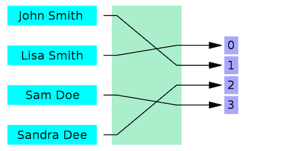
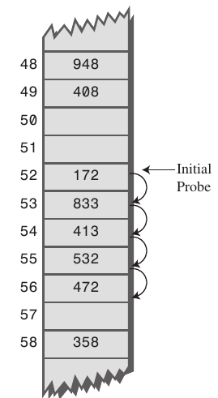
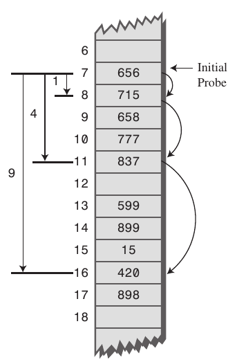
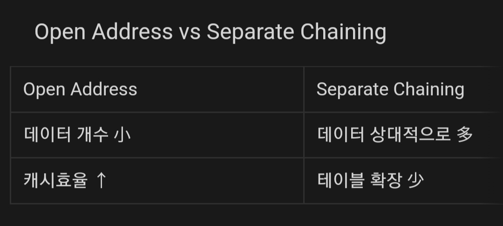

# Hash

해시 함수 : 임의의 길이의 데이터를 고정된 길이의 데이터로 매핑하는 함수

해시 함수를 수행하기 전의 원래 데이터를  키 ( key)

수행한 결과 값을 해시 값(hash value)

키 → 해시 값으로 매핑하는 전체 과정 : 해싱 (Hashing)

각각의 키에 모두 다른 해시값

해시값이 중복 → 해시 충돌(Collision)

Hash Function의 특징

- 키에 상관없이 항상 고정된 길이의 해시값
- 눈사태 효과
    
    입력  값이 아주 조금만 변경되어도 해시값은 전혀 다른 값 반환
    
- 해시값으로 키 유추할 수 X (key는 String)
- 같은 키에 대해 항상 같은 해시값
- 키에 대해 해시값이 항상 1:1인 경우도 메모리 너무 많이 차지, 마냥 좋지 않음 ⇒ 해시 충돌 최소화, 충돌에 대비 대응책 만들기

Hash Algorithm

MD(Message-Direct) Algorithm / SHA(Secure Hash) Algorithm

MD5

- 임의의 길이 입력 → 128비트 해시값 출력
- 단방향 암호화, 출력값에서 입력값 복원  X
- 패스워드 암호화
- 보안관련 용도 권장 X

SHA

- 암호학적 해시 함수들의 모음
- 미국 국가안보국이 설계

Hash Table (해시 테이블)

해시함수를 사용해서 키를 해시값으로 매핑하고, 해시값을 index 또는 주소로 삼아 데이터의 값을 저장하는 자료구조

데이터가 저장되는 곳 = 버킷(bucket) 또는 슬롯(slot)

해시 테이블의 장점

- 적은 리소스로 많은 데이터 효율적 관리 가능
- 빠른 검색 속도
- 데이터 접근(삽입, 삭제, 탐색) 시 Big-O(1)의 시간복잡도

해시 충돌을 해결하기 위한 방법

1. Open Address 방식 (개방주소, 공개주소 방식)

해시 충돌 발생시, 다른 해시 버킷에 해당 자료를 삽입

-Linear Probing (선형 조사)

최초 해시값에 해당하는 버킷에 다른 데이터가 저장되어 있으면 해당 해시값에서 고정 폭만큼 옮겨가면서 다음 해시값에 해당하는 버킷에 데이터가 있는지 확인. 데이터가 없는 버킷을 찾으면 해당 버킷에 저장.

이동 폭이 지정되어 있어서 주변 버킷이 모두 채워져있는  Primary Clusting 문제에 취약.

-Quadratic Probing (제곱 조사)

이동 폭이 제곱수로 늘어남. 여러 개의 다른 키들이 모두 동일한 초기 해시값을 갖고 있는 Secondary Clustering에 취약함.

초기 해시값이 같으면 다음 탐사 위치 또한 동일하기 때문에 효율성이 떨어짐

-Double Hashing (이중 해싱)

2개의 해시함수를 준비해서 하나는 최초의 해시값을 얻을 때, 또 하나는 해시 충돌이 일어났을 때 이동폭을 얻기 위해 사용함.

규칙성을 없애서 clustering(군집화,  저장되는 데이터가 한 곳에 몰리는 문제)를 방지

최초 해시값이 같은 경우가 많더라도 이동폭이 달라지고, 이동폭이 같더라도 최초 해시값이 달라져 Primary Clusting, Secondaray Clustering 모두 완화할 수 있음

1. Separate Chaining 방식 (분리 연결법)

Open Addressing 방식은 Seperate Chaining 방식보다 느림

보조 해시 함수를 통해 Worst Case의 빈도 줄일 수 있음.

 -연결 리스트 (Linked List) 사용

각각의 버킷 연결리스트로 만들어서 충돌 발생하면 리스트에 추가

삭제, 삽입 쉬움

연결리스트 자체의 오버헤드 부담

Open Address 방식에 비해 테이블의 확장을 늦출 수 있음

 -Tree 사용 (Red-Black Tree)

연결 리스트 대신 트리 사용

Key-Value 쌍의 개수로 판단

데이터 개수가 적으면 연결리스트 사용이 유리

