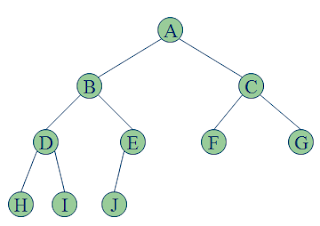
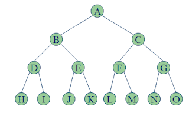
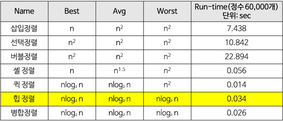
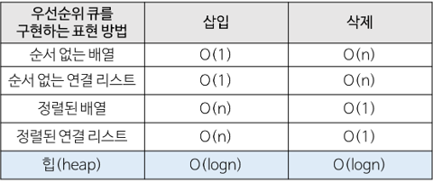
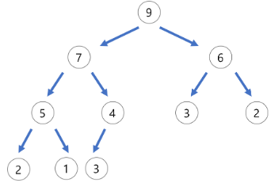
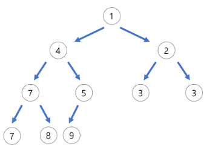
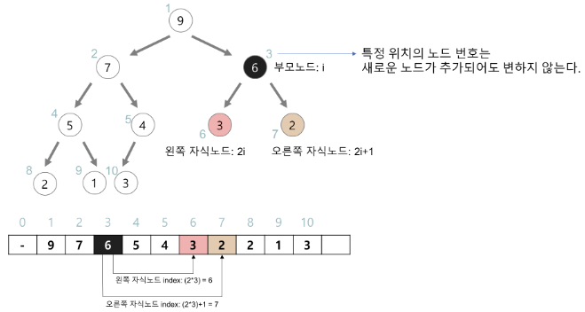
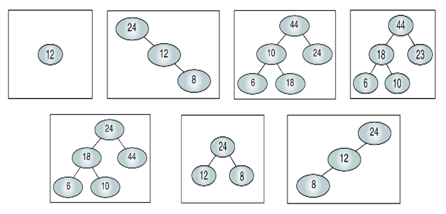
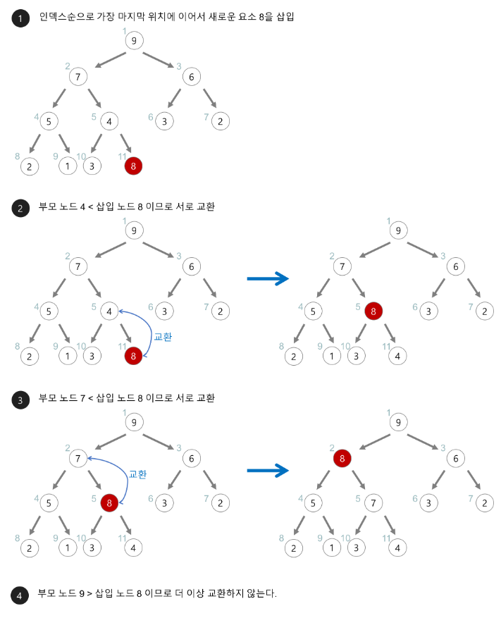
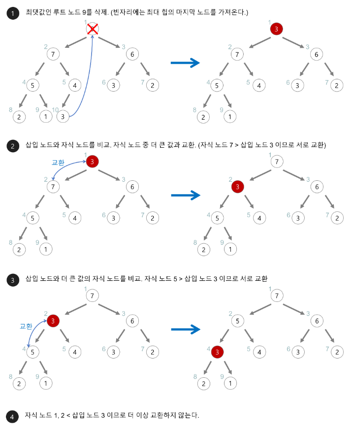

# **힙(Heap)**  

## 📒 **개념**  

- **완전 이진 트리**의 일종으로 우선순위 큐를 위하여 만들어진 구조

- 💡 **Complete Binary Tree와 Perfect Binary Tree**

    - **Complete Binary Tree**

        - 마지막 level을 제외한 나머지 노드가 꽉 차 있어야 함

        - 마지막 레벨의 노드는 모두 왼쪽으로 몰려 있어야 함

            <div markdown="1">
                
            </div>
        
    - **Perfect Binary Tree**

        - 모든 레벨에서 노드가 꽉 차있는 트리

            <div markdown="1">
                
            </div>
        
- 여러 개의 값들 중에서 최댓값이나 최솟값을 빠르게 찾아내도록 만들어진 자료구조

- 일종의 **반정렬 상태(느슨한 정렬 상태)**를 유지한다.

    - 큰 값이 상위 레벨에 있고 작은 값이 하위 레벨에 있다는 정도

    - 부모 노드의 키 값이 자식 노드의 키 값보다 항상 큰(작은) 이진 트리

    - 형제 사이에는 대소관계가 정해지지 않음

- **중복된 값**을 **허용**한다.

- 큐 : 배열, 연결리스트, 힙으로 구현 가능.  

### ⏰ **시간복잡도**

- 힙 정렬은 시간 복잡도가 좋은 편이다.

- 힙 정렬이 가장 유용한 경우는 전체 자료를 정렬하는 것이 아니라 가장 큰 값 몇개만 필요할 때이다.

- **시간 복잡도 계산**
    - 힙 트리의 전체 높이가 거의 log₂n(완전 이진 트리)이므로 하나의 요소를 힙에 삽입하거나 삭제할 때 힙을 재정비하는 시간이 log₂n만큼 소요된다.

    - 요소의 개수가 n개이므로 전체적으로 O(nlog₂n)의 시간이 걸린다.

    - **T(n) = O(nlog₂n)**

        <div markdown="1">
            
        </div>

        <div markdown="1">
            
        </div>

---

## 🗒️ **종류**

- **최대 힙(max heap)**

    - 부모 노드의 키 값이 자식 노드의 키 값보다 크거나 같은 완전 이진 트리

    - key(부모 노드) ≥ key(자식 노드)

        <div markdown="1">
            
        </div>
    
- **최소 힙(min heap)**

    - 부모 노드의 키 값이 자식 노드의 키 값보다 작거나 같은 완전 이진 트리

    - key(부모 노드) ≤ key(자식 노드)

        <div markdown="1">
            
        </div>
    
---

## 🖥️ **구현**

- 힙을 저장하는 표준적인 자료구조는 배열이다.

- 구현을 쉽게 하기 위하여 배열의 첫 번째 인덱스인 0은 사용되지 않는다.

- 특정 위치의 노드 번호는 새로운 노드가 추가되어도 변하지 않는다.

    - 예를 들어 루트 노드의 오른쪽 노드의 번호는 항상 3이다.

- 힙에서의 부모 노드와 자식 노드의 관계

    - 노드 i의 **부모노드** 인덱스 = ⌊(i / 2)⌋

    - 노드 i의 **왼쪽 자식** 인덱스 = i * 2

    - 노드 i의 **오른쪽 자식** 인덱스 = i * 2 + 1

        <div markdown="1">
            
        </div>

- 힙정렬의 조금 더 복잡한 예시를 보고 싶을 때
    
    → [https://zeddios.tistory.com/56](https://zeddios.tistory.com/56)
    

### 💯 **Quiz**

- 다음 예시들 중 Heap은 무엇일까요?

    (Heap이라면 level을, Heap이 아니라면 그 이유를 함께 말씀해주세요!)

    <div markdown="1">
        
    </div>

    <details>
    <summary>Answer</summary>
    <div markdown="1">

        1. O : Root-only heap
        2. X : Not nearly complete
        3. X : Subtree 10 not a heap
        4. O : Three-level heap
        5. X : Root not largest
        6. O : Two-level heap
        7. X : Not nearly complete

    </div>
    </details>

---

## 📝 **삽입**

1. 힙에 새로운 요소가 들어오면, 일단 새로운 노드를 힙의 마지막 노드에 이어서 삽입한다.

2. 새로운 노드를 아래 부모 노드들과 교환해서 힙의 성질을 만족시킨다.

    <div markdown="1">
        
    </div>

- **코드**
    
    ```java
    class MinHeap {
        private ArrayList<Integer> heap;
    
        /*heap init*/
        public MinHeap(){
            heap = new ArrayList<>();
            heap.add(0); // heap 의 인덱스는 알기 쉽게 0부터 시작한다는 특성을 따른다.
        }
    
        // insertion
        private void insert(int data) {
            heap.add(data);
            int position = heap.size() - 1;
            // 루트 노드까지 이동했거나, 부모 Heap이 자식 Heap보다 작을 때 까지
            while(position > 1 && heap.get(position / 2) < heap.get(position)) {
    
                /*부모 노드와 자식 노드간의 swap을 위한 연산*/
                int temp = heap.get(position / 2);
                heap.set(position / 2, heap.get(position));
                heap.set(position, temp);
    
                position /= 2;
            }
        }
    }
    ```
    
---

## 🖊️ **삭제**

1. 최대 힙에서 최댓값은 루트(최고 우선순위) 노드이므로 루트 노드가 삭제된다.

    - 최대 힙에서 삭제 연산은 최댓값을 가진 요소를 삭제하는 것이다.

2. 삭제된 루트 노드에는 힙의 마지막 노드를 가져온다.

3. 힙을 재구성한다.

    - 자식 노드 중 더 큰 값(최대 힙) 혹은 더 작은 값(최소 힙)과 교환한다.

    <div markdown="1">
        
    </div>

- **코드**
    
    ```java
    int delete() {
            // heap 사이즈가 1보다 작으면 즉, 힙에 값이 없으면 return 0;
            if(heap.size() - 1 < 1) {
                return 0;
            }
    
            int deleteData = heap.get(1); // 루드 노드 삭제
    
            heap.set(1, heap.get(heap.size() - 1)); // 루트 노드의 자리에 말단 노드의 data를 설정
            heap.remove(heap.size() - 1); // 말단 노드 삭제
    
            int position = 1;
            while((position * 2) < heap.size()) { // 힙의 크기보다 작을 떄 까지
                int min = heap.get(position * 2); // 현재 노드의 왼쪽 자식 노드의 값
                int minPos = position * 2; // 현재 노드의 왼쪽 자식 노드의 인덱스
    
                // 오른쪽 자식 노드와 왼쪽 자식 노드 중 더 큰 노드에 값과 비교하고 교환하기 때문에 왼쪽 자식노드와 오른쪽 자식 노드의 값을 비교하는 과정을 거친다.
                if(((position * 2 + 1) < heap.size()) && min > heap.get(position * 2 + 1)){  // 오른쪽 자식 노드가 더 크면 바꿔줘야한다.
                    min = heap.get(position * 2 + 1); // 오른쪽 자식 노드로 변경
                    minPos = position * 2 + 1; // 위치 또한 오른쪽 자식 노드로 변경
                }
    
                if(heap.get(position) < min) break; // 현재 노드보다 자식 노드의 값이 더 크면, 힙의 성질을 만족하면 반복 종료
    
                /*자식과 부모의 SWAP 과정*/
                int temp = heap.get(position);
                heap.set(position, heap.get(minPos));
                heap.set(minPos, temp);
                position = minPos;
            }
            return deleteData;
        }
    ```
    