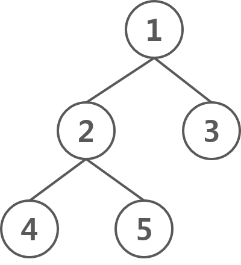

# 트리 & 이진 탐색 트리

생성일: 2022년 8월 15일 오후 4:35
속성: Done

## 트리 (Tree)

### 비-선형 자료 구조 (Non-Linear)

- 선형 자료 구조란, 구조에 저장될 데이터들이 순차적으로 저장되는 형태를 의미한다. 우리가 기존에 공부했던 **ArrayList, LinkedList, Map, Stack, Queue** 등이 선형 자료 구조이다.
- 반대로 이번에 설명할 트리 구조는 비-선형 자료 구조이다. 이러한 구조는 단일 방향으로 각각의 데이터들이 연결되거나 나열된 것이 아니라 복수의 데이터들이 복수의 데이터들과 연결될 수 있는 구조로 설계 될 수 있다.

### 선형 구조와 비-선형 구조의 차이




| Point | 선형 구조 | 비-선형 구조 |
| --- | --- | --- |
| 데이터 저장 | 순차적으로 각 데이터를 순회할 수 있도록 저장 | 데이터들이 계층적으로 연결되어 저장 |
| 수준(Level) | 단일 수준(Level)에서 모든 데이터를 저장 | 복수 수준(Level)에서 데이터를 저장 |
| 구현 복잡도 | 구현이 쉬움 | 구현이 어렵고 이해도 난해 |
| 순회 | 단일 동작으로 모든 데이터 순차적 순회 가능 | 데이터 순회에 복수의 동작 필요 |
| 메모리 활용 | 메모리 공간 활용 효율성 낮음 | 메모리 공간을 매우 효율적으로 활용 |
| 시간 복잡도 | 저장 공간이 늘어나면 비례하여 증가 | 저장 공간이 늘어나면 비례하는 수준보다 적게 증가 |

### 그래프와 트리의 차이

](./img/Tree&Binary_search_tree_2.png)

| 구분 | 트리(Tree) | 그래프(Graph) |
| --- | --- | --- |
| 정의 | 그래프의 한 종류, 방향성이 없으며 순환하지 않음 | 객체 혹은 노드(Node)와 그것을 연결하는 간선(Edge)으로 모인 구조 |
| 방향성 | 무방향 그래프 | 무방향 혹은 유방향으로 가능 |
| 순환성 | 순환 불가능, 자기 자신 연결 간선(Self-Loop) 불가능, 비순환 그래프(Acyclic Graph) | 순환 가능, 자기 자신을 연결하는 간선(Self-Loop) 가능, 순환(Cyclic), 비순환(Acyclic) 그래프 모두 가능 |
| 루트 | 하나의 루트 노드 존재 | 루트의 개념이 있거나 없을 수 있음 |
| 모델 | 계층 모델 | 네트워크 모델 |
| 순회 | 전위(Pre) / 중위(In) / 후위(Post) 순회 방식 | 넓이 우선 탐색(BFS), 깊이 우선 탐색(DFS) |
| 간선 수 | N개의 노드(Node)라면 N-1개 | 그래프에 따라 다르며 없을 수도 있음 |

### 트리의 구조

](./img/Tree&Binary_search_tree_3.png)

| 이름 | 설명 | 위 그림 기반 예시 |
| --- | --- | --- |
| Root | Tree 구조의 최상단 Node | Node1 |
| Edge | Node와 Node의 연결 | 화살표 |
| Parent | Leaf Node 제외한 모든 NodeEdge로 연결된 Node를 하위에 보유한 모든 Node | Node1 ~ 3 |
| Child | Root Node를 제외한 모든 Node즉, Parent를 갖는 Node | Node2 ~ 7 |
| Leaf | Tree의 구조에서 Child를 갖지 않는 모든 최하단 Node | Node4 ~ 7 |
| Height | 전체 Tree 구조에서 가장 긴 경로 | Root - Leaf 모든 경로가 2의 거리(경로) |
| Depth | 특정 Node에서 Root Node 까지의 경로(깊이) | Node3은 Root 까지 1의 Depth |
| Sub Tree | Tree 구조 내에 있는 모든 부분적인 Tree들 | Node2와 그 아래는 전체 Tree의 Sub Tree |
| Sibling | 동일한 Parent / Level 갖는 관계인 Node | Node2, Node3은 Sibling |

### 다음은 트리일까?

](./img/Tree&Binary_search_tree_4.png)

[https://ratsgo.github.io/data structure&algorithm/2017/10/21/tree/](https://ratsgo.github.io/data%20structure&algorithm/2017/10/21/tree/)

### 이진 트리

이진 트리는 각 노드가 Child 노드를 최대 2개씩 보유한 형태를 의미하고 ,  노드는 left, right child 노드라고 부릅니다.

이진 트리는 트리 구조의 자료 형태 중에서도 가장 많이 쓰이는 트리입니다. 그 이유로는 이진 트리는 1차원 배열로 표현이 가능하기 때문입니다.

](./img/Tree&Binary_search_tree_5.png)

[https://ratsgo.github.io/data structure&algorithm/2017/10/21/tree/](https://ratsgo.github.io/data%20structure&algorithm/2017/10/21/tree/)

```
left_index = 2 * index + 1
right_index = 2 * index + 2
```

### 트리 순회

- 전위 순회(preorder)
    
    ](./img/Tree&Binary_search_tree_6.png)
    
    [https://hongjw1938.tistory.com/18](https://hongjw1938.tistory.com/18)
    
    ```java
    public void preOrder(Node node){
            if(node != null){
                System.out.print(node.value + ", ");
                preOrder(node.left);
                preOrder(node.right);
            }
        }
    ```
    
- 중위 순회(inorder)
    
    ](./img/Tree&Binary_search_tree_7.png)
    
    [https://hongjw1938.tistory.com/18](https://hongjw1938.tistory.com/18)
    
    ```java
    public void inorder(Node node){
            if(node != null){
                inorder(node.left);
                System.out.print(node.value + ", ");
                inorder(node.right);
            }
        }
    ```
    
- 후위 순회(postorder)
    
    ](./img/Tree&Binary_search_tree_8.png)
    
    [https://hongjw1938.tistory.com/18](https://hongjw1938.tistory.com/18)
    
    ```java
    public void postOrder(Node node){
            if(node != null){
                postOrder(node.left);
                postOrder(node.right);
                System.out.print(node.value + ", ");
            }
        }
    ```
    
    참고로 이 **후위 순회가 제일 중요**하다. 왜냐면, Leaf에서 Root로 올라갈수록 작은 문제들의 결과를 통해 큰 문제를 해결하는 방향이라고 한다면 자식 노드들의 결과를 통해 현재 노드의 결과를 구하는 방식이 필요할 수 있기 때문이다.
    
    그래서, Dynamic Programming이나 Segment Tree를 통해 문제를 해결할 때 등 모두 이 후위 순회를 사용한다
    
- 레벨 순회(levelorder)
    
    ](./img/Tree&Binary_search_tree_9.png)
    
    [https://hongjw1938.tistory.com/18](https://hongjw1938.tistory.com/18)
    
    ```java
    public void levelOrder(Node root){
            Queue<Node<T>> q = new LinkedList<>();
            q.add(root);
    
            while(!q.isEmpty()){
                Node temp = q.peek();
                System.out.print(temp.value + ", ");
                if(temp.left != null){
                    q.add(temp.left);
                }
                if(temp.right != null) {
                    q.add(temp.right);
                }
                q.poll();
            }
    
        }
    ```
    

### 이진 트리 코드 예제 코드

- 코드 보기
    
    ```java
    import java.util.LinkedList;
    import java.util.Queue;
    
    public class BinaryTree {
    
        Node head;
        int size;
    
        public BinaryTree() {
            head = null;
            size = 0;
        }
    		// 노드를 트리에 추가하는 함수
        public void push(Node nd) {
            if (size == 0) {
                Node node = nd;
                head = node;
            }
            else {
                Node node = head;
    
                Queue<Node> q = new LinkedList<Node>();
                q.add(node);
    
                while (!q.isEmpty()) {
                    Node temp = q.poll();
    
                    if (temp.left == null) {
                        temp.left = nd;
                        break;
                    }
                    else {
                        q.add(temp.left);
                    }
    
                    if (temp.right == null) {
                        temp.right = nd;
                        break;
                    }
                    else {
                        q.add(temp.right);
                    }
                }
            }
            size++;
        }
    		// 노드를 트리에서 제거하는 함수
        public int pop(Node node) {
            if (contain(node)) {
                Node lastNode = removeLastNode();
    
                if(head != null){
                    if(isSame(head,node)){
                        head.value = lastNode.value;
                    }
                    else{
                        Queue<Node> q = new LinkedList<Node>();
                        q.add(head);
    
                        while(!q.isEmpty()){
                            Node temp = q.poll();
    
                            if(temp.left != null){
                                if(isSame(temp.left,node)){
                                    temp.left.value = lastNode.value;
                                    break;
                                }else{
                                    q.add(temp.left);
                                }
                            }
    
                            if(temp.right != null){
                                if(isSame(temp.right,node)){
                                    temp.right.value = lastNode.value;
                                    break;
                                }
                            }
                        }
                    }
                }
                size--;
                return 1;
            }
            return 0;
        }
    		// 노드가 트리에 있는지 확인하는 함수
        public boolean contain(Node node) {
            boolean check = false;
    
            if (size != 0) {
                Queue<Node> q = new LinkedList<Node>();
                q.add(head);
    
                while (!q.isEmpty()) {
                    Node temp = q.poll();
    
                    if (isSame(temp,node)) {
                        check = true;
                        break;
                    }
    
                    if (temp.left != null) {
                        q.add(temp.left);
                    }
    
                    if (temp.right != null) {
                        q.add(temp.right);
                    }
                }
            }
            return check;
        }
    		// 트리에서 마지막 노드를 제거하는 함수
        private Node removeLastNode() {
            Node last = head;
    
            if(size == 1){
                head = null;
            }
            else {
                Queue<Node> q = new LinkedList<Node>();
                q.add(last);
    
                while (!q.isEmpty()) {
                    Node temp = q.poll();
                    last = temp;
    
                    if (temp.left != null) {
                        q.add(temp.left);
                    }
    
                    if (temp.right != null) {
                        q.add(temp.right);
                    }
                }
    
                q.add(head);
    
                while(!q.isEmpty()){
                    Node temp = q.poll();
    
                    if(temp.left != null){
                        if(isSame(temp.left,last)){
                            temp.left = null;
                            break;
                        }else{
                            q.add(temp.left);
                        }
                    }
    
                    if(temp.right != null){
                        if(isSame(temp.right,last)){
                            temp.right = null;
                            break;
                        }else{
                            q.add(temp.right);
                        }
                    }
                }
            }
            return last;
        }
    		// 두 개의 노드가 같은 노드인지 확인하는 함수
        private boolean isSame(Node a, Node b) {
            if (a.value == b.value && a.left == b.left && a.right == b.right) {
                return true;
            }
            return false;
        }
    
        public void printBFS(Node node) {
    
            Queue<Node> queue = new LinkedList<Node>();
            queue.add(node);
    
            while (!queue.isEmpty()) {
                Node temp = queue.poll();
                System.out.println(temp.value);
    
                if (temp.left != null) {
                    queue.add(temp.left);
                }
    
                if (temp.right != null) {
                    queue.add(temp.right);
                }
            }
        }
    
        public void printDFS(Node node) {
    
            if(node.left == null && node.right == null){
                System.out.println(node.value);
            }else{
                if(node.left != null){
                    printDFS(node.left);
                }
                System.out.println(node.value);
                if(node.right != null){
                    printDFS(node.right);
                }
            }
        }
    }
    ```
    
    ```java
    public class Node {
        int value;
        Node left;
        Node right;
    
        public Node(int value) {
            this.value = value;
            left = null;
            right = null;
        }
    }
    ```
    

## 이진 탐색 트리

### 이진 탐색 트리**(Binary Search Tree)**란?

1. 각 노드에 중복되지 않는 키(key)가 있다.
2. 루트 노드의 왼쪽 서브 트리는 해당 노드의 키보다 작은 키를 갖는 노드들로 이루어져 있다.
3. 루트 노드의 오른쪽 서브 트리는 해당 노드의 키보다 큰 키를 갖는 노드들로 이루어져 있다.
4. 좌우 서브 트리도 모두 이진 탐색 트리여야 한다.

](./img/Tree&Binary_search_tree_10.png)

[https://code-lab1.tistory.com/10](https://code-lab1.tistory.com/10)

### 이진 탐색 트리의 특징

이진 탐색 트리는 기존 이진 탐색과 달리 동적으로 데이터 집합 크기와 순서가 바뀌어도 된다. 

이진 탐색 트리의 탐색 연산은 균형 이진 트리라면 logn, 불균형 트리라면 O(h)의 시간 복잡도를 가진다. (h는 높이)

### 이진 탐색 트리 탐색

1. 루트 노드의 키와 찾고자 하는 값을 비교한다. 찾고자 하는 값이라면 탐색을 종료한다.
2. 찾고자 하는 값이 루트 노드의 키보다 작다면 왼쪽 서브 트리로 탐색을 진행한다.
3. 찾고자 하는 값이 루트 노드의 키보다 크다면 오른쪽 서브 트리로 탐색을 진행한다.

](./img/Tree&Binary_search_tree_11.png)

[https://code-lab1.tistory.com/10](https://code-lab1.tistory.com/10)

### 이진 탐색 트리 예제 코드

- 코드 보기
    
    ```java
    /**
     * Binary Search Tree
     *
     * @author kimtaeng
     */
    class BinaryTree {
        Node rootNode = null;
    
        /**
         * 새로운 노드 삽입
         */
        public void insertNode(int element) {
    
            /*
             * 루트가 빈 경우, 즉 아무 노드도 없는 경우
             */
            if (rootNode == null) {
                rootNode = new Node(element);
            } else {
                Node head = rootNode;
                Node currentNode;
    
                while (true) {
                    currentNode = head;
    
                    /*
                     * 현재의 루트보다 작은 경우, 왼쪽으로 탐색을 한다.
                     */
                    if (head.value > element) {
                        head = head.leftChild;
    
                        /*
                         * 왼쪽 자식 노드가 비어있는 경우, 해당 위치에 추가할 노드를 삽입한다.
                         * 현재 currenNode head를 가리키고 있다.
                         */
                        if (head == null) {
                            currentNode.leftChild = new Node(element);
                            break;
                        }
                    } else {
                        /*
                         * 현재의 루트보다 큰 경우, 오른쪽으로 탐색을 한다.
                         */
                        head = head.rightChild;
    
                        /*
                         * 오른쪽 자식 노드가 비어있는 경우, 해당 위치에 추가할 노드를 삽입한다.
                         * 현재 currenNode head를 가리키고 있다.
                         */
                        if (head == null) {
                            currentNode.rightChild = new Node(element);
                            break;
                        }
                    }
                }
            }
        }
    
        /**
         * 특정 노드 삭제
         */
        public boolean removeNode(int element) {
            Node removeNode = rootNode;
            Node parentOfRemoveNode = null;
    
            while (removeNode.value != element) {
                parentOfRemoveNode = removeNode;
    
                /* 삭제할 값이 현재 노드보다 작으면 왼쪽을 탐색한다. */
                if (removeNode.value > element) {
                    removeNode = removeNode.leftChild;
                } else {
                    removeNode = removeNode.rightChild;
                }
    
                /*
                 * 값 대소를 비교하며 탐색했을 때
                 * 잎 노드(Leaf node)인 경우 삭제를 위한 탐색 실패
                 */
                if (removeNode == null)
                    return false;
    
            }
    
            /* 자식 노드가 모두 없을 때 */
            if (removeNode.leftChild == null && removeNode.rightChild == null) {
                /* 삭제 대상이 트리의 루트일 때 */
                if (removeNode == rootNode) {
                    rootNode = null;
                } else if (removeNode == parentOfRemoveNode.rightChild) {
                    parentOfRemoveNode.rightChild = null;
                } else {
                    parentOfRemoveNode.leftChild = null;
                }
            }
    
            /* 오른쪽 자식 노드만 존재하는 경우 */
            else if (removeNode.leftChild == null) {
                if (removeNode == rootNode) {
                    rootNode = removeNode.rightChild;
                } else if (removeNode == parentOfRemoveNode.rightChild) {
                    /*
                     * 삭제 대상의 오른쪽 자식 노드를 삭제 대상 위치에 둔다.
                     */
                    parentOfRemoveNode.rightChild = removeNode.rightChild;
                } else {
                    parentOfRemoveNode.leftChild = removeNode.rightChild;
                }
            }
    
            /* 왼쪽 자식 노드만 존재하는 경우 */
            else if (removeNode.rightChild == null) {
                if (removeNode == rootNode) {
                    rootNode = removeNode.leftChild;
                } else if (removeNode == parentOfRemoveNode.rightChild) {
                    parentOfRemoveNode.rightChild = removeNode.leftChild;
                } else {
                    /*
                     * 삭제 대상의 왼쪽 자식을 삭제 대상 위치에 둔다.
                     */
                    parentOfRemoveNode.leftChild = removeNode.leftChild;
                }
            }
    
            /*
             * 두 개의 자식 노드가 존재하는 경우
             * 삭제할 노드의 왼쪽 서브 트리에 있는 가장 큰 값 노드를 올리거나
             * 오른쪽 서브 트리에 있는 가장 작은 값 노드를 올리면 된다.
             * 구현 코드는 2번째 방법을 사용한다.
             */
            else {
                /* 삭제 대상 노드의 자식 노드 중에서 대체될 노드(replaceNode)를 찾는다. */
                Node parentOfReplaceNode = removeNode;
    
                /* 삭제 대상의 오른쪽 서브 트리 탐색 지정 */
                Node replaceNode = parentOfReplaceNode.rightChild;
    
                while (replaceNode.leftChild != null) {
                    /* 가장 작은 값을 찾기 위해 왼쪽 자식 노드로 탐색한다. */
                    parentOfReplaceNode = replaceNode;
                    replaceNode = replaceNode.leftChild;
                }
    
                if (replaceNode != removeNode.rightChild) {
                    /* 가장 작은 값을 선택하기 때문에 대체 노드의 왼쪽 자식은 빈 노드가 된다. */
                    parentOfReplaceNode.leftChild = replaceNode.rightChild;
    
                    /* 대체할 노드의 오른쪽 자식 노드를 삭제할 노드의 오른쪽으로 지정한다. */
                    replaceNode.rightChild = removeNode.rightChild;
                }
    
                /* 삭제할 노드가 루트 노드인 경우 대체할 노드로 바꾼다. */
                if (removeNode == rootNode) {
                    rootNode = replaceNode;
                } else if (removeNode == parentOfRemoveNode.rightChild) {
                    parentOfRemoveNode.rightChild = replaceNode;
                } else {
                    parentOfRemoveNode.leftChild = replaceNode;
                }
    
                /* 삭제 대상 노드의 왼쪽 자식을 잇는다. */
                replaceNode.leftChild = removeNode.leftChild;
            }
    
            return true;
        }
    
        /**
         * 중위 순회
         */
        public void inorderTree(Node root, int depth) {
            if (root != null) {
                inorderTree(root.leftChild, depth + 1);
                for (int i = 0; i < depth; i++) {
                    System.out.print("ㄴ");
                }
                System.out.println(root.value);
                inorderTree(root.rightChild, depth + 1);
            }
        }
    
        /**
         * 후위 순회
         */
        public void postorderTree(Node root, int depth) {
            if (root != null) {
                postorderTree(root.leftChild, depth + 1);
                postorderTree(root.rightChild, depth + 1);
                for (int i = 0; i < depth; i++) {
                    System.out.print("ㄴ");
                }
                System.out.println(root.value);
            }
        }
    
        /**
         * 전위 순회
         */
        public void preorderTree(Node root, int depth) {
            if (root != null) {
                for (int i = 0; i < depth; i++) {
                    System.out.print("ㄴ");
                }
                System.out.println(root.value);
                preorderTree(root.leftChild, depth + 1);
                preorderTree(root.rightChild, depth + 1);
            }
        }
    }
    ```
