# DataBase

# 데이터베이스의 기본

<aside>
    
💡 **데이터베이스(DB, DataBase)** 란 일정한 규칙 혹은 규약을 통해 구조화되어 저장되는 데이터의 모음이다.

</aside>

- DB를 제어, 관리하는 통합 시스템을 **DBMS(DataBase Management System)**라 한다.
- DB 안의 데이터들은 특정 DBMS마다 정의된 쿼리언어(query language)를 통해 삽입, 삭제, 수정, 조회 등의 작업을 수행한다.
- DB는 실시간 접근과 동시 공유가 가능하다.
- DB, DBMS, 응용프로그램은 위의 그림과 같은 구조로 데이터를 주고받아 로직을 구축한다.

## 엔터티와 속성

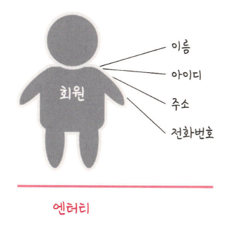

<aside>
    
💡 **엔터티(Entity)** 란 사람, 장소, 물건, 사건, 개념 등 여러 속성을 지닌 명사를 의미한다.

</aside>

<aside>
    
💡 **속성(Attribute)** 이란 릴레이션에서 관리하는 구체적이고 고유한 이름을 갖는 정보이다.

</aside>

- 엔터티의 속성은 서비스의 요구 사항에 맞춰 정해진다.
- 엔터티는 약한 엔터티와 강한 엔터티로 구분된다. 스스로 존재할 수 있는 엔터티는 강한 엔터티, 다른 엔터티의 존재에 종속적이면 약한 엔터티이다.
- 위의 그림의 예시와 같이, 회원이라는 엔터티 안에 다양한 속성이 존재한다. 전화번호가 주소에 종속될 경우, 전화번호는 강한 엔터티, 주소는 약한 엔터티라 볼 수 있다.
- 다양한 속성들 중 서비스 요구사항 기반으로 관리해야 할 필요한 속성들만이 엔터티의 속성이 된다.

## 릴레이션

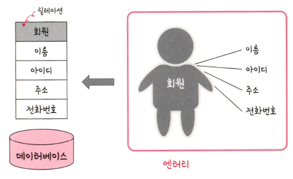

<aside>
    
💡 **릴레이션(Relation)** 이란 DB에서 정보를 구분하여 저장하는 기본단위이다.

</aside>

- DB는 릴레이션 하나에 엔티티에 관한 데이터를 담아서 관리한다.
- 위의 그림 예시와 같이, 회원이라는 엔터티가 DB에서 관리될 경우 릴레이션으로 변화된다.
- 릴레이션은 관계형 DB에서는 테이블이라고 하며, NoSQL DB에서는 컬렉션이라 한다.

## 테이블과 컬렉션

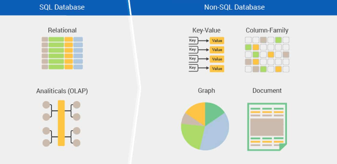

- DB의 종류는 관계형 DB와 NoSQL(Not Only SQL) DB로 나뉜다.
- 관계형 DB의 예로는 MySQL이, NoSQL의 예로는 MongnoDB가 있다.
- MySQL의 구조는 레코드-테이블-DB로 이루어진다.
- NoSQL의 구조는 도큐먼트-컬렉션-DB로 이루어진다.

*뒷 챕터에서 상세히 다뤄질 예정

## 도메인

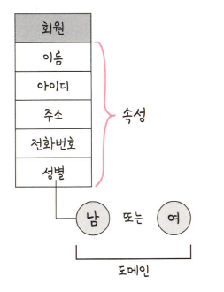

<aside>
    
💡 **도메인(Domain)** 이란 릴레이션에 포함된 각 속성들이 가질 수 있는 값의 집합이다.

</aside>

위의 그림 예시의 경우, 회원이라는 릴레이션에서 성별이라는 속성이 갖는 도메인은 {남, 여}이다.

## 필드와 레코드

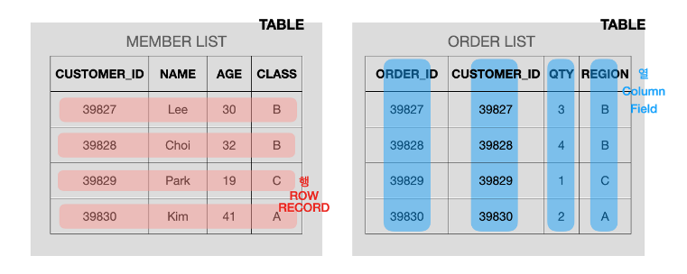

- **필드 Fields**는 엑셀에서 **열** **column**에 해당하는 **가장 작은 단위의 데이터**를 의미한다.
- 필드는 엔티티의 속성을 표현한다. 위의 표에서 각 열은 고객의 정보(ID, 이름, 나이, 클래스)를 나타낸다. 첫번째 행에서 'Lee'라는 값은 NAME 속성을 표현합니다.

- **레코드 Records (튜플 Tuple)**는 논리적으로 **연관된 필드의 집합**을 의미하며, 엑셀의 **행 row**에 해당된다.
- **튜플 Tuple** 이라고 불리기도 한다. 여기서 각각의 필드는 특정한 데이터 타입과 크기가 지정되어 있다. 즉, 여러 행이 모여 한 열을 이루듯이 여러 필드가 모여 한 레코드를 이루는 것.
- 위의 테이블은 고객들의 정보들이 모여있다. 고객의 ID, 이름, 나이, 등급 데이터가 모여 하나의 레코드를 구성하며, 한 고객 레코드는 4개의 필드(CUSTOMER_ID, NAME, AGE, CLASS)로 이루어져 있다고 할 수 있다.
    
    

### 필드타입

필드의 타입은 DBMS마다 다르며, MySQL을 기준으로는 다음과 같은 타입들이 존재한다.

1. **숫자 타입**
    
    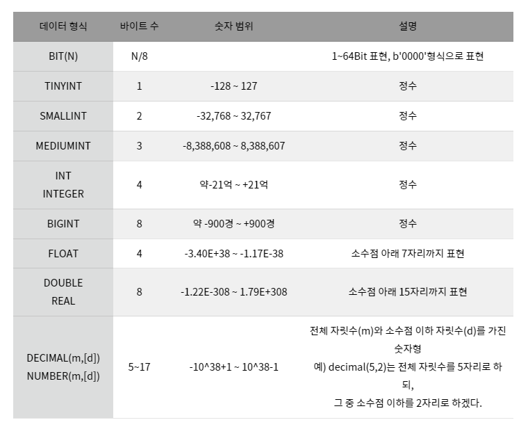
    

1. **문자 타입**

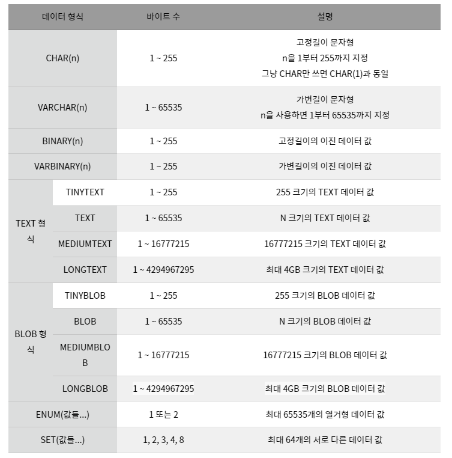

- **CHAR 형식은 고정길이 문자형으로 자릿수가 고정**되어 있다. 예를 들어, CHAR(100)에 'ABC' 3글자만 저장해도 100자리를 모두 확보한 후에 앞에 3자리 사용하고 97자리는 낭비한다. 때문에 가변길이 문자형인 VARCHAR를 사용하는게 좋아보이지만 **되도록 CHAR로 설정하는 것이 INSRET/UPDATE 시 일반적으로 더 좋은 성능**을 발휘한다.
- TEXT는 대용량 글자를 저장하기 위한 형식
- BLOB은 이미지, 동영상 등 크기가 큰 데이터를 저장할 때 쓰지만 보통의 경우 서버에 파일을 올리고 경로를 VARCHAR로 저장한다.
- ENUM은 정의된 리스트에 있는 값 중 단일 선택만 가능하고, 잘못된 값을 삽입할 시 빈 문자열이 저장된다. 메모리를 절약하는 데 이점이 존재한다.
- SET은 ENUM과 비슷하지만 여러 데이터를 선택할 수 있고, 비트 단위 연산을 할 수 있다.

1. **날짜와 시간 타입**

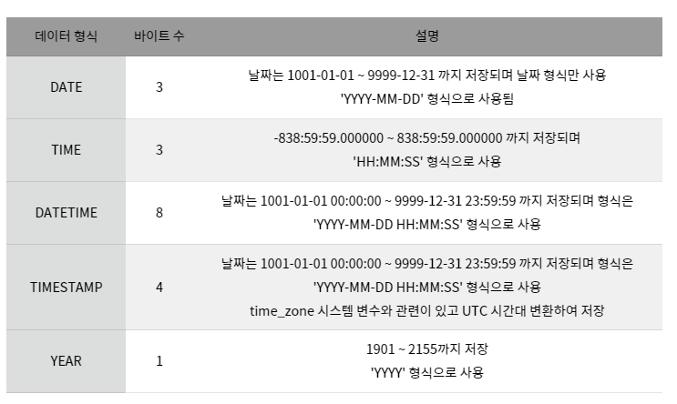

## 데이터 베이스의 관계

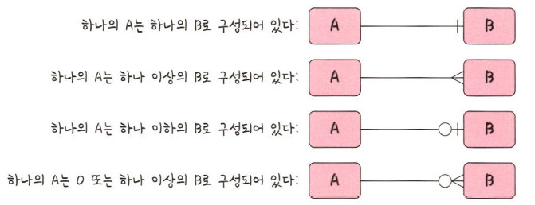

DB에는 일반적으로 여러 개의 테이블이 있고, 이러한 테이블은 서로의 관계가 정의되어 있다. 이를 관계화살표로 나타내면 위의 그림과 같다.

### 1:1 관계

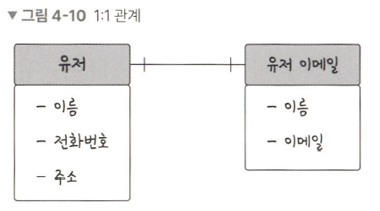

한 유저당 이메일을 하나씩 가지는 경우, 이를 1:1 관계로 볼 수 있다.

### 1:N 관계

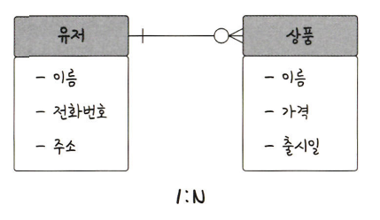

한 유저가 장바구니에 여러 개의 상품을 넣을 수 있을 때, 이를 1:N 관계로 볼 수 있다.

위의 예시에서는 한 개도 넣지 않는 경우를 고려해 0이 포함되는 형태의 화살표를 사용했다.

### N:M 관계

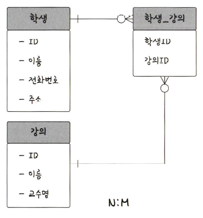

한 학생은 여러 강의를 들을 수 있고, 한 강의를 듣는 학생은 여러명일 수 있다.

이를 N:M 관계로 볼 수 있다.

N:M 관계의 경우 두 개의 테이블을 직접적으로 연결해서 구축하기보다, 1:N, 1:M이라는 관계를 갖는 테이블 두 개로 나누어-Join 테이블을 만들어-관리하는 방식이 보편적이다.

## 키(Key)

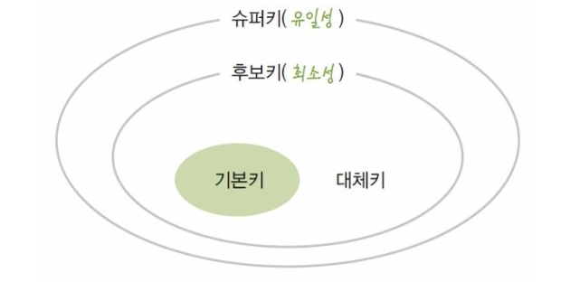

<aside>
    
💡 **키(Key)** 란 테이블 간 관계를 더욱 명확하게 하고, 테이블 자체 인덱스를 위해 설정된 장치이다. 이러한 키에는 기본키, 외래키, 후보키, 슈퍼키가 있다.

</aside>

### 기본키(Primary Key, PK)

- 기본키는 유일성(중복되지 않음)과 최소성(필드 조합 없이 최소의 필드만 써서 키를 형성할 수 있음)을 만족한다.
- 기본키는 자연키 혹은 인조키 중에서 설정한다.
    - 자연키란 중복되지 않는 것을 걸러내어 자연스럽게 나오는 키를 의미한다. 언젠가 변할 수 있다.
    - 인조키란 인위적으로 생성한 고유식별자를 의미한다. 변화하지 않는다. 때문에 주로 인조키를 기본키로 설정한다.

### 외래키(Foreign Key, FK)

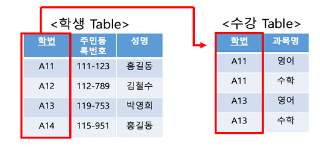

- 외래키는 다른 테이블의 기본키를 그대로 참조하는 값으로, 개체와의 관계를 식별하는데 사용한다.
- 외래키는 중복될 수 있다.

### 후보키(Candidate Key)

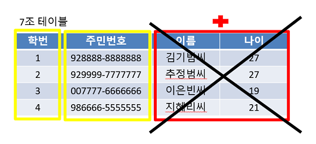

- 후보키는 기본키가 될 수 있는 후보들로, 유일성과 최소성을 동시에 만족한다.
- 테이블에서 각 행을 유일하게 식별할 수 있는 최소한의 속성들의 집합이다.

### 대체키(Alternate Key)

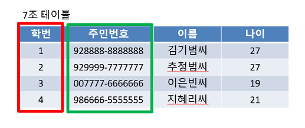

- 대체키는 후보키가 두 개 이상일 경우, 어느 하나를 기본키로 지정한 뒤 남은 후보키들을 말한다.

### 슈퍼키( Super Key)

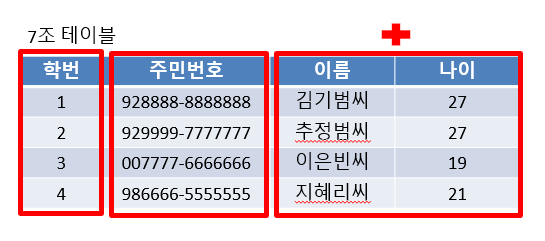

- 슈퍼키는 각 레코드를 유일하게 식별할 수 있는 유일성을 갖춘 키이다.
- 테이블에서 각 행을 유일하게 식별할 수 있는 하나 또는 그 이상의 속성들의 집합
이다.
- 유일성만 만족하면 슈퍼키가 될 수 있다.
