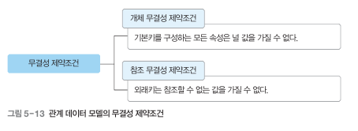
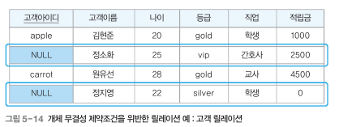
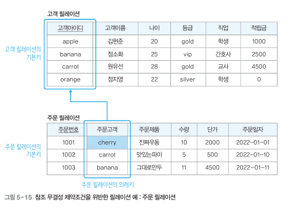
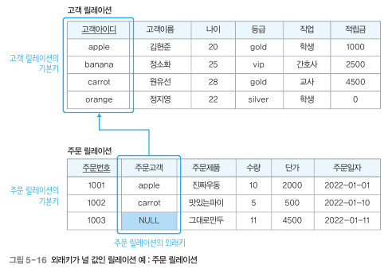

# 4.3 트랜잭션과 무결성

## 4.3.2 무결성

### **무결성**

- 데이터 결함이 없는 상태
- 데이터가 정확하고 유효하게 유지된 상태
- 목적 : 데이터베이스에 저장된 데이터의 무결성을 보장하고, 데이터베이스의 상태를 일관되게 유지하는 것

### **무결성 제약 조건(integrity constraint)**

- 관계 데이터 모델에서 정의하고 있는 기본 제약 사항
- 어느 시점에서 데이터베이스에 저장된 데이터를 의미하는 데이터베이스 상태 또는 데이터베이스 인스턴스가 항상 지켜야 하는 중요한 규칙
- DB의 상태가 변하더라도 무결성 제약 조건으 반드시 지켜져야 함

### 개체 무결성 제약조건

**기본키**를 구성하는 모든 속성은 널 값을 가지면 안 된다

### 참조 무결성 제약조건

외래키는 참조할 수 없는 값을 가질 수 없다

+) 외래키가 널 값을 가지는 경우 참조 무결성 제약조건 위반은 아님

### 고유 무결성 제약조건

특정 속성에 대해 고유한 값을 가지도록 조건이 주어진 경우 그 속성 값은 모두 고유한 값을 가짐

### NULL 무결성 제약조건

특정 속성 값이 NULL 이 올 수 없다는 조건이 주어진 경우 그 속성 같은 NULL이 될 수 없음
