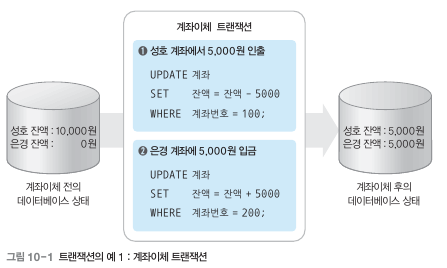
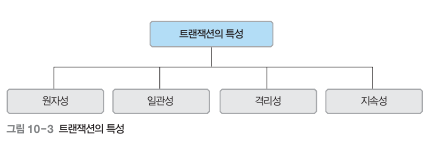
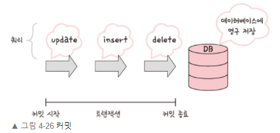
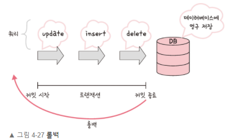
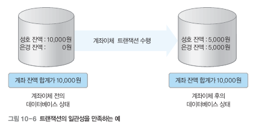
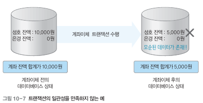
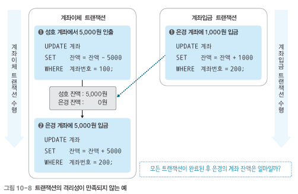
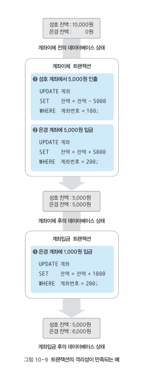
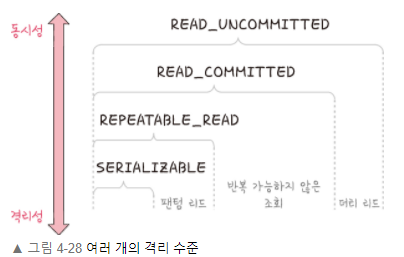
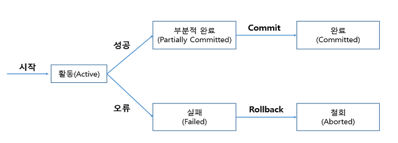

# 4.3 트랜잭션과 무결성

## 4.3.1 트랜잭션

### **트랜잭션(Transaction)이란?**

- 데이터베이스에서 논리적인 작업의 단위
- 작업 수행에 필요한 SQL문들의 모임
  - 질의어 개수가 아닌, **사람이 정하는 기준**에 따라 단위가 정해짐
    ex) 게시판 글작성 ~ 게시판 조회까지 한 단위 ⇒ INSERT + SELECT문이 하나의 트랜잭션

### **트랜잭션의 특징 (ACID)**

- **원자성(Atomicity)**

  - 트랜잭션이 데이터베이스에 모두 반영되던가, 아니면 전혀 반영되지 않아야 함 (all-or-noithing)
  - 커밋 (commit) : 여러 쿼리가 성공적으로 처리되었음을 확정하는 명령어

    

  - 롤백 : 트랜잭션으로 처리한 하나의 묶음 과정을 일어나기 전으로 되돌리는 일(취소)

    

  - 트랜잭션 전파
    - 커넥션 객체를 넘기지 않고 **여러 트랜잭션 관련** **메서드의 호출을 하나의 트랜잭션에 묶이도록** 하는 것
    - 트랜잭션 전파 설정 : 트랜잭션이 동작중인 과정에서 다른 트랜잭션을 실행할 경우 **어떻게 처리할지 결정**
      - Spring 에서는 **@Transactional** 을 통해 여러 쿼리 관련 코드를 하나의 트랜잭션으로 처리함
        [[Spring] 트랜잭션의 전파 설정별 동작](https://deveric.tistory.com/86)

- **일관성(Consistency)**
  - 트랜잭션의 작업 처리 결과가 항상 일관성이 있어야 함
    
    
- **독립성(Isoltation) (=격리성)**

  - 현재 수행 중인 트랜잭션이 완료될 때까지 트랜잭션이 생성한 중간 연산 결과에 다른 트랜잭션들이 접근할 수 없음

    

    

  - 여러 개의 **격리 수준**으로 나뉘어 격리성 보장
    
    - 위로 갈수록 동시성 ↑, 격리성 ↓ / 아래로 갈수록 동시성 ↓, 격리성 ↑
      | SERIALIZABLE | - 트랜잭션을 순차적으로 진행시키는 것
    - 여러 트랜잭션이 동시에 같은 행 접근 불가
    - 매우 엄격한 수준으로 해당 행에 대해 격리, 이후 트랜잭션이 이 행에 대해 일어날 경우 기다려야 함
      → 교착상태 발생 확률 높음 & 성능 가장 떨어짐 |
      | --- | --- |
      | REPEATABLE_READ | - 하나의 트랜잭션이 수정한 행을 다른 트랜잭션이 수정할 수 없도록 막음
    - 새로운 행 추가는 막지 않음
    - 이후 추가된 행 발견 가능성 O |
      | READ_COMMITTED | - 가장 많이 사용되는 격리 수준
    - MySQL8.0, PostgreSQL, SQL Server, 오라클에서 기본값
    - 트랜잭션이 커밋하지 않은 정보 읽을 수 없음 (커밋 완료된 데이터에 대해서만 조회 허용)
    - 어떤 트랜잭션이 접근한 행을 다른 트랜잭션이 수행 가능 |
      | READ_UNCOMMITTED | - 가장 낮은 격리 수준 & 가장 빠름
    - 하나의 트랜잭션이 커밋되지 이전에 다른 트랜잭션에 노출되는 문제가 있음
    - 되도록 사용 X, 거대한 양의 데이터를 어림잡에 집계할 때 사용 |
  - 단계별 발생 가능 현상
    | 팬텀 리드
    (phatom read) | 한 트랜잭션 내에서 동일한 쿼리를 보냈을 때 해당 조회 결과가 다른 경우 |
    | --- | --- |
    | 반복 가능하지 않은 조회
    (non-repeatable read) | 한 트랜잭션 내의 같은 행에 두 번 이상 조회가 발생했을 때, 그 값이 다른 경우 |
    | 더티 리드
    (dirty read) | 한 트랜잭션이 실행 중일 때 다른 트랜잭션에 의해 수정되었지만 아직 커밋되지 않은 행의 데이터를 읽을 수 있을 때 발생 |
    - REPEATABLE_READ : 팬텀 리드
    - READ_COMMITTED : 팬텀 리드, 반복 가능하지 않은 조회
    - READ_UNCOMMITTED : 팬텀 리드, 반복 가능하지 않은 조회, 더티 리드

- **지속성(Durability)**
  - 트랜잭션이 성공적으로 완료되었을 경우, 결과는 영구적으로 반영되어야 함
  - DB에 시스템 장애가 발생해도 원래 상태로 복구하는 회복 기능이 있어야 함
    - 체크섬 : 중복검사의 한 형태, 오류 정정을 통해 송신된 자료의 무결성을 보호하는 단순한 방법
    - 저널링 : 파일 시스템 / 데이터베이스 시스템에 변경 사항을 반영(commit)하기 전에 로깅하는 것(트랜잭션 등 변경 사항에 대한 로그를 남김)

### **트랜잭션 상태**

- 활동 상태 : 트랜잭션이 수행을 시작하여 현재 수행 중인 상태
- 부분 완료 상태 : 트랜잭션의 마지막 연산이 실행을 끝낸 직후의 사태
- 완료 상태 : 트랜잭션이 성공적으로 완료되어 commit 연산을 실행한 상태
- 실패 상태 : 장애가 발생하여 트랜잭션의 수행이 중단된 상태
- 철회 상태 : 트랜잭션의 수행 실패로 rollback 연산을 실행한 상태\

[트랜잭션(Transaction)이란?](https://mommoo.tistory.com/62)

[[SQL] Transaction(트랜잭션)](https://jerryjerryjerry.tistory.com/48)

[트랜잭션(Transaction)이란?](https://starkying.tistory.com/entry/%ED%8A%B8%EB%9E%9C%EC%9E%AD%EC%85%98Transaction%EC%9D%B4%EB%9E%80)

[트랜잭션 데이터란 무엇입니까?](https://www.tibco.com/ko/reference-center/what-is-transactional-data)
