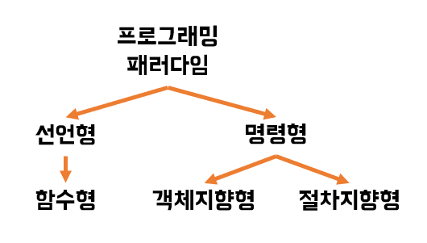
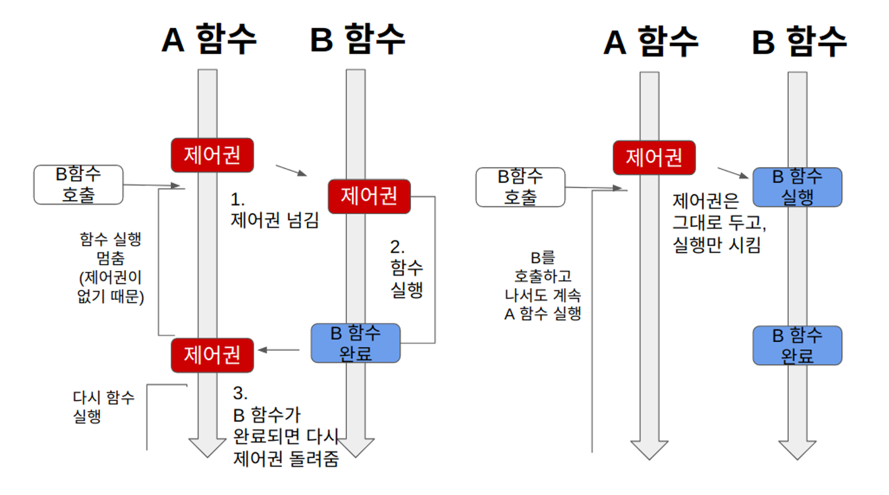

# 1.2.1 선언형과 함수형 프로그래밍



### ✍🏻 **프로그래밍 패러다임(Programming Paradigm)**

- 프로그래머에게 프로그래밍의 관점을 갖게 해주는 역할을 하는 개발 방법론
- 자바의 경우 jdk 1.8부터 함수형 프로그래밍 패러다임을 지원하기 위해 **람다식**, **생성자 레퍼런스**, **메서드 레퍼런스**를 도입했고, 선언형 프로그래밍을 위해 **스트림(stream)** 같은 표준 API 등도 추가했다.
- Java 8부터 **NodeJS**처럼 **비동기 논블로킹** 방식을 도입했지만, 순수한 함수형 언어는 아니다. JavaScript, C# 등의 함수형 언어 특성을 접목할 수 있도록 했다.
- **용어 설명**
    1. **람다식** :
       - 람다 함수는 **익명 함수**(Anonymous functions)를 지칭하는 용어이다.
       - 장점 - 코드의 간결성, 지연연산 수행, 병렬처리 가능
       - 단점 - 람다식의 호출이 까다로움, 단순 for문, while문 사용시 성능 떨어짐
        
        - **코드 예시**
            
            **[기존 자바 문법]**
            
            ```java
            new Thread(new Runnable() {
               @Override
               public void run() { 
                  System.out.println("Welcome Heejin blog"); 
               }
            }).start();
            ```
            
            **[람다식 문법]**
            
            ```java
            new Thread(()->{
                  System.out.println("Welcome Heejin blog");
            }).start();
            ```
            
            **[함수형 Interface 선언]**
            
            ```java
            @FunctionalInterface
            interface Math {
                public int Calc(int first, int second);
            }
            ```
            
            **[추상 메소드 구현 및 함수형 인터페이스 사용]**
            
            ```java
            public static void main(String[] args){
            
               Math plusLambda = (first, second) -> first + second;
               System.out.println(plusLambda.Calc(4, 2));
            
               Math minusLambda = (first, second) -> first - second;
               System.out.println(minusLambda.Calc(4, 2));
            
            }
            // 6
            // 2
            ```
            
    2. **생성자**
       - 객체가 생성될 때 **초기화** 목적으로 실행되는 메소드
       - 객체가 생성되는 순간에 자동 호출
       - 클래스로부터 객체를 생성할 때 수행되어 객체의 초기화를 담당하는 것
        
        - **코드 예시**
            
            **[두 개의 생성자를 가진 Circle 클래스 예제]**
            
            ```java
            public class Circle {
            	int radius;
            	String name;
            
            	public Circle { 
                // 매개 변수 없는 생성자
                // 생성자 이름은 클래스 이름과 같음
            		radius = 1;
            		name = "";
            	}
            	
            	public Circle(int r, String t) {
                // 매개 변수 가진 생성자
            		radius = r;
            		name = t;
            	}
            	
            	public double getArea() {
            		return 3.14 * radius * radius;
            	}
            	
            	public static void main(String[] args) {
            		Circle pizza = new Circle(10, "자바피자");
            		double area = pizza.getArea();
            		System.out.println(pizza.name + "의 면적은 " + area);
            		
            		Circle donut = new Circle();
            		donut.name = "도넛피자";
            		area = donut.getArea();
            		System.out.println(donut.name + "의 면적은 " + area);
            	}
            
            }
            ```
            
        - **생성자 특징**
            - 생성자 이름 = 클래스 이름

            - 생성자는 여러 개 작성 가능 → **다형성**

            - 생성자는 객체생성 시 한 번만 호출

                - 자바에서 객체 생성은 반드시 new 연산자로 함

            - 생성자의 목적은 객체 생성 시 초기화됨

            - 생성자는 **리턴 타입을 지정할 수 없음**

            - 클래스 내부에 생성자를 선언하지 않으면 자동으로 기본 생성자 선언

            - 생성자의 종류 : 1) 기본 생성자 2) 일반 생성자
                - 기본 생성자
            
                    ```java
                    class Circle {
                    	public Circle(); // 기본 생성자
                    }
                    ```
            
    3. **메서드 레퍼런스**
       - 람다 표현식이 단 하나의 메소드만을 호출하는 경우 해당 람다 표현식에서 **불필요한 매개변수를 제거**하고 사용할 수 있도록 해줌
        
        - **코드 예시**
            
            **[람다식 코드]**
            
            ```java
            Consumer<String> func = text -> System.out.println(text);
            func.accept("Hello");
            ```
            
            **[메소드 레퍼런스 코드]**
            
            ```java
            Consumer<String> func = System.out::println;
            func.accept("Hello");
            ```
            
    4. **스트림** 
       - 컬렉션에 저장되어 있는 엘리먼트들을 하나씩 순회하면서 처리할 수 있는 코드 패턴. 람다식과 함께 사용됨. 내부 반복자 사용으로 병렬 처리가 쉬움
        
        - **코드 예시**
            
            **[기존 코드]**
            
            ```java
            ArrayList<String> list = new ArrayList<String>(Arrays.asList("a", "b", "c"));
            
            for (String value : list) {
            
                    if (StringUtils.equals(value, "b") {
                    System.out.println("값 : " + value);
                }
            }
            ```
            
            **[스트림 사용]**
            
            ```java
            ArrayList<String> list = new ArrayList<String>(Arrays.asList("a", "b", "c"));
            list.stream()
                .filter("b"::equals)    
                .forEach(System.out::println);
            ```
            
    5. **NodeJS** : 비동기 + 논블로킹 처리 프레임워크
    6. **비동기 논블로킹** 
       - A 함수가 B 함수를 호출할 때, 제어권을 B 함수에 주지 않고, 자신이 계속 가지고 있는다(**논블로킹**). 따라서 B 함수를 호출한 이후에도 멈추지 않고 자신의 코드를 계속 실행한다. 그리고 B 함수를 실행할 때 콜백함수를 함께 줘서 B 함수는 자신의 작업이 끝나면 A 함수가 준 콜백 함수를 실행한다(**비동기**)
        
            **[블로킹]**  &nbsp;&nbsp;&nbsp;&nbsp;&nbsp;&nbsp;&nbsp;&nbsp;&nbsp;&nbsp;&nbsp;&nbsp;&nbsp;&nbsp;&nbsp;&nbsp;&nbsp;&nbsp;&nbsp;&nbsp;&nbsp;&nbsp;&nbsp;&nbsp;&nbsp;&nbsp;&nbsp;&nbsp;&nbsp;&nbsp;&nbsp;&nbsp;&nbsp;&nbsp;&nbsp;&nbsp;&nbsp;&nbsp;&nbsp;&nbsp;&nbsp;&nbsp;&nbsp;&nbsp;&nbsp;&nbsp;&nbsp;&nbsp;&nbsp;&nbsp;&nbsp;&nbsp;&nbsp;&nbsp;&nbsp;&nbsp;&nbsp;&nbsp;&nbsp;&nbsp;&nbsp;&nbsp;&nbsp;&nbsp;&nbsp;&nbsp;&nbsp;&nbsp;&nbsp;&nbsp;&nbsp;&nbsp;&nbsp;&nbsp;&nbsp;&nbsp;&nbsp;&nbsp;&nbsp;&nbsp;&nbsp;&nbsp;&nbsp;&nbsp;&nbsp;&nbsp;&nbsp;&nbsp;&nbsp;&nbsp;&nbsp;&nbsp;&nbsp;&nbsp;&nbsp;&nbsp;&nbsp;&nbsp;&nbsp;&nbsp;&nbsp;&nbsp;&nbsp;&nbsp;&nbsp;&nbsp;&nbsp;   **[논블로킹]**
        
            
        
- **객체지향 프로그래밍**

    - 프로그래머들이 프로그램을 상호 작용하는 객체들의 잡합으로 볼 수 있게 해준다.

- **함수형 프로그래밍**

    - 상태 값을 지니지 않는 함수 값들의 연속으로 생각할 수 있게 해준다.

- **선언형 프로그래밍**

    - ‘무엇을’ 풀어내는가에 집중하는 패러다임

    - “프로그램은 함수로 이루어진 것이다”라는 명제가 담겨 있는 패러다임

- **함수형 프로그래밍**

    - **작은 ‘순수 함수’들을 블록처럼 쌓아 로직을 구현하고 ‘고차 함수’를 통해 재사용성을 높인 프로그래밍 패러다임**

        - **순수 함수**
            
            ```jsx
            const pure = (a, b) => {
            		return a + b
            }
            ```
            
            - 출력이 입력에만 의존하는 것을 의미함

            - pure 함수는 들어오는 매개변수 a, b에만 영향을 받음

            - 만약 a, b 말고 다른 전역 변수 c 등이 출력에 영향을 주면 순수 함수가 아님

        - **고차 함수**

            - 함수를 **전달인자**(argument) 또는 **매개변수**(parameter)로 받거나 함수를 리턴하는 함수

            - **일급 객체**란?

                - 다른 객체들에 일반적으로 적용 가능한 연산을 모두 지원하는 객체

                - 조건

                    1. 변수에 **할당**(assignment)할 수 있다.
                        
                        ```jsx
                        const mul = function (num) {
                          return num*num;
                        }
                        ```
                        
                    2. 다른 함수를 **인자**(argument)로 전달 받는다.
                        
                        ```jsx
                        function mul(num) {
                          return num*num;
                        }
                        
                        // func는 매개변수임, 이름은 아무거나 지정해도 상관없음
                        function mulNum(func, number) {
                          return func(number);
                        }
                        
                        let result = mulNum(mul, 3); // 9
                        ```
                        
                    3. 다른 함수의 결과로서 **리턴**될 수 있다.
                        
                        ```jsx
                        function add(num1) {
                          return function (num2) {
                            return num1 + num2;
                          }
                        }
                        
                        add(3)(4); // 7
                        ```
                        
                - 함수를 데이터(string, number, boolean, array, object) 다루듯이 다룰 수 있다.

                - 함수가 일급 객체이기 때문에 할 수 있는 것 → 고차함수, 콜백

                - **콜백함수(callback)**

                    - **전달인자(Argument)** 로 받는 함수
                    
                    ```jsx
                    // 일반함수
                    const mul = function(num) { return num * 2 }
                    
                    // 매개변수(parameter)로 func를 받았고, 함수(func)를 리턴하기 때문에 고차함수
                    const mulNum = function(func, num) { return func(num) }
                    
                    // mulNum은 전달인자(argument)로 함수(mul)을 받았으므로 고차함수
                    // 전달인자(argument)로 받은 함수인 mul은 콜백함수
                    mulNum(mul, 3) // 6
                    ```
                    
            - 고차 함수를 쓰기 위해서는 해당 언어가 일급 객체라는 특징을 가져야 한다.
                
                ```jsx
                # func는 익명함수
                
                # 다른 함수를 인자로 받는 경우
                function mul(num) { return num * num }
                
                function mulNum(func, num) {
                  return func(num);
                }
                
                # 함수를 리턴하는 경우
                function mul(num1) {
                  return function(num2) {
                    return num2*num1;
                  };
                }
                
                # 함수를 인자로 받고, 함수를 리턴하는 경우
                ```
                
- **자바스크립트**는 단순하고 유연한 언어이며, 함수가 **일급 객체**이기 때문에 **객체지향 프로그래밍**보다는 **함수형 프로그래밍** 방식이 선호됨
- 함수형 프로그래밍은 이외에도 커링, 불변성 등 많은 특징이 있음
<details>
<summary><b>참고 링크</summary>
<div markdown="1">
    
    [https://velog.io/@reveloper-1311/일급-객체First-Class-Object란](https://velog.io/@reveloper-1311/%EC%9D%BC%EA%B8%89-%EA%B0%9D%EC%B2%B4First-Class-Object%EB%9E%80)
    
    [https://tecoble.techcourse.co.kr/post/2021-09-30-java8-functional-programming/](https://tecoble.techcourse.co.kr/post/2021-09-30-java8-functional-programming/)
    
    [https://codechacha.com/ko/java8-method-reference/](https://codechacha.com/ko/java8-method-reference/)
    
    [https://khj93.tistory.com/entry/JAVA-람다식Rambda란-무엇이고-사용법](https://khj93.tistory.com/entry/JAVA-%EB%9E%8C%EB%8B%A4%EC%8B%9DRambda%EB%9E%80-%EB%AC%B4%EC%97%87%EC%9D%B4%EA%B3%A0-%EC%82%AC%EC%9A%A9%EB%B2%95)
    
    [https://hbase.tistory.com/171](https://hbase.tistory.com/171)
    
    [https://velog.io/@dailylifecoding/why-do-we-need-async-nonblocking](https://velog.io/@dailylifecoding/why-do-we-need-async-nonblocking)
    
    [https://dinfree.com/lecture/language/112_java_4.html](https://dinfree.com/lecture/language/112_java_4.html)
    
    [https://www.nextree.co.kr/p6960/](https://www.nextree.co.kr/p6960/)
    
    [https://ahnty0122.tistory.com/124](https://ahnty0122.tistory.com/124)

</details>