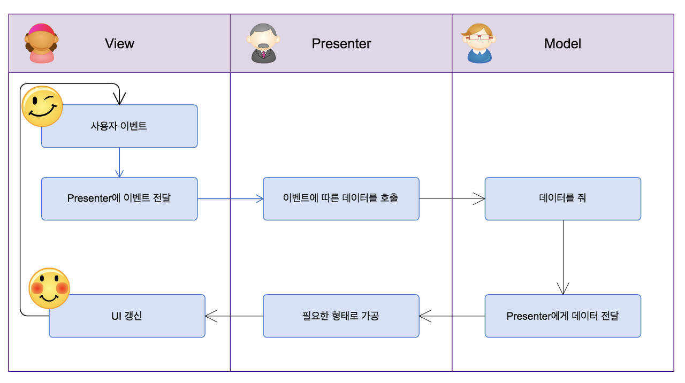

# MVP Pattern

## 특징

Model-View-Presenter 패턴

MVC에서 파생, 주로 안드로이드에서 사용

- MVC 패턴의 단점: View와 Model 사이의 의존성이 높다.

MVP 패턴은 MVC 패턴의 단점을 해결 → **UI(View)와 로직(Model)을 분리, 의존성 최소화**

View와 Model은 **Presenter를 통해서만 데이터를 주고받을 수 있음**

## 구조

### Model

MVC와 동일

프로그램 내부적으로 쓰이는 데이터를 저장하고, 처리

View 또는 Presenter 등 다른 어떤 요소에도 의존적이지 않은 **독립적인 영역**

### View

View 인터페이스를 구현하여 해당 View를 담당할 Presenter에서 컨트롤

→ 특정 뷰와 상관없이 가상 뷰를 구현하여 간단한 유닛테스트를 할 수 있게된다.

**UI를 담당** (ex. 안드로이드에서의 Activity, Fragment)

**사용자의 입력**을 받음 (MVC는 Controller에서 받음)

Model에서 처리된 데이터를 Presenter를 통해 전달받아서 유저에게 보여줌

유저의 행동(Action) 및 Activity 생명 주기 상태 변경을 주시하며 Presenter에 전달

Presenter를 이용하여 데이터를 주고받기 때문에 **Presenter에 매우 의존적**

### Presenter

**Model과 View사이의 매개체**

Controller와 유사하지만, View에 직접 연결되는 대신 **인터페이스를 통해 상호작용**한다는 차이

인터페이스를 통해 상호작용: 각각의 클래스는 독립적으로 동작 → 테스트에 용이함

View에게 표시할 내용(Data)만 전달, 어떻게 보여줄 지는 View가 담당

## 동작 과정

1. View로 사용자의 입력이 들어옴
2. View는 데이터를 Presenter에 요청
3. Presenter는 Model에 데이터 요청
4. Model은 Presenter에 데이터 응답
5. Presenter는 View에 데이터를 응답 (뷰 업데이트 요청)
6. View는 사용자에게 화면을 보여줌

## 장단점

### 장점

View와 Model의 의존성이 없음

- 어플리케이션의 디버깅을 더 쉽게 만든다. MVP는 세 가지의 다른 계층의 추상화를 소개하기 때문이다.
- 코드 재사용성이 높아진다. 뷰를 컨트롤 하기 위해 여러개의 프레젠터를 가질 수 있다.
- 더 나은 관심사 분리를 실행할 수 있다. 비즈니스 로직과 영속성 로직을 Activity와 Fragment 클래스에서 분리할 수 있다.

### 단점

View와 Presenter의 강한 의존성

어플리케이션이 복잡해질수록 View와 Presenter 사이의 의존성이 강해짐

[https://fomaios.tistory.com/entry/Design-Pattern-MVP-패턴이란](https://fomaios.tistory.com/entry/Design-Pattern-MVP-%ED%8C%A8%ED%84%B4%EC%9D%B4%EB%9E%80)

[https://thdev.tech/androiddev/2016/10/12/Android-MVP-Intro/](https://thdev.tech/androiddev/2016/10/12/Android-MVP-Intro/)

[https://brunch.co.kr/@oemilk/75](https://brunch.co.kr/@oemilk/75)

[https://beomy.tistory.com/43](https://beomy.tistory.com/43)

[https://frtt0608.tistory.com/94](https://frtt0608.tistory.com/94)

[https://salix97.tistory.com/205](https://salix97.tistory.com/205)

[https://devowen.com/457](https://devowen.com/457)