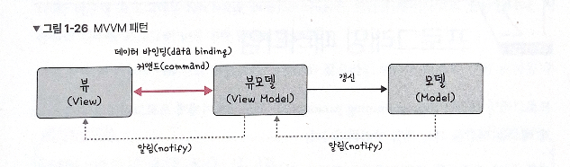
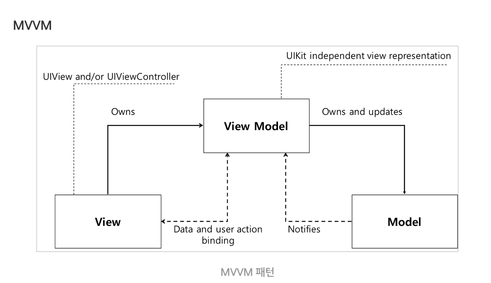

# MVVM Pattern

## 특징

MVC의 C에 해당하는 컨트롤러가 **뷰모델(view model)** 로 바뀐  패턴



뷰 모델: 뷰를 더 추상화한 계층

**커맨드(command)** : 여러 가지 요소에 대한 처리를 하나의 액션으로 처리

```java
/*the Invoker class*/
public class Switch {
    private Command flipUpCommand;
    private Command flipDownCommand;

    public Switch(Command flipUpCmd,Command flipDownCmd){
        this.flipUpCommand=flipUpCmd;
        this.flipDownCommand=flipDownCmd;
    }

    public void flipUp(){
         flipUpCommand.execute();
    }

    public void flipDown(){
         flipDownCommand.execute();
    }
}

/*Receiver class*/

public class Light{
     public Light(){  }

     public void turnOn(){
        System.out.println("The light is on");
     }

     public void turnOff(){
        System.out.println("The light is off");
     }
}

/*the Command interface*/

public interface Command{
    void execute();
}

/*the Command for turning on the light*/

public class TurnOnLightCommand implements Command{
   private Light theLight;

   public TurnOnLightCommand(Light light){
        this.theLight=light;
   }

   public void execute(){
      theLight.turnOn();
   }
}

/*the Command for turning off the light*/

public class TurnOffLightCommand implements Command{
   private Light theLight;

   public TurnOffLightCommand(Light light){
        this.theLight=light;
   }

   public void execute(){
      theLight.turnOff();
   }
}

/*The test class*/
public class TestCommand{
   public static void main(String[] args){
       Light light=new Light();
       Command switchUp=new TurnOnLightCommand(light);
       Command switchDown=new TurnOffLightCommand(light);

       Switch s=new Switch(switchUp,switchDown);

       s.flipUp();
       s.flipDown();
   }
}
```

**커맨드 패턴:** 요청을 객체의 형태로 캡슐화하여 사용자가 보낸 요청을 나중에 이용할 수 있도록 매서드 이름, 매개변수 등 요청에 필요한 정보를 저장 또는 로깅, 취소할 수 있게 하는 패턴

**데이터 바인딩(data binding)**: 화면에 보이는 데이터와 웹 브라우저의 메모리 데이터를 일치, **뷰모델을 변경하면 뷰가 변경**됨

각 데이터 변경 사항은 데이터에 바인딩된 요소에 의해 **자동으로 반영 →** **데이터의 일관성을 유지**

뷰와 뷰모델 사이의 양방향 데이터 바인딩

뷰모델에서 변화를 주기 위해서, 뷰 모델은 **옵저버 패턴**을 사용

## 구조

### Model

어플리케이션에서 사용되는 **데이터** 및 **데이터 조작** 부분

### ViewModel

**UI를 위한 데이터를 가지고 있음**

View를 표현하기 위해 만들어진 Model

View와 Model 간의 **데이터 처리/중개**를 담당

View와는 Binding을 하여 연결후 View에게서 액션을 받고 또한 View를 업데이트

View와 분리된 구조를 가지기 때문에, 액티비티나 프래그먼트의 **생명주기에 영향을 받지 않는다.**  (뷰모델은 어플리케이션이 종료될 때까지 살아있음.) 

### View

**사용자가 직접적으로 보는 화면, UI**

화면에 무엇을 그릴 지 결정하고, 사용자와 직접적으로 상호작용하는 부분

데이터의 변화를 감지하기 위한 **Observer**를 가지고 있다.

## 동작 과정



1. View에 사용자의 입력이 들어오면 ViewModel에게 명령(Command 패턴)
2. ViewModel은 필요한 데이터를 Model에게 요청
3. Model은 ViewModel에게 요청된 데이터를 응답
4. ViewModel은 응답 받은 데이터를 가공해서 저장
5. View는 ViewModel과의 Data Binding으로 인해 **자동으로 화면 갱신**

## 장단점

### 장점

- View와 Model 간의 독립성을 유지
- 독립성을 유지하기 때문에 효율적인 유닛테스트가 가능합니다
- View와 ViewModel을 바인딩하기 때문에 코드의 양이 줄어듭니다 (뷰를 추상화)
- Command 패턴 + Data Binding → View와 View Model 사이의 의존성도 없앰
- 확장성, 모듈화 -유지 보수가 쉽다

### 단점

- 간단한 UI에서 View Model을 설계하는 것이 더 복잡할 수 있음
- 데이터 바인딩이 필수적으로 요구됩니다
- 복잡해질수록 Controller처럼 ViewModel이 빠르게 비대해진다
- 표준화된 틀 존재x

---

[https://jhtop0419.tistory.com/m/21](https://jhtop0419.tistory.com/m/21)

[https://beomy.tistory.com/43](https://beomy.tistory.com/43)

[https://devowen.com/457](https://devowen.com/457)

[https://co-no.tistory.com/49](https://co-no.tistory.com/49)

[https://ko.wikipedia.org/wiki/커맨드_패턴](https://ko.wikipedia.org/wiki/%EC%BB%A4%EB%A7%A8%EB%93%9C_%ED%8C%A8%ED%84%B4)
