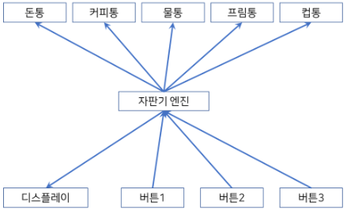
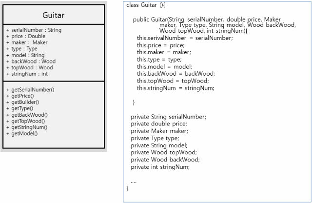
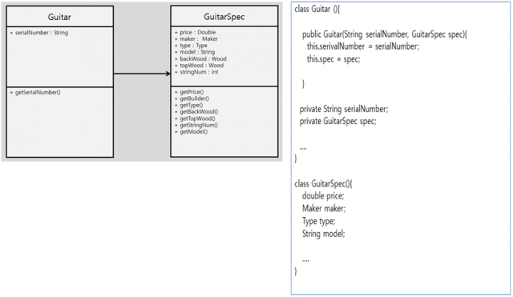
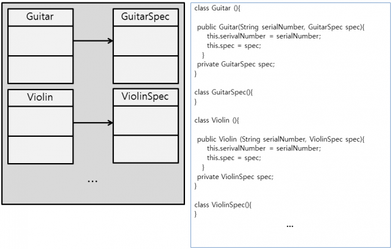
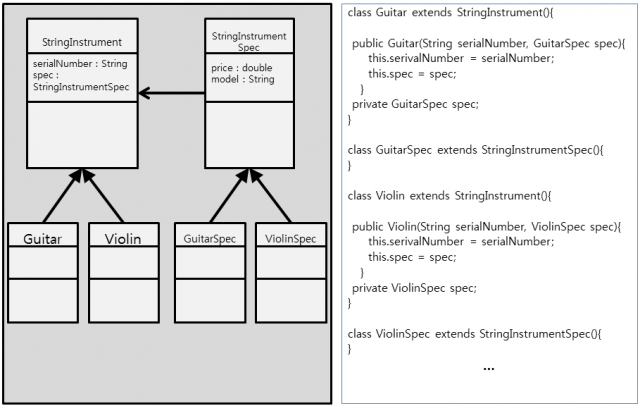
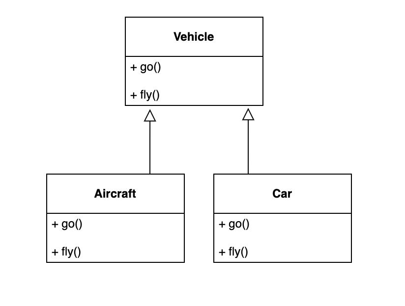
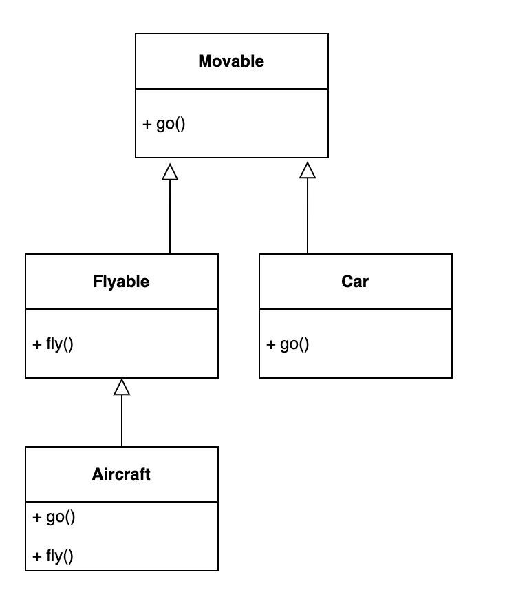
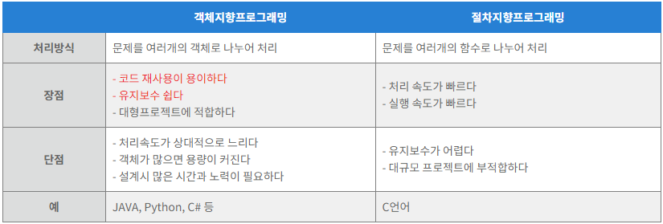

# 1.2.2 객체지향 프로그래밍



- **객체지향 프로그래밍**(OOP, Object-Oriented Programming)은 객체들의 집합으로 프로그램의 상호 작용을 표현하며 데이터를 객체로 취급하여 객체 내부에 선언된 메서드를 활용하는 방식
    
- 설계에 많은 시간이 소요되며 처리속도가 다른 패러다임에 비해 상대적으로 느림

```java
class Calculator {
    int result = 0;

    int add(int num) {
        result += num;
        return result;
    }

		int sub(int num) {
        result -= num;
        return result;
    }
}

public class Sample {
    public static void main(String[] args) {
        Calculator cal1 = new Calculator();  // 계산기1 객체를 생성한다.
        Calculator cal2 = new Calculator();  // 계산기2 객체를 생성한다.

        System.out.println(cal1.add(3));
        System.out.println(cal1.add(4));

        System.out.println(cal2.add(3));
        System.out.println(cal2.add(7));
    }
}
```

- 교재 예시(JavaScript)
    
    ```jsx
    const ret = [1, 2, 3, 4, 5, 11, 12]
    class List {
    		constructor(list) {
    				this.list = list
    				this.mx = list.reduce((max, num) => num > max ? num : max, 0)
    		}
    		getMax() {
    				return this.mx
    		}
    }
    const a = new List(ret)
    console.log(a.getMax()) // 12
    ```
    
    - List라는 클래스를 만들고 a라는 객체를 만들 때 최댓값을 추출해내는 메서드

### 🗒️ **특징**

- **추상화**(abstraction)

    - 복잡한 시스템으로부터 핵심적인 개념 또는 기능을 간추려내는 것

- **캡슐화**(encapsulation)

    - 객체의 속성과 메서드를 하나로 묶고 일부를 외부에 감추어 은닉하는 것

    - 외부의 클래스 혹은 모듈에 의존적인 프로그램의 경우 변경이나 오류에 취약해지는데, 정보은닉을 통해 이러한 결합도를 낮추며 응집도를 높여준다.

    - **접근제어자** : public, protected, default, private

- **상속성**(inheritance)

    - 상위 클래스의 특성을 하위 클래스가 이어받아서 재사용하거나 추가, 확장하는 것

    - 코드의 재사용 측면, 계층적인 관계 생성, 유지 보수성 측면에서 중요

- **다형성**(polymorphism)
    
    
    
    - 하나의 메서드나 클래스가 다양한 방법으로 동작하는 것

    - **오버로딩(Overloading)**

        - 같은 이름을 가진 메서드를 여러개 두는 것

        - 메서드의 타입, 매개변수의 유형, 개수 등으로 여러 개를 둘 수 있으며 컴파일 중에 발생하는 ‘**정적**’ 다형성이다.
        
        ```java
        class Person {
        
        		public void eat(String a) {
        				System.out.println("I eat " + a);
        		}
        
        		public void eat(String a, String b) {
        				System.out.println("I eat " + a + " and " + b);
        		}
        }
        
        public class CalculateArea {
        
        		public static void main(String[] args) {
        				Person a = new Person();
        				a.eat("apple");
        				a.eat("tomato", "phodo");
        		}
        }
        /*
        I eat apple
        I eat tomato and phodo
        */
        ```
        
    - **오버라이딩(Overriding)**

        - 상위 클래스로부터 상속받은 메서드를 하위 클래스가 재정의하는 것을 의미함

        - 런타임 중에 발생하는 ‘동적’ 다형성이다.
        
        ```java
        class Animal {
        		public void bark() {
        				System.out.println("mumu! mumu!");
        		}
        }
        
        class Dog extends Animal {
        		@Override
        		public void bark() {
        				System.out.println("wal!!!wal!!!");
        		}
        }
        
        public class Main {
        		public static void main(String[] args) {
        				Dog d = new Dog();
        				d.bark();
        		}
        }
        /*
        wal!!! wal!!!
        */
        ```
        

### 🛠️ **설계 원칙**

객체지향 프로그래밍을 설계할 때는 **SOLID** 원칙을 지켜주어야 함

- **단일 책임 원칙**(**SRP**, Single Responsibility Principle)

    - 모든 클래스는 하나의 책임만 가져야 하는 원칙

    - ex) A라는 로직이 존재한다면 어떠한 클래스는 A에 관한 클래스여야 하고 이를 수정한다고 했을 때도 A와 관련된 수정이어야 함
    
    **<SRP 적용 전>**
    
    
    
    **<SRP 적용 후>**
    
    
    
- **개방-폐쇄 원칙**(**OCP**, Open Closed Principle)

    - 유지 보수 사항이 생긴다면 코드를 쉽게 확장할 수 있도록 하고 수정할 때는 닫혀 있어야 하는 원칙

    - 기존의 코드는 잘 변경하지 않으면서도 확장은 쉽게 할 수 있어야 함
    
    **<OCP 적용 전>**
    
    
    
    **<OCP 적용 후>**
    
    
    
- **리스코프 치환 원칙**(**LSP**, Liskov Substitution Principle)

    - 프로그램의 객체는 프로그램의 정확성을 깨뜨리지 않으면서 하위 타입의 인스턴스로 바꿀 수 있어야 하는 것을 의미함

    - 클래스는 상속이 되기 마련이고 부모, 자식이라는 계층 관계가 만들어짐

    - 이때 부모 객체에 자식 객체를 넣어도 시스템이 문제없이 돌아가게 만드는 것

    - ex) 범석 객체가 홍철 객체의 자식 계층일 때 범석 객체를 홍철 객체와 바꿔도 문제가 없어야 함

- **인터페이스 분리 원칙**(**ISP**, Interface Segregation Principle)

    - 하나의 일반적인 인터페이스보다 구체적인 여러 개의 인터페이스를 만들어야 하는 원칙
    
    **<ISP 위반 사례>**
    
    <div markdown="1">
        
    </div>
    
    **<ISP 적용 후>**
    
    <div markdown="1">
        
    </div>
    
- **의존 역전 원칙**(**DIP**, Dependency Inversion Principle)

    - 자신보다 변하기 쉬운 것에 의존하던 것을 추상화된 인터페이스나 상위 클래스를 두어 변하기 쉬운 것의 변화에 영향받지 않게 하는 원칙

    - ex) 타이어를 갈아끼울 수 있는 틀을 만들어 놓은 후 다양한 타이어를 교체할 수 있어야 함

    - 즉 상위 계층은 하위 계층의 변화에 대한 구현으로부터 독립해야 함
    
    **< Layering >**
    
     <div markdown="1">
        
    </div>
    

### **클래스와 인스턴스 예시**

```java
public class Car {
    private String color;
    private String model;
    private int power;
    private int curSpeed;

    public Car() {
        curSpeed = 0;
    }

    public Car(String color, String model, int power) {
        this.color = color;
        this.model = model;
        this.power = power;
    }

    public void go() {
        if (power < 200) {
            curSpeed += 10;
        } else if (power >= 200) {
            curSpeed += 20;
        }
        System.out.printf("Accelerate %s, Current Speed %d\n", model, curSpeed);
    }

    public void stop() {
        curSpeed = 0;
    }
    // getter/setter 메서드 생략
}
```

```java
public class CarGame {
    public static void main(String[] args){
        Car c1 = new Car();
        c1.setColor("RED");
        c1.setModel("Hyundai Sonata");
        c1.setPower(180);

        Car c2 = new Car("BLUE","BMW 520",210);
        c1.go();
        c2.go();
    }
}

// Accelerate Hyundai Sonata, Current Speed 10
// Accelerate BMW 520, Current Speed 20
```

### **상속과 오버라이딩 예시**

```java
public class Gun {
    protected String model;       // model name of gun
    protected int bulletCount;    // total count of bullet

    public void fire() {
        System.out.println(model + "=>");
        bulletCount -= 1;
    }

    public Gun(String model) {
        bulletCount = 10;
        this.model = model;
    }
}

public class AssaultRifle extends Gun {
    public void fire() {
        bulletCount -= 5;
        System.out.printf("%s => => => => => , %d\n",model, bulletCount);
    }

    public AssaultRifle(String model) {
    	super(model);
        bulletCount = 40;
    }	
}

public class ShotGun extends Gun {
    public void fire() {    	
        bulletCount -= 1;
    	System.out.printf("%s =}}} , %d\n",model, bulletCount);
    }
    
    public ShotGun(String model) {
    	super(model);
    }
}
```

```java
public class GunGame {
	public static void main(String[] args) {
		Gun gun = new ShotGun("S12K");
		// Gun gun = new AssaultRifle("M416");
		
		gun.fire();
	}
}

// S12K =}}} , 9
// or
// M416 => => => => => , 35
```

### **추상클래스와 인터페이스 실습 예시**

```java
public interface Pet {
    void bark();
}

public abstract class Robot {
    private String name;

    void move() {
        System.out.println("Robot moved !!");
    }

    abstract void charging();

    public String getName() {
        return name;
    }

    public void setName(String name) {
        this.name = name;
    }

}
```

```java
public class RobotDog extends Robot implements Pet {

    @Override
    public void bark() {
        System.out.println("Woof Woof~~");
    }

    @Override
    void charging() {
        System.out.println(getName() + " go to charging station");
    }

    public static void main(String[] args) {
        RobotDog rd = new RobotDog();
        rd.setName("robo dog");
        rd.bark();
        rd.move();
        rd.charging();
    }
}

// Woof Woof~~
// Robot moved !!
// robo dog go to charging station
```



<details>
<summary><b>참고 링크</summary>
<div markdown="1">
    
    [https://dinfree.com/lecture/language/112_java_4.html](https://dinfree.com/lecture/language/112_java_4.html)
    
    [https://www.nextree.co.kr/p6960/](https://www.nextree.co.kr/p6960/)
    
    [https://yoongrammer.tistory.com/99](https://yoongrammer.tistory.com/99)

</details>