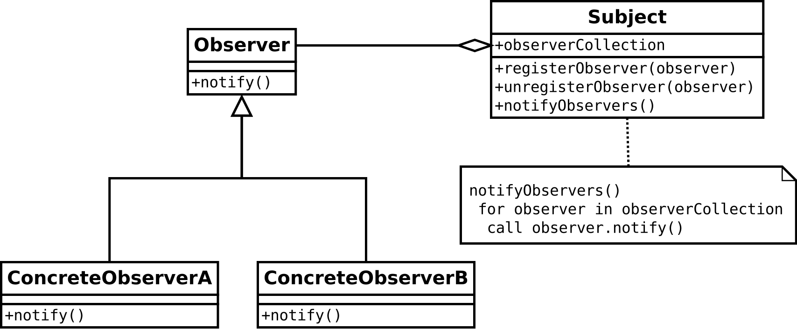

# Observer pattern

생성일: 2022년 10월 2일 오전 1:01
속성: Done
태그: #옵저버 패턴

## 옵저버 패턴이란.

> 옵서버 패턴(observer pattern)은 객체의 상태 변화를 관찰하는 관찰자들, 
즉 옵저버들의 목록을 객체에 등록하여 상태 변화가 있을 때마다 메서드 등을 통해 
객체가 직접 목록의 각 옵저버에게 통지하도록 하는 디자인 패턴이다. 
주로 분산 이벤트 핸들링 시스템을 구현하는 데 사용되며, 
발행/구독 모델로 알려져 있기도 하다.
> 



### 그냥 메서드로 구현하면 안되나요?

Subobjet에서 직접 변경 점을 업데이트 해주는 메서드를 만들어서 보내주는 방법도 있겠지만 

이는 강한 결합으로 이어지며 작은 프로젝트라면 문제 없지만,

큰 프로젝트라면 수정하면서 실수도 나오겠죠.

또한 상태를 업데이트 받아야 하는 객체가 많아진다면 일일이 더 추가하게 되면서 

코드 유지 보수는 더더욱 힘들어집니다.

### 그럼 옵저버를 쓰면 어떻게 되나요?

옵저버를 사용하여 구현한다면 아래의 코드처럼 

관찰해야 하는 클래스에 Subject 를 상속해주고

변화를 받아오는 클래스에 Observer 를 상속해 주는 것으로 해결됩니다.

Subject 클래스도 수정해야 하던 이전 방식에 비해서 훨씬 간편해집니다.

```java
import java.util.ArrayList;
import java.util.List;

interface Subject {
    public void register(Observer obj);
    public void unregister(Observer obj);
    public void notifyObservers();
    public Object getUpdate(Observer obj);
}

interface Observer {
    public void update(); 
}

class Topic implements Subject {
    private List<Observer> observers;
    private String message; 

    public Topic() {
        this.observers = new ArrayList<>();
        this.message = "";
    }

    @Override
    public void register(Observer obj) {
        if (!observers.contains(obj)) observers.add(obj); 
    }

    @Override
    public void unregister(Observer obj) {
        observers.remove(obj); 
    }

    @Override
    public void notifyObservers() {   
				// ClassName::MethodName 메소드 레퍼런스
        this.observers.forEach(Observer::update); 
    }

    @Override
    public Object getUpdate(Observer obj) {
        return this.message;
    } 
    
    public void postMessage(String msg) {
        System.out.println("Message sended to Topic: " + msg);
        this.message = msg; 
        notifyObservers();
    }
}

class TopicSubscriber implements Observer {
    private String name;
    private Subject topic;

    public TopicSubscriber(String name, Subject topic) {
        this.name = name;
        this.topic = topic;
    }

    @Override
    public void update() {
        String msg = (String) topic.getUpdate(this); 
        System.out.println(name + ":: got message >> " + msg); 
    } 
}

public class HelloWorld { 
    public static void main(String[] args) {
        Topic topic = new Topic(); 
        Observer a = new TopicSubscriber("a", topic);
        Observer b = new TopicSubscriber("b", topic);
        Observer c = new TopicSubscriber("c", topic);
        topic.register(a);
        topic.register(b);
        topic.register(c); 
   
        topic.postMessage("amumu is op champion!!"); 
    }
}
/*
Message sended to Topic: amumu is op champion!!
a:: got message >> amumu is op champion!!
b:: got message >> amumu is op champion!!
c:: got message >> amumu is op champion!!
*/
```
