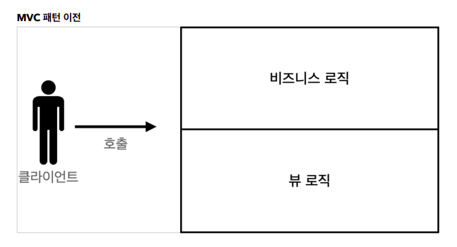
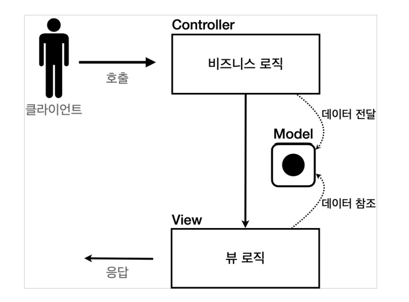
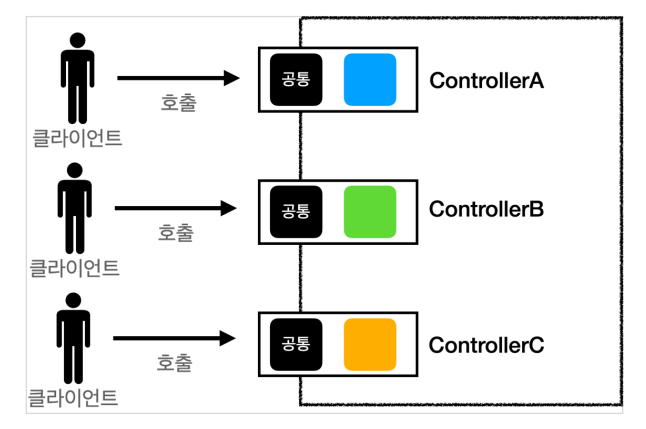
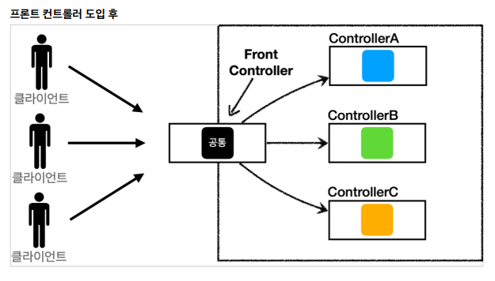

# 1.1.7 노출모듈 패턴

## **💡노출모듈 패턴(revealing module pattern)**
: 즉시 실행 함수를 통해 private, public 같은 접근 제어자를 만드는 패턴  

| 접근제어자 | 가능 범위 |
| --- | --- |
| public  | 클래스에 정의된 함수, 자식클래스, 외부 클래스 |
| protected | 클래스에 정의된 함수, 자식클래스  |
| private | 클래스에 정의된 함수 |
| 즉시 실행 함수 | 함수를 정의하자마자 바로 호출하는 함수 (초기화 코드, 라이브러리 내 전역 변수 충돌 방지 등에 사용) |

## **모듈 패턴**

**모듈**이란 전체 어플리케이션의 일부를 독립된 코드로 분리하여 만들어 놓은 것이다.

### 모듈화 시 장점

- 자주 사용되는 코드를 별도의 파일로 만들어서 필요할 때마다 활용할 수 있다.
- 코드를 개선하면 이를 사용하고 있는 모든 애플리케이션의 동작이 개선된다.
- 코드 수정 시에 필요한 로직을 빠르게 찾을 수 있다.
- 필요한 로직만을 로드해서 메모리의 낭비를 줄일 수 있다.
- 한번 다운로드된 모듈은 웹브라우저에 의해서 저장되기 때문에 동일한 로직을 로드할 때 시간과 네트워크 트래픽을 절약할 수 있다.(브라우저에서만 해당)

## **노출식 모듈 패턴 Revealing Module Pattern**

이 패턴은 모듈 패턴과 같은 개념으로 public과 private 메소드에 초점을 둔 패턴. 

모듈 패턴과 달리 **명시적으로 노출하고 싶은 부분**만 정해서 노출하는 방식

- Javascript에는 네임스페이스가 없기 때문에 전역 범위에서 실행되는 프로그램은 내부 어플리케이션과 종속된 라이브러리 코드의 데이터들로 인해 충돌이 발생할 수 있음, 이를 해결하기 위해 주로 이용되는 패턴

### **장점**

- 개발자에게 깔끔한 접근 방법을 제공
- private 데이터 제공
- 전역 변수를 덜 더럽힘
- 클로저를 통해 함수와 변수를 지역화
- 스크립트 문법이 더 일관성 있음
- 명시적으로 public 메소드와 변수를 제공해 명시성을 높임

### **단점**

- private 메소드 접근할 방법이 없음 (이런 메소드에 대한 테스트의 어려움을 이야기하기도 하지만 함수 무결성을 고려할 때 공개된 메소드만 테스트 하는게 맞음. 관련 없지만 기록용으로.)
- private 메소드에 대해 함수 확장하는데 어려움이 있음
- private 메소드를 참조하는 public 메소드를 수정하기 어려움

**참고링크**

[https://edykim.com/ko/post/revealing-module-pattern/](https://edykim.com/ko/post/revealing-module-pattern/)

[https://smilejsu.tistory.com/1976](https://smilejsu.tistory.com/1976)

[https://webclub.tistory.com/5](https://webclub.tistory.com/5)

[https://velog.io/@recordboy/자바스크립트-모듈-패턴](https://velog.io/@recordboy/%EC%9E%90%EB%B0%94%EC%8A%A4%ED%81%AC%EB%A6%BD%ED%8A%B8-%EB%AA%A8%EB%93%88-%ED%8C%A8%ED%84%B4)

# 1.1.8 MVC 패턴

## 💡 **MVC 패턴** 
: 애플리케이션의 구성 요소를 세 가지 역할(**M**odel-**V**iew-**C**ontroller)로 구분하여 개발 프로세스에서 각각의 구성 요소에만 집중해서 개발할 수 있도록 하는 개발 방법론

### **MVC 패턴 이전 개발 방식**

1. 서블릿 방식으로 개발을 진행하게 되면 뷰(View)단에서 HTML을 만드는 작업이 자바 코드에 섞여 지저분하고 복잡함 
2. 이를 해결하기 위해 JSP를 사용하여 중간중간 동적으로 변경이 필요한 부분만 자바 코드를 적용함
3. 그러나 JAVA코드, 데이터 조회 리포지토리 등 다양한 코드가 JSP에 노출되어 있으며, JSP가 너무 많은 역할을 하는 문제점을 가짐
4. 이를 해결하기 위해 몰려있는 역할을 나누어 처리하는 방법인 MVC패턴이 등장하게 됨

### **MVC**

| 모델(Model) | 애플리케이션의 데이터를 뜻함 (DB, 상수, 변수) |
| --- | --- |
| 뷰(View) | 사용자 인터페이스 요소 - UI (사용자가 볼 수 있는 화면) |
| 컨트롤러(Controller) | 하나 이상의 모델과 하나 이상의 뷰를 잇는 다리 역할, 이벤트 등의 메인 로직 담당, 모델&뷰의 생명주기 관리 |

**※ 각 컴포넌트는 서로 독립적이어야 함**

- **모델(Model)** : 비즈니스 로직 처리 후 모델의 변경사항을 컨트롤러와 뷰에 저장함
    - 사용자가 편집하길 원하는 모든 데이터를 가지고 있어야 함
    - 뷰나 컨드롤러에 대해서 어떤 정보도 알지 말아야 함
    - 변경이 일어나면, 변경 통지에 대한 처리 방법을 구현해야 함
- **뷰(View)** : MVC패턴은 여러개의 뷰가 존재할 수 있으며, 모델에게 질의하여 데이터를 전달받음
    - 모델이 가지고 있는 정보를 따로 저장X
    - 모델이나 컨트롤러와 같이 다른 구성요소를 몰라야 함
    - 변경이 일어나면 변경통지에 대한 처리방법을 구현해야 함
- **컨트롤러(Controller)** : 모델과 뷰 사이를 이어주는 역할을 함
    - 모델이나 뷰에 대해 알고 있어야 함
    - 모델이나 뷰의 변경을 모니터링해야 함

**MVC 패턴 동작 방식**

사용자 → Controller 조작 → Model을 통해 데이터를 가져옴 → View제어 → 사용자

**Web에 MVC 패턴 적용**

1. 사용자가 웹사이트에 접속(Web) - controller 호출
2. Controller는 사용자가 요청한 웹페이지를 서비스하기 위해 모델을 호출
3. Model은 데이터베이스, 파일과 같은 데이터 소스를 제어한 뒤 그 결과를 리턴함
4. Controller는 Model이 리턴한 결과를 View에 반영 (Updates)
5. 데이터가 반영된 View는 사용자에게 보여짐

**MVC 패턴의 장점**

- **유지보수의 편리성**
- 컨트롤러의 역할과 뷰 역할을 명확하게 구분 가능
- 뷰의 경우 화면을 그리는 역할에 충실하기 때문에 코드가 깔끔하고 직관적임

**MVC 패턴의 한계**

- 복잡한 대규모 프로그램이나 복잡한 화면을 구성 시 다수의 뷰와 모델이 컨트롤러를 통해 연결되어 컨트롤러가 불필요하게 커지는 현상 발생 (Massive-View-Controller)
- 공통처리 어려움

→ 기능이 복잡해질수록 컨트롤러에서 공통으로 처리해야하는 부분 증가

→ 단순히 공통 기능을 메서드로 뽑으면 될 것 같지만, 해당 메서드를 항상 호출해야하고, 실수로 호출하지 않으면 문제가 발생할 수 있다. +) 호출하는 것 자체가 중복

→ MVC 패턴의 한계를 해결하기 위해 다양한 패턴(MVP, MVVM, Flux, Redux, RxMVVM 등)이 도입됨 (스프링에서 추가된 패턴의 예로는 FrontController 패턴이 있음)

**+)** **FrontController 패턴이란?**

호출 전에 공통 기능을 처리하기 위한 수문장의 역할을 하는 기능을 도입한 패턴

**참고링크**

[https://www.inflearn.com/course/스프링-mvc-1/dashboard](https://www.inflearn.com/course/%EC%8A%A4%ED%94%84%EB%A7%81-mvc-1/dashboard)

[https://opentutorials.org/course/697/3828](https://opentutorials.org/course/697/3828)

[https://junhyunny.github.io/information/design-pattern/mvc-pattern/](https://junhyunny.github.io/information/design-pattern/mvc-pattern/)
