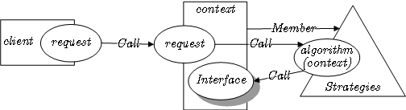

# Strategy pattern

또는: or Policy pattern
생성일: 2022년 10월 1일 오후 10:55
속성: Done
태그: #디자인 패턴, #전략 패턴, #정책 패턴

## 전략 패턴이란.

> **전략 패턴**(strategy pattern) 또는 **정책 패턴**(policy pattern)은 실행 중에 알고리즘을 선택할 수 있게 하는 행위 소프트웨어 디자인 패턴이다.
> 
- 특정한 계열의 알고리즘들을 정의하고
- 각 알고리즘을 캡슐화하며
- 이 알고리즘들을 해당 계열 안에서 상호 교체가 가능하게 만든다.



무인 판매 음료 매장을 운영한다고 생각해보자.

내가 특정 시간대를 happy time 이라고 정해두고 

그 시간대에 구입하는 사람들은 모두 50% 할인을 해준다고 한다면.

```java
class Customer {
	private List<Double> drinks;

	public Customer(IBillingStrategy strategy) {
		this.drinks = new ArrayList<Double>();
	}

	public void Add(double price, int quantity) {
		drinks.add(strategy.GetActPrice(price * quantity));
	}

	public void PrintBill() {
			double sum = 0;
			for (double i : drinks) {
					if (isHappyTime){
							sum += rawPrice * 0.5;
					} else {
							sum += rawPrice;
					}
			}
			
			System.out.println("Total due: " + sum);
			drinks.clear();
	}
}
```

다음과 같은 class를 구현 할 수 있을 것입니다. 

하지만 이는 기존의 코드를 수정하게 되는 문제와 

시스템이 확장 될 수록 코드가 복잡해지는 문제가 있습니다.

이런 식으로 목표하는 행동의 카테고리를 묶을 수 있고 그걸 수행하는 수단은 여러 개일 때

전략 패턴이 유효하게 작동합니다.

---

### 1. 특정한 계열의 알고리즘들을 정의하고

```java
import java.util.ArrayList;
import java.util.List;

public class StrategyPatternWiki {
	public static void Main(String[] args) {
		// 여기서는 목록을 담고 결제하는 일을 처리할 것이다.
	}
}

class Customer {
	// 손님은 음료를 고르고 결제하는 역할을 한다.
	private List<Double> drinks;
	private IBillingStrategy strategy;

	// 음료 추가
	public void Add(double price, int quantity) {
	}

	// 영수증 계산
	public void PrintBill() {
	}
}

// 결제 전략
interface IBillingStrategy {
	double GetActPrice(double rawPrice);
}

// 난 기본 전략이야 할인이 없어
class NormalStrategy implements IBillingStrategy {
	public double GetActPrice(double rawPrice) {
		return rawPrice;
	}
}

// 난 해피 타임 전략이야 50% 할인이지
class HappyHourStrategy implements IBillingStrategy {
	public double GetActPrice(double rawPrice) {
		return rawPrice * 0.5;
	}
}
```

### 2. 각 알고리즘을 캡슐화하며

```java
public class StrategyPatternWiki {
	public static void Main(String[] args) {
		// 여기서는 목록을 담고 결제하는 일을 처리할 것이다.
	}
}

class Customer {
	private List<Double> drinks;
	private IBillingStrategy strategy;
}

interface IBillingStrategy {
	double GetActPrice(double rawPrice);
}
```

### 3. 이 알고리즘들을 해당 계열 안에서 상호 교체가 가능하게 만든다.

```java
public static void Main(String[] args) {
		Customer firstCustomer = new Customer(new NormalStrategy());

		// Normal billing
		firstCustomer.Add(1.0, 1);

		// Start Happy Hour
		firstCustomer.setStrategy(new HappyHourStrategy());
		firstCustomer.Add(1.0, 2);

		// New Customer
		Customer secondCustomer = new Customer(new HappyHourStrategy());
		secondCustomer.Add(0.8, 1);
		// The Customer pays
		firstCustomer.PrintBill();

		// End Happy Hour
		secondCustomer.setStrategy(new NormalStrategy());
		secondCustomer.Add(1.3, 2);
		secondCustomer.Add(2.5, 1);
		secondCustomer.PrintBill();
}
```

<aside>
💡 위 내용을 정리하면 아래와 같은 코드가 작성됩니다.
결제 방식을 Main 함수에서 컨트롤 가능하며,
추가 결제 옵션이 생기더라도 class Customer 나 기존 결제 방식을 수정하지 않습니다.

</aside>

```java
import java.util.ArrayList;
import java.util.List;

public class StrategyPatternWiki {
	public static void Main(String[] args) {
		Customer firstCustomer = new Customer(new NormalStrategy());

		// Normal billing
		firstCustomer.Add(1.0, 1);

		// Start Happy Hour
		firstCustomer.setStrategy(new HappyHourStrategy());
		firstCustomer.Add(1.0, 2);

		// New Customer
		Customer secondCustomer = new Customer(new HappyHourStrategy());
		secondCustomer.Add(0.8, 1);
		// The Customer pays
		firstCustomer.PrintBill();

		// End Happy Hour
		secondCustomer.setStrategy(new NormalStrategy());
		secondCustomer.Add(1.3, 2);
		secondCustomer.Add(2.5, 1);
		secondCustomer.PrintBill();
	}
}

class Customer {
	private List<Double> drinks;
	private IBillingStrategy strategy;

	// Get/Set Strategy
	public IBillingStrategy getStrategy() {
		return strategy;
	}

	public void setStrategy(IBillingStrategy strategy) {
		this.strategy = strategy;
	}

	public Customer(IBillingStrategy strategy) {
		this.drinks = new ArrayList<Double>();
		this.strategy = strategy;
	}

	public void Add(double price, int quantity) {
		drinks.add(strategy.GetActPrice(price * quantity));
	}

	// Payment of bill
	public void PrintBill() {
		double sum = 0;
		for (double i : drinks) {
			sum += i;
		}
		System.out.println("Total due: " + sum);
		drinks.clear();
	}
}

interface IBillingStrategy {
	double GetActPrice(double rawPrice);
}

// Normal billing strategy (unchanged price)
class NormalStrategy implements IBillingStrategy {
	public double GetActPrice(double rawPrice) {
		return rawPrice;
	}
}

// Strategy for Happy hour (50% discount)
class HappyHourStrategy implements IBillingStrategy {
	public double GetActPrice(double rawPrice) {
		return rawPrice * 0.5;
	}
}

// 출처 - 위키백과
```
