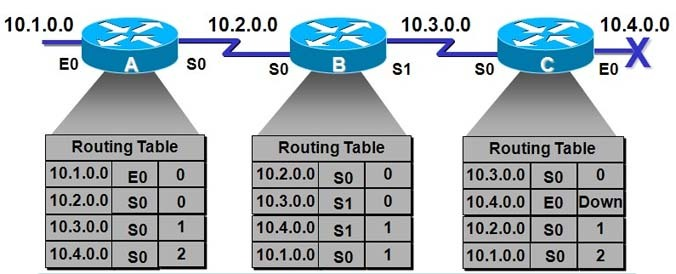
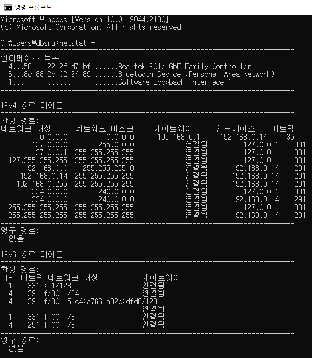
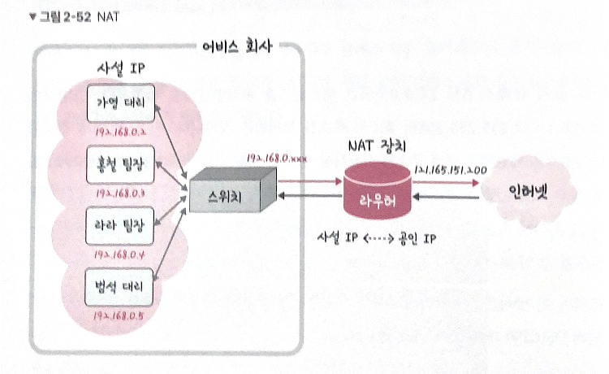

# 2.4. IP 주소

### IP 주소

**네트워크 계층의 기능을 수행하는 IP 프로토콜이 호스트를 구분하기 위해 사용하는 주소 체계**

임의의 호스트를 인터넷에 연결하려면 반드시 IP 주소를 할당

국제 표준화 기구가 전체 주소를 관리, 할당 - **유일성 보장**

최대 주소 공간의 크기가 32비트로 제한되어 **확장성에 많은 문제점 야기**

→ 새로운 프로토콜 IPv6(Internet Protocol Version 6): 128비트로 확장, 32비트=IPv4

패킷의 경로를 결정하는 데 중요한 역할

## 2.4.1 ARP

컴퓨터와 컴퓨터 간 통신은 IP 주소 기반

→ 보다 정확히: **ARP를 통해 MAC 주소를 찾아 MAC 주소를 기반으로 통신**

### ARP와 RARP

인터넷 모델에서 사용하는 주소: 데이터 링크 계층의 **MAC 주소**, 네트워크 계층의 **IP 주소**, 전송 계층의 **포트 번호**

- MAC 주소
    - 계층 2의 MAC (Medium Access Protocol) 계층에서 사용, **일반적으로 LAN 카드에 내장**
    - 물리 계층을 통해 데이터를 전송할 때 이용
- IP 주소
    - 인터넷에서 **네트워크 계층**의 기능을 수행하는 IP 프로토콜에 사용
    - 송신자 IP 주소와 수신자 IP 주소로 구분
    - 수신자 IP주소 = IP 패킷이 지나가는 경로를 결정하는 라우팅의 기준

통신을 위해 송신 호스트는 자신의 세 가지 주소 + 수신 호스트의 세 가지 주소를 모두 알아야 함

- 포트 번호: 사용자 프로그램에서 환경 → 할당과 관리가 동작에 크게 영향X
- 송신 호스트 IP 주소: 자신의 파일 시스템에 보관
- 수신 호스트 IP 주소: 일반 사용자가 접속하고자 하는 호스트의 IP 주소 지정
    - 사용자는 일반적으로 도메인 이름 입력, DNS 서비스를 통해 IP 주소로 변환
- 송신 호스트 MAC 주소: 자신의 LAN 카드에 내장
- **수신 호스트 MAC 주소: 송신 호스트의 내부 정보로 얻을 수 없음**

**→ ARP(Address Resolution Protocol) 기능을 통해 수신 호스트의 IP 주소에서 MAC 주소를 얻어야 함**

**ARP request(특수 패킷) 브로드 캐스팅**

네트워크의 모든 호스트가 수신, 관계 없는 호스트들은 패킷을 무시하고 **자신의 IP 주소와 동일한 호스트만 동일함을 인지**

해당 호스트는 **ARP reply 패킷**을 사용해 자신의 MAC 주소를 호스트 A에 회신

cf. 브로드 캐스팅: 네트워크에 연결된 모든 호스트에 데이터 전송

### RARP

RARP(Reverse Address Resolution Protocol): MAC 주소를 이용해 IP 주소를 제공

: **송신 호스트와 관련해서 IP 주소를 얻는 기능**

디스크가 존재하지 않는 시스템이나 X 윈도우 터미널에서는 **LAN 카드를 통해 MAC 주소를 알 수 있음**

**파일 시스템이 없어서 IP 주소 보관X** → 서버 호스트로부터 IP 주소를 얻어옴

## 2.4.2 홉바이홉 통신

IP 주소를 통해 통신하는 과정

**홉(hop)**: 각 패킷이 여러 개의 라우터를 건너가는 모습을 비유적으로 표현

통신 장치에 있는 라우팅 테이블의 IP를 통해 시작 주소부터 시작하여 다음 IP로 계속해서 이동하는 ‘라우팅’ 과정을 거쳐 패킷이 최종 목적지까지 도달하는 통신

### 라우팅

데이터를 최종 목적지까지 올바른 경로로 중개하는 교환(Switching) 기능

호스트 a에서 d로 데이터 전송

1. a-c 간의 직접 연결에 의한 **전송**
2. c에서의 올바른 경로 선택= **라우팅**
3. c-d 간의 직접 연결에 의한 **전송**

**라우터**: 올바른 경로를 선택하기 위해 라우팅 기능을 수행하는 호스트

### 라우팅 테이블

송신지에서 수신지까지 도달하기 위해 사용하는 라우터에 들어가 있는 **목적지 정보**들과 그 **목적지로 가기 위한 방법**이 들어 있는 리스트

게이트웨이, 모든 목적지에 대해 해당 목적지에 도달하기 위해 거쳐야 할 다음 라우터의 정보를 가지고 있음

필수 정보: (목적지 호스트, 다음 홉)

- **목적지 호스트**: 패킷의 최종 목적지가 되는 호스트의 주소 값
- **다음 홉**: 목적지 호스트까지 패킷을 전달하기 위한 이웃 라우터 ( 여러 경로 중 효괒거인 라우팅을 지원하는 경로)

라우팅 테이블 정보는 모든 라우터에 존재, 라우터마다 내용이 다름

### 게이트웨이

**서로 다른 통신망, 프로토콜**을 사용하는 네트워크 간의 통신을 가능하게 하는 관문 역할을 하는 컴퓨터나 소프트웨어를 두루 일컫는 용어

ex. 인터넷 공유기, 랜이나 무선 랜을 인터넷이나 다른 원거리 통신망에 연결

사용자는 인터넷에 접속하기 위해 수많은 톨게이트인 게이트웨이를 거쳐야 함

**서로 다른 네트워크 상의 통신 프로토콜을 변환해주는 역할**

cmd 창에서 `netstat -r` 을 실행해 라우팅 테이블을 확인 가능

## 2.4.3 IP 주소 체계

IPv4와 IPv6로 나뉨

IPv4: 32비트를 8비트 단위로 점을 찍어 표기

ex. 11010011 11011111 11001001 00011110 → 211.223.201.30 (10진수)

IPv6: 64비트를 16비트 단위로, 16비트의 숫자 8개를 콜론으로 구분 

ex. D1D1:1111:3F3F:1700:4545:1212:1111:1231 등

### 클래스 기반 할당 방식

처음에는 A, B, C, D, E 다섯 개의 클래스로 구분하는 클래스 기반 할당 방식 사용(CIDR)

클래스 A, B, C = 유니 캐스팅 / 클래스 D = 멀티캐스팅 / 클래스 E = 향후 새로운 환경

클래스 A, B, C= 주소를 network와 host 필드로 구분

- **network:** 네트워크 주소, 전 세계적으로 유일한 번호가 모든 컴퓨터 네트워크에 할당, NIC에서 할당을 담당
- **host**: 개별 네트워크 관리자가 host 비트 값 할당, 클래스 A: 규모가 큰 네트워크, C: 작은 네트워크

**가장 왼쪽에 있는 비트: 구분 비트** = 각 클래스를 구분할 수 있음

- **IP 주소 값에 따른 주소 체계**
    - 클래스 A: 0.0.0.0 ~ 127.255.255.255
    - 클래스 B: 128.0.0.0 ~ 192.255.255.255
    - 클래스 C: 192.0.0.0 ~ 223.255.255.255
    - 클래스 D: 224.0.0.0 ~ 239.255.255.255
    - 클래스 E: 240.0.0.0 ~ 255.255.255.255

네트워크의 첫 번째 주소=네트워크 주소

가장 마지막 주소=브로드캐스트용 주소, 네트워크에 속해 있는 모든 컴퓨터에 데이터를 보낼 때 사용

ex. 클래스 A로 12.0.0.0 이란 네트워크를 부여받음 → 12.0.0.1 ~ 12.255.255.255.254의 호스트 주소를 부여받은 것

12.0.0.0: 첫 번째 주소=네트워크 구별 주소

12.255.255.255: 마지막 주소=브로드캐스트용 주소 → **두 주소는 호스트 주소로 사용 불가능**

### DHCP

네트워크 관리자는 개별 호스트들에 수동으로 고정 IP 주소를 할당할 수 있음

**DHCP(Dynamic Host configuration Protocol)**: IP 주소 및 기타 통신 매개 변수를 자동으로 할당하기 위한 네트워크 관리 프로토콜

할당 가능한 IP 주소는 DHCP 서버가 관리하는 풀에 저장되어 관리

클라이언트로부터 IP 주소 요청이 오면 풀에서 하나의 IP 주소를 할당, 사용이 끝나면 풀로 반환

### NAT

Network Address Translation: **패킷이 라우팅 장치를 통해 전송되는 동안 패킷의 IP 주소 정보를 수정하여 IP 주소를 다른 주소로 매핑하는 방법**

IPv4 주소 체계만으로는 많은 주소들을 감당x → NAT로 **공인 IP와 사설 IP로 나눠서 많은 주소 처리**

소프트웨어: ICS, RRAS, Netfilter

홍철 팀장, 가영 대리: 192.168.0.xxx를 기반으로 각각의 다른 IP를 가지고 있음: **사설 IP**

NAT 장치를 이용해 하나의 **공인 IP**인 121.165.151.200 으로 외부 인터넷에 요청

사설 IP ↔ 공인 IP 변환

- 공유기와 NAT

여러 대의 호스트가 하나의 공인 IP 주소를 사용하여 인터넷에 접속하기 위해

인터넷 공유기를 달아 인터넷 회선 하나를 여러 PC가 사용 → NAT 기능이 탑재

- NAT를 이용한 보안

내부 네트워크에서 사용하는 IP 주소와 외부에 드러나는 IP 주소를 다르게 유지 → 내부 네트워크에 대한 보안 가능

- 단점

여러 명이 동시에 인터넷 접속 → 접속하는 호스트 숫자에 따라 접속 속도가 느려질 수 있음

## 2.4.4 IP 주소를 이용한 위치 정보

인터넷에서 사용하는 네트워크 주소 → 동 또는 구까지 위치 추적 가능

[https://mylocation.co.kr/](https://mylocation.co.kr/) IP 주소를 기반으로 위치를 찾는 사이트

---

[https://enter.tistory.com/m/165](https://enter.tistory.com/m/165)

[https://ko.wikipedia.org/wiki/게이트웨이](https://ko.wikipedia.org/wiki/%EA%B2%8C%EC%9D%B4%ED%8A%B8%EC%9B%A8%EC%9D%B4)

박기현, 쉽게 배우는 데이터 통신과 컴퓨터 네트워크 3판