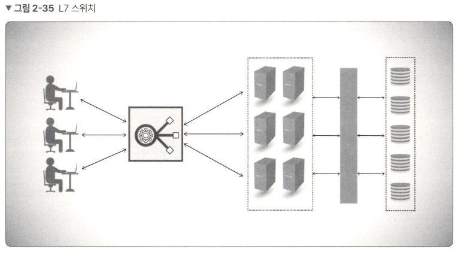
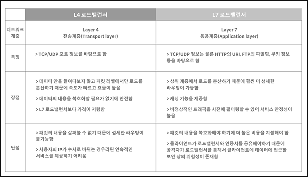
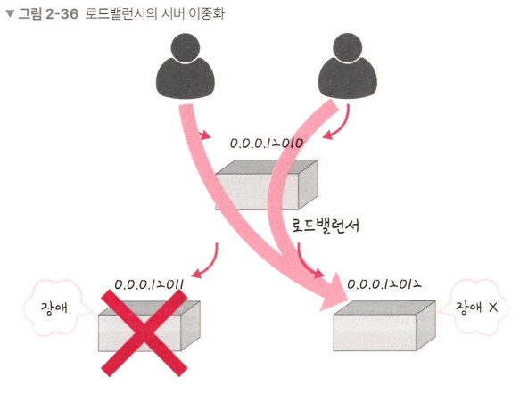
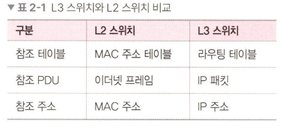
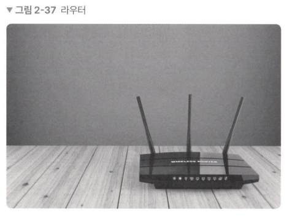
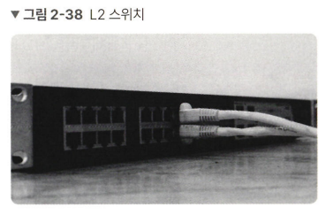
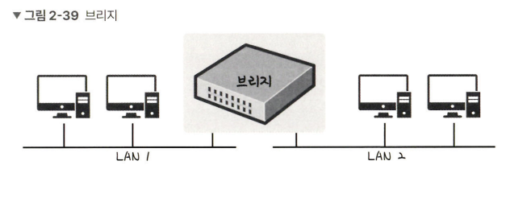
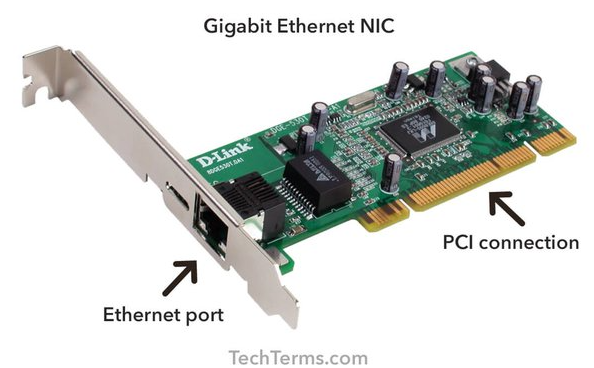
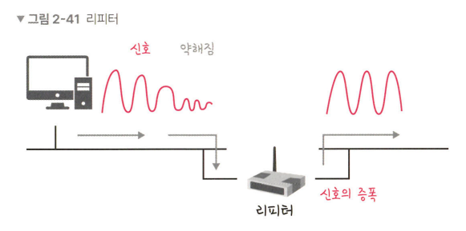
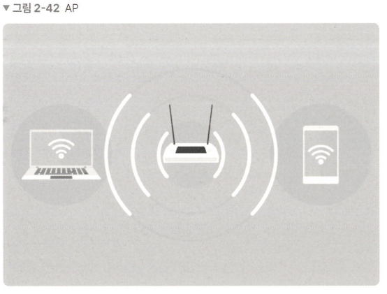

# 네트워크 기기

## 네트워크 기기의 처리 범위

네트워크 기기는 **계층 별**로 처리 범위를 나눌 수 있다.

**이 때 상위 계층을 처리하는 기기는 하위 계층을 처리할 수 있지만, 그 반대는 불가능하다.**

- **애플리케이션 계층** : L7 스위치
- **인터넷 계층** : 라우터, L3 스위치
- **데이터 링크 계층** : 브릿지, L2 스위치
- **물리 계층** : NIC, 리피터 ,AP

예를 들어 L7 스위치는 모든 계층의 프로토콜을 처리할 수 있지만 AP 는 물리 계층만 처리할 수 있다.

## **애플리케이션 계층 처리 기기**

### L7 스위치

- **스위치**는 여러 장비를 연결하고 데이터 통신을 중재하며 목적지가 연결된 포트로만 전기 신호를 보내 데이터를 전송하는 통신 네트워크 장비이다.
- **L7 스위치**는 **로드밸런서**라고도 불리며 **서버의 부하를 분산**하는 기기이다.
- 클라이언트로부터 오는 **요청들을 뒤쪽 서버로 나누는 역할**을 하며, 시스템이 처리 할 수 있는 **트래픽 증가**를 목표로 한다.
- URL, 서버, 캐쉬, 쿠키들을 기반으로 **트래픽을 분산**해주고, 바이러스, 불필요한 외부 데이터 등을 걸러내는 필터링 기능 또한 가지고 있으며 모니터링까지 가능하다.
- 만약 **장애가 발생한 서버가 있다면** 이를 트래픽 분산 대상에서 제외해야 하는데, 이는 정적으로 **헬스 체크**를 이용하여 감시하면서 이루어집니다.

<aside>
    
💡
    **로드 밸런싱이란?** 
    네트워크 또는 서버에 가해지는 부하를 분산해 주는 기술을 의미한다. 로드 밸런싱 기술을 제공하는 서비스 또는 장치를 로드 밸런서 (LB, Load Balancer)라고 부른다. LB는 클라이언트와 네트워크 트래픽이 집중되는 서버들 사이에 위치하며 VIP (Virtual IP)와 함께 구성된다. 또한, 특정 서버에 부하가 집중되지 않도록 트래픽을 다양한 방법으로 분산하여 서버들의 성능을 최적인 상태로 유지할 수 있도록 한다.

</aside>

<aside>
    
💡 
    **VIP란?** 
    로드 밸런싱의 대상이 되는 여러 서버를 대표하는 가상의 IP이다. 클라이언트들은 서버의 IP로 직접 요청을 하는 것이 아니라 LB가 가지고 있는 VIP를 대상으로 요청한다. 그리고 LB는 설정된 부하 분산 방법에 따라 각 서버로 요청을 분산한다.

</aside>

참고 링크 : [https://steady-coding.tistory.com/535](https://steady-coding.tistory.com/535)

### L7 스위치와 L4 스위치의 차이점

- L7 스위치 뿐 아니라 L4 스위치도 로드밸런서이다.
- **L4 스위치**는 인터넷 계층을 처리하는 기기로 **스트리밍 관련 서비스에서는 사용할 수 없으며**, 메시지를 기반으로 인식하지 못하고 **IP**와 **포트**(특히) 기반으로 트래픽을 분산한다.
- **L7 스위치**는 **IP, 포트, URL, HTTP헤더, 쿠키** 등을 기반으로 트래픽을 분산한다.
- 클라우드 서비스(AWS 등)에서 L7스위치를 이용한 로드 밸런싱은 **ALB 애플리케이션 로드밸런서 컨포넌트**, L4스위치를 이용한 로드밸런싱은 **NLB 네트워크 로드밸런서 컨포넌트**라고 한다.

### 헬스 체크

- 헬스 체크란 전송 주기와 재 전송 횟수 등을 설정한 이후 반복적으로 서버에 요청을 보내는 것
- L4스위치, L7스위치 모두 헬스 체크를 통해 **정상적인 서버 또는 비정상적인 서버를 판별**한다.
- 서버에 부하가 되지 않을 만큼 요청 횟수가 적절해야함
- TCP, HTTP 등 다양한 방법으로 요청을 보내며, 요청이 정상적으로 이루어 졌다면 정상적인 서버로 판별한다.
    - ex) TCP 요청을 했는데 3웨이 핸드셰이크가 정상적으로 일어나지 않았다면 비정상
    

### 로드밸런서를 이용한 서버 이중화

- 로드밸런서의 대표적인 기능으로 **서버 이중화**가 있음
- 서비스를 안정적으로 운영하기 위해 2대 이상의 서버는 필수적. 에러가 발생하여 서버 1대가 종료되더라도 서비스는 안정적으로 운용되어야 하기 때문
- 로드벨런서는 2대 이상의 서버를 기반으로 가상 IP를 제공하고 이를 기반으로 안정적인 서비스를 제공

## **인터넷 계층** 처리 기기

### **라우터**

- 라우터는 **여러개의 네트워크를 연결, 분할, 구분**시켜주는 역할을 수행한다.
- 다른 네트워크에 존재하는 장치끼리 서로 데이터를 주고받을 때 **패킷 소모를 최소화**하고, **경로를 최적화**하여, **최소 경로로 패킷을 포워딩** 하는 방식으로 라우팅 하는 장비이다.

<aside>
    
💡 
    **라우팅**이란? 
    우리가 네트워크에서 특정 경로로 데이터를 보낼때 사용되는 과정을 말한다.

라우팅은 어떤 네트워크 안에서 데이터를 최적의 경로를 선택하는 과정을 말한다. 여기서 최적의 경로는 최단거리가 될 수도 있고, 가장 빠른 시간에 전달하는 것으로 계산될 수 도 있다.

</aside>

### **L3 스위치**

- **L2 스위치**의 기능과 **라우팅** 기능을 갖춘 장비를 말한다.
- L3 스위치를 라우터라고 봐도 무방하다.
- 라우터는 소프트웨어 기반, 하드웨어 기반의 라우팅을 하는것으로 나눠지고, 그 중 **하드웨어 기반의 라우팅**을 담당하는 장치를 L3 스위치라고 한다.

## **데이터 링크 계층 처리 기기**

**L2 스위치**

- 장치들의 **MAC 주소**를 MAC 주소 테이블을 통해 관리
- 연결된 장치로부터 패킷이 왔을 때 **패킷 전송**을 담당한다.
- IP 주소를 이해하지 못해 **IP 주소를 기반으로 라우팅은 불가능**하며, 단순 패킷의 MAC 주소를 읽어 스위칭하는 역할을 한다.
- 목적지가 MAC 주소 테이블에 없다면 전체 포트에 전달하고 MAC 주소 테이블의 주소는 일정시간 이후 삭제하는 기능도 있다.

**브리지**

- 두 개의 **근거리 통신망(LAN)을 상호 접속할 수 있도록 하는 통신망 연결 장치**로, 포트와 포트 사이의 다리 역할을 한다.
- 장치에서 받아온 MAC 주소를 MAC 주소 테이블로 관리합니다.
- 통신망 범위를 확장하고 서로 다른 LAN 등으로 이루어진 하나의 통신망을 구축할때 쓰인다.

## **물리 계층을 처리하는 기기**

**NIC**

- **LAN 카드**라고 하는 네트워크 인터페이스 카드(NIC)는 2대 이상의 컴퓨터 네트워크를 구성하는데 사용
- 네트워크와 빠른 속도로 **데이터를 송수신**할 수 있도록 컴퓨터 내에 설치하는 확장 카드
- 각 LAN 카드 (NIC) 에는 주민등록번호처럼 각각을 구분하기 위한 **고유 식별번호인 MAC 주소**가 있다.

**리피터**

- 들어오면서 **약해진 신호 정도를 증폭하여 다른쪽으로 전달**하는 장치
- 이를 통해 **패킷**이 더 멀리 갈 수 있다.
- 하지만 **광케이블**이 보급됨에 따라 현재는 잘 쓰이지 않는 장치

**AP**

- **Access Point** 는 패킷을 복사하는 기기
- AP에 유선 LAN을 연결한 후 다른 장치에서 **무선 LAN기술(WIFI)**을 사용하여 무선 네트워크에 연결 할 수 있다.

<aside>
    
💡 
    **패킷(Packet)**
    이란 네트워크에서 출발지와 목적지간에 라우팅 되는 데이터 단위입니다.

</aside>
