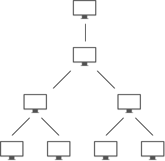
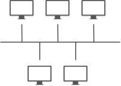
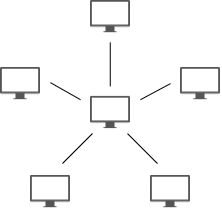
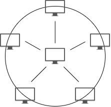
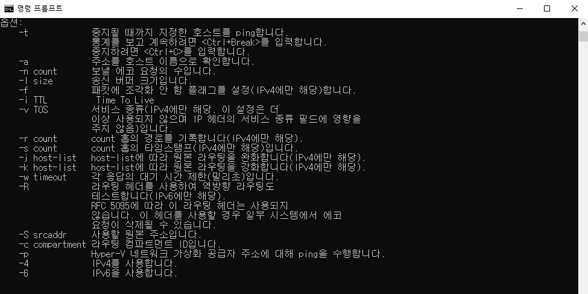
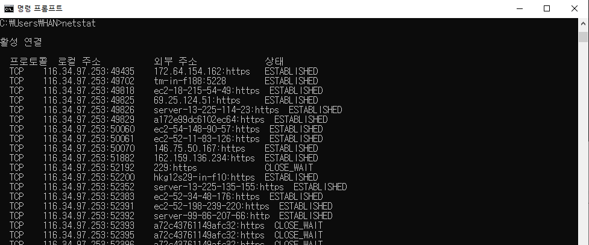
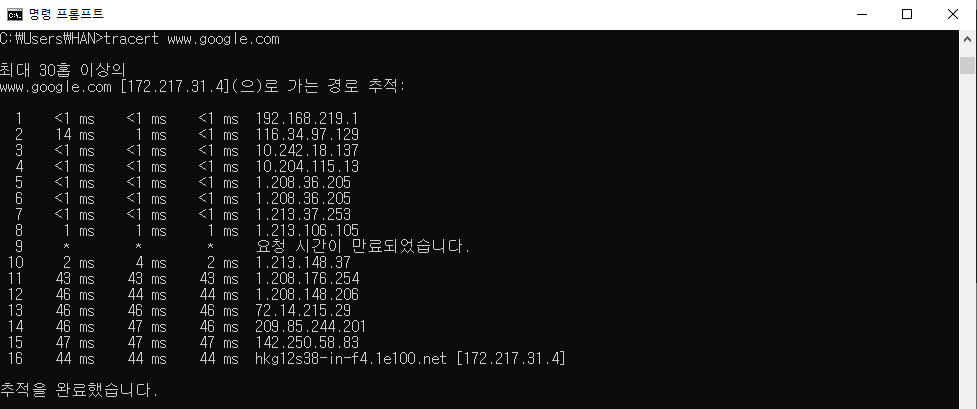

# 네트워크 정리

네트워크란 노드(Node)와 링크(Link)의 집합체로, 컴퓨터 등의 장치를 통신 기술을 이용하여 연결한 통신망을 의미한다. 여기서 노드가 될 수 있는 것에는 서버, 라우터, 스위치 등 네트워크 장치 전반이 있겠고, 링크는 유선 또는 무선 연결을 의미한다고 볼 수 있다.

## 처리량과 지연시간

좋은 네트워크의 조건

- 많은 처리량
- 짧은 지연시간
- 적은 장애 빈도수
- 좋은 보안

### 처리량(Throughput)

링크를 통해 어떤 노드로부터 다른 노드로 전달되는 단위 시간 당 데이터양을 의미

<aside>
💡 데이터(bit) / 초(sec) = 단위 시간 당 데이터(bps = bit per second)

</aside>

### 지연 시간(Latency)

요청이 처리되는데 걸리는 시간을 지연 시간 혹은 레이턴시라고 하며, 네트워크 상에서는 두 노드 사이를 데이터가 왕복하는데 걸리는 시간이라고 할 수 있다

## 네트워크 토폴로지

컴퓨터 네트워크 요소들(노드, 링크 등)을 물리적으로 연결해 놓은 방식을 의미한다

이러한 토폴로지에 대한 연구는 그래프 이론을 사용한다

### 트리 토폴로지

계층형 토폴로지라고도 하며 네트워크가 트리 형태로 배치된 구성을 의미한다

노드의 추가, 삭제가 간단하며 특정 노드에 트래픽이 집중되면 자식 노드에 영향이 간다는 단점이 있음

### 버스 토폴로지

중앙 회선 하나에 여러개의 노드가 연결되어 공유하는 네트워크 구성을 의미한다

주로 근거리 통신망(LAN)에서 사용한다

설치비용이 적고 신뢰성이 우수하며 중앙 회선에 노드를 추가하거나 삭제하기 쉽지만

스푸핑이 가능하다는 단점이 있음

### 스타 토폴로지

중앙 노드에 모든 노드가 연결된 네트워크 구성을 의미한다

노드 추가가 쉽고 패킷의 충돌 발생가능성이 낮다

어떤 노드에 장애나 에러가 생겼는지 탐지하기 쉽고, 중앙 노드가 정상일 경우 다른 노드에 영향을 끼칠 가능성이 적다

단지 중앙 노드에 장애나 에러가 발생하면 전체 네트워크를 사용할 수 없게 되고 비용이 많이 든다는 단점이 있다

### 링 토폴로지

각각의 노드가 양 옆 노드와 연결된 고리 모양의 네트워크 구성을 의미한다

노드의 수가 증가해도 네트워크 상의 손실이 거의 없고, 충돌 발생 가능성이 적으며 노드의 장애나 에러를 탐지하기 쉽다

다만 노드의 추가 및 삭제 등 네트워크 구성의 변경이 어렵고 회선 하나에 장애가 발생하면 전체 네트워크에 영향을 끼치는 단점이 있다

### 메시 토폴로지

노드가 그물망처럼 서로서로 연결되어 있는 네트워크 구성을 의미한다

한 노드에 장애가 발생해도 다른 링크를 통해 네트워크를 계속 사용할 수 있고 트래픽의 분산 처리도 가능하다

단점으로는 네트워크 구성 변경이 어렵고 구축 비용 및 운용 비용이 고가라는 점이 있다

### 병목 현상 (Bottleneck)

전체 시스템의 성능이나 용량이 하나의 구성요소로 인해 제한을 받는 현상을 의미한다

네트워크 구조(토폴로지)에 대해 파악하고 있다면 어디서 병목 현상이 일어났는지 찾을 때 중요한 기준이 될 수 있다.

## 네트워크 분류

네트워크는 규모에 따라 분류할 수 있다

### PAN (Personal Area Network)

3m 내의 초근거리 간 네트워크를 의미한다. 짧은 거리로 인해 유선보다는 무선의 네트워크가 활용된다. 블루투스, 무선 마우스 등이 이에 해당된다.

### LAN (Local Area Network)

수 km 범위 이내의 사무실, 건물 내 정도의 작은 규모의 공간에서 운영되는 네트워크를 의미한다. 전송 속도가 빠르고 혼잡하지 않다. Wi-Fi가 해당됨.

### MAN (Metropolitan Area Network)

최대 75km 정도 범위 내의 대도시 지역 네트워크를 의미하며 LAN과 WAN의 중간 정도 특성을 가지고 있다. 데이터, 음성, 영상 등을 지원하기 위해 개발되었으며, 전송 매체로는 동축 케이블과 광케이블이 사용된다. 

### WAN (Wide Area Network)

광대역 네트워크를 의미하며 국가, 대륙과 같은 넓은 지역에서 운용되는 네트워크를 의미한다.

선로 에러율이 높고, 전송 지연이 크기 때문에 전송 속도가 느리다. 이 때문에 전송 효율과 특성을 고려해야 하고, 두 목적지 사이를 최단 경로로 연결시켜 주는 라우팅 알고리즘이 중요하다. 우리가 사용하는 인터넷이 이에 해당한다.

## 네트워크 성능 분석 명령어

네트워크의 병목 현상의 주된 원인은 다음과 같다

- 네트워크 대역폭
- 네트워크 토폴로지
- 서버CPU, 메모리 사용량
- 비효율적 네트워크 구성

사용은 윈도우의 경우 실행창 - cmd 명령어를 통해 해볼 수 있다

### ping (Packet INternet Groper)

ping은 네트워크 상태를 확인하고자 하는 노드를 향해 일정 크기의 패킷을 전송하는 명령어이다

해당 노드의 패킷 수신 상태나 도달하는데 걸리는 시간을 알 수 있다

ping 명령어의 옵션

ping www.google.com -n 12 명령어의 실행 결과

www.google.com 주소에 12번 요청(패킷)을 보낸 결과

TTL (Time To Live) : 패킷의 유효 기간을 나타내는 값으로, 단위는 초(sec)이다. 패킷의 무한 루프 방지를 위한 기능으로 만들어졌으며, 라우터를 거칠 때마다 1씩 차감된다. TTL이 0이 되면 그 패킷은 폐기된다. 윈도우의 경우 기본 TTL값이 128로 시작한다.

### netstat

netstat 명령어는 접속되어 있는 서비스들의 네트워크 상태를 표시하는데 사용된다. 

### tracert

tracert 명령어는 목적지 노드까지의 네트워크 경로를 확인하기 위한 명령어이다

목적지까지 가는 구간 중 어느 구간에서 응답 시간이 느려지는지 등을 확인할 수 있다

tracert www.google.com 의 실행결과

## 네트워크 프로토콜

> 복수의 컴퓨터, 중앙 컴퓨터, 단말기 사이에서 데이터 통신을 원활하게 하기 위한 통신 규약. 신호 송신의 순서, 데이터의 표현법, 오류 검출법 등을 정함.
> 

서로 다른 운영체제, 단말이더라도 동일한 프로토콜을 사용하면 상호 통신이 가능해지기 때문에 표준 프로토콜을 채택하여 네트워크를 구축해야 한다.

### 프로토콜의 3요소

- 구문(Syntax) : 송수신 데이터 형식, 부호화 방법 등을 정의
- 의미(Semantic) : 오류 제어, 동기 제어, 흐름 제어와 같은 각종 제어 절차에 관한 정보 정의
- 순서(Timing) : 송/수신자 간 혹은 양단의 통신 시스템과 망 사이의 통신 속도나 순서 등을 정의

### 프로토콜의 기능

- 주소 지정(Addressing) : 각 전송 계층에 맞는 송신자와 수신자의 주소 지정
- 순서 제어(Sequence Control) : 데이터 단위가 전송될 때 보내지는 순서 명시
- 단편화와 재조립(Fragmentation & Reassembly) : 전송 효율을 높이기 위해 작은 단위로 데이터 단편화 및 응용 프로그램에서 재사용하기 위한 재조립
- 캡슐화(Encapsulation) : 데이터에 제어 정보를 덧붙임
- 연결 제어(Connection Control) : 연결 설정, 데이터 전송, 연결 해제에 대한 통제 수행
- 흐름 제어(Flow Control) : 송신측 개체에서 오는 데이터의 양과 속도 조절
- 오류 제어(Error Control) : 데이터를 교환할 때 오류 검사
- 동기화(Sychronization) : 두 개체 간에 데이터가 전송될 때 특정 타이머값 등 서로의 상태 동기화
- 다중화(Multiplexing) : 여러 시스템이 동시에 통신할 수 있는 기법