# 2.2. TCP/IP 4계층 모델

## 2.2.1 계층 구조

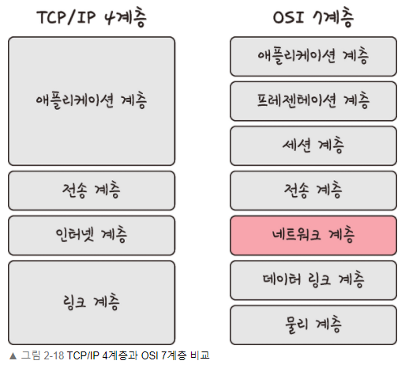

- OSI 7계층
    - TCP/IP 4계층의 **애플리케이션 계층**을 3개로 나눔
    - **링크 계층**을 데이터 링크, 물리 계층으로 나눔
    - **인터넷 계층** → 네트워크 계층

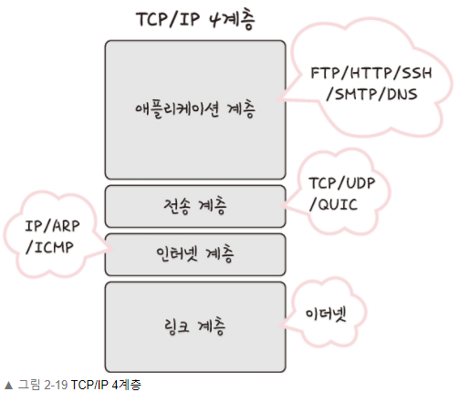

**애플리케이션 계층**

- 웹 서비스, 이메일 등 서비스를 실질적으로 사람들에게 제공해주는 계층
- FTP, HTTP, SSH, SMTP, DNS 등 응용 프로그램이 사용되는 프로토콜 계층
    - FTP : 장치와 장치 간 파일 전송에 사용되는 표준 통신 프로토콜
    - SSH : 보안되지 않은 네트워크에서 네트워크 서비스를 안전하게 운영하기 위한 암호화 네트워크 프로토콜
    - HTTP : World Wide Web 을 위한 데이터 통신의 기초, 웹 사이트 이용에 사용하는 프로토콜
    - SMTP : 전자 메일 전송을 위한 인터넷 표준 통신 프로토콜
    - DNS : 도메인 이름 - IP 주소 매핑 서버

**전송 계층**

- 송신자 - 수신자를 연결하는 **통신 서비스** 제공
- 연결 지향 데이터 스트림 지원
- 신뢰성, 흐름 제어 제공
- 애플리케션 계층 - 인터넷 계층 사이의 데이터가 전달될 때 중계 역할
- **TCP, UDP**
    - **TCP**
        - 패킷 사이의 순서 보장
        - 연결지향 프로토콜 사용 → 신뢰성 구축
        - 가상회선 패킷 교환 방식 사용
        
        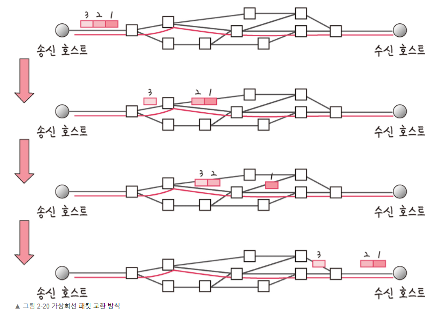
        
    - **UDP (User Datagram Protocol)**
        - 기능 거의 없지만 단순하고 빠름
        - 패킷 순서 보장 X
        - **패킷이 독립적으로 이동**하며 최적 경로 선택 → 도착 순서 다를 수 있음
        - 데이터그램 패킷 교환 방식 사용 (단순 데이터 전송)
        
        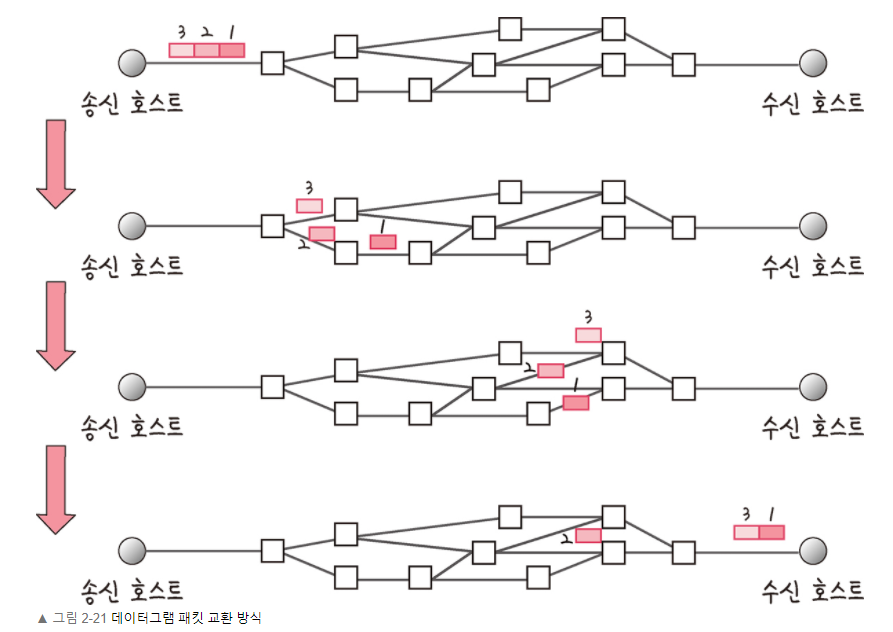
        

- **TCP 연결 성립 과정 (3-way handshake)**
    
    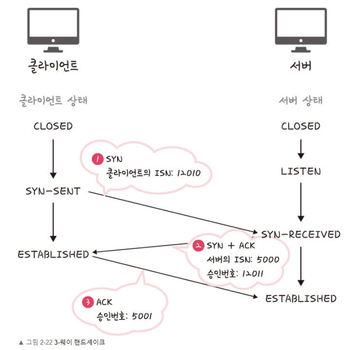
    
    1. SYN 단계 
        - 클라이언트 : 클라언트의 ISN을 담아 서버에 SYN을 보냄
        - ISN : 새로운 TCP 연결의 첫 번째 패킷에 하당된 임의의 시쿼스 번호 (장치마다 다름)
    2. SYN + ACK 단계 
        - 서버 : 클라이언트의 SYN를 수신, 서버의 ISN + 승인번호(클라이언트 ISN+1) 보냄
    3. ACK 단계
        - 클라이언트 : 서버의 ISN+1  값인 승인번호를 담아 ACK를 서버에 보냄
    
    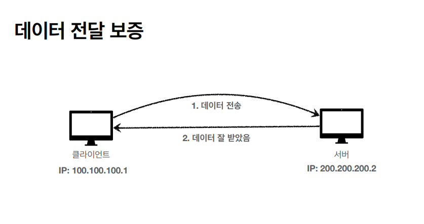
    
    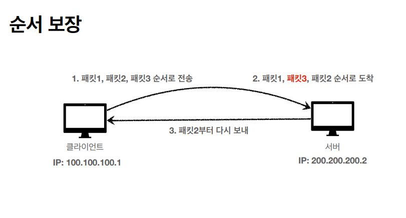
    

- **TCP 연결 해제 과정 (4-way hanshake)**
    
    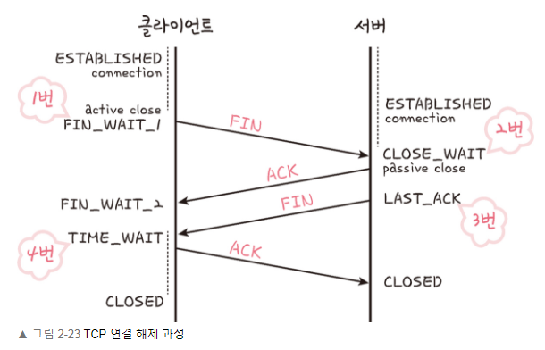
    
    1. 클라이언트 
        - 연결 닫기 위해 FIN으로 설정된 세그먼트 전송
        - FIN_WAIT_1 상태로 전환 (서버 응답 기다림)
    2. 서버 
        - 클라이언트에 ACK 승인 세그먼트 전송
        - CLOSE_WAIT 상태로 전환
        - 클라이언트가 세그먼트를 반으면 FIN_WAIT_2 상태로 전환
    3. 서버
        - ACK 전송 후 일정 시간 이후 클라언트에 FIN 세그먼트 전송
    4. 클라이언트 
        - **TIME_WAIT** 상태로 전환
        - 서버로 ACK 보냄
        - 서버 : CLOSED 상태로 전환
        - 일정 시간 대기 후 연결 종료 → 클라이언트, 서버 모든 자원 연결 해제
            - 지연 패킷 발생 대비 (데이터 무결성 유지)
            - 두 장치간 연결 닫힘 확인

**인터넷 계층**

- 장치로부터 받은 네트워크 패킷을 IP 주소로 지정된 목적지로 전송하기 위해 사용되는 계층
- 패킷을 수신해야 할 상대의 주소를 지정하여 데이터 전달
- 비연결형적 특징 (상대받의 정상수신 여부 확인 X)
- IP, ARP, ICMP ..
    
    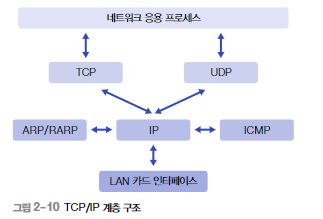
    
    - TCP/UDP : 데이터 송수신 기능 수행 (특별 환경에서 IP 프로토콜 직접 사용)
    - ICMP, ARP/RARP : 같은 계층에 속하는 IP 프로토콜의 도움을 받음
    - IP : 사용자 데이터 전송 프로토콜
    
    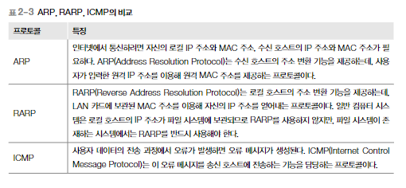
    

**링크 계층**

- 실질적으로 데이터를 전달하며 장치 간에 신호를 주고받는 ‘규칙’을 정하는 계층
- 네트워크 접근 계층이라고도 함
- 물리 계층 / 데이터 링크 계층으로 나누기도 함
    - 물리 계층 : 무선 LAN, 유선 LAN을 통해 0과 1로 이루어진 데이터를 보내는 계층
    - 데이터 링크 계층 : ‘이더넷 프레임’을 통해 에러 확인, 흐름 제어, 접근 제어 담당 계층
- 유선 LAN (IEEE802.3)
    - 전이중화(full duplex) 통신 사용
        - 양쪽 장치가 동시에 송수신 가능 방식
        - 송신로와 수신로로 나누어 데이터 전송
        
        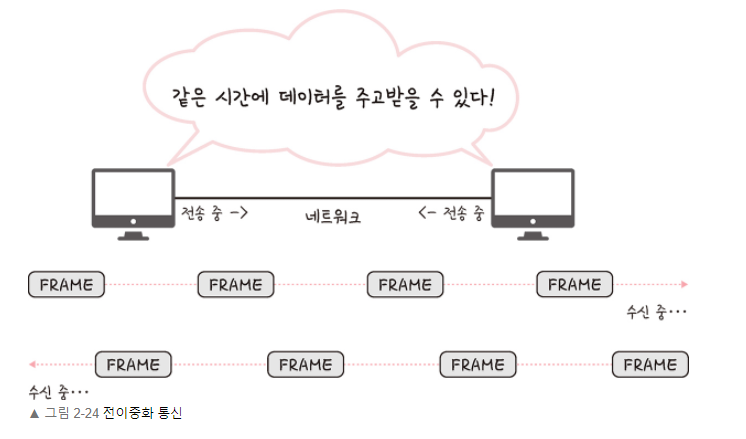
        
    - 유선LAN을 이루는 케이블 종류
        - 트위스트 페어 케이블(twisted pair cable) : 하나의 케이블처럼 보이지만 실제로는 여덟 개의 구리선을 두 개씩 꼬아서 묶은 케이블
            
            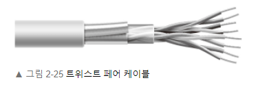
            
            - 케이블
                - UTP 케이블 : 구리선 실드 처리 X
                - STP 케이블 : 실드 처리 O
                
                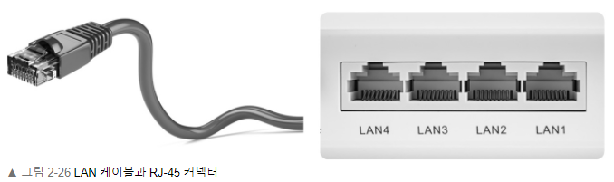
                
            - 광섬유 케이블
                - 광섬유로 만든 케이블
                - 레이저를 이용하여 통신 (장거리 & 고속 통신 가능)
                - 광섬유 내부와 외부를 다른 밀도를 가지는 유리 및 플라스틱 섬유로 제작해서 빛의 반사를 이용한 방식 (빛의 굴절률이 높은 부분 : 코어 / 낮은 부분 : 클래딩(cladding)
    - 무선 LAN (IEEE802.11)
        - 송수신에 같은 채널을 사용하기 때문에 반이중화 통신 사용
            - 반이중화(half duplex) 통신 : 양쪽 장치 서로 통신 가능 but 동시 통신 불가능, 한번에 한 방향만 통신 가능
                
                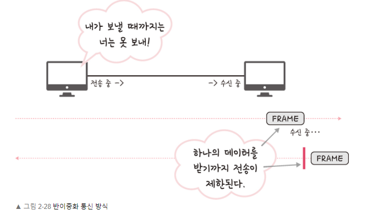
                

**CSMA / CD**

- 다중 접근 채널(Multiple Access Channel) 방식 이용 → 데이터 충돌 가능성 존재 **전송 방식**
- 데이터 전송 이후 충돌이 발생할 경우 일정 시간 이후 데이터 재전송
- **충돌 허용** : 이더넷 (CSMA/CD 방식)
    - 프레임을 송신한 호스트에서 충돌 감지 기능 필요 (충돌로 깨진 프레임 복구)
    - **충돌 발생↑ ⇒ 재전송↑ ⇒ 네트워크 성능↓**
    - **공유 매체 길이**↑,  **프레임 전송 지연**↑ ⇒ **충돌 발생 가능성** **↑**

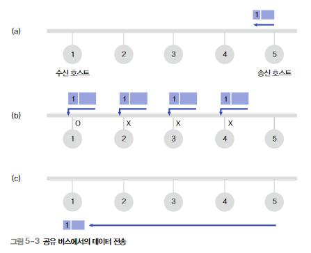

- **데이터 전송 과정**
    1. 호스트 5 → 호스트 1 데이터 전송, 타 호스트 공유버스 사용여부 확인 (a) 
    2. 버스 사용 X →  프레임 전송, 모든 버스에 전송(브로드캐스팅) (b)
    3. 2에서 다른 호스트가 데이터를 전송할 경우 충돌 발생 → 해결해야 함
    4. 2에서 프레임의 목적지가 아닌 호스트에서는 프레임 수신 X (각 호스트 고유주소 활용)
    5. 목적지 호스트에서 프레임 수신 (c)

**무선 LAN을 이루는 주파수**

- 무선 신호 전달 방식을 이용하여 2대 이상의 장치를 연결하는 기술
- 공기(비유도 매체)에 주파수를 쏘아 무선 통신망 구축
    - 주파수 대역 : 2.4GHz / 5GHz 중 하나 사용
    - 2.4GHz : 장애물에 강하지만 무선 등의 전파 간섭 일어남
    - 5GHz : 상대적으로 깨끗한 전파 환경 구축 가능

- **와이파이**
    - 전자기기들이 무선 LAN 신호에 연결하도록 하는 기술
    - 무선 접속 장치(AP, Access Point) 필요 (공유기)
    - 공유기를 통해 유선 LAN에 흐르는 신호를 무선 LAN 신호로 바꾸어줌
- **BSS (Basic Service Set)**
    - 기본 서비스 집합
    - 동일 BSS 내에 있는 AP 장치들이 서로 통신 가능한 구조
    - 근거리 무선 통신 제공
- **ESS (Extended Service Set)**
    - **하나 이상의 연결된 BSS 그룹**
    - 장거리 무선 통신 제공
    - BSS 보다 더 많은 가용성, 이동성 제공
    - 사용자가 한 장소에서 다른 장소로 이동하며 중단 없이 네트워크 연결 가능
    

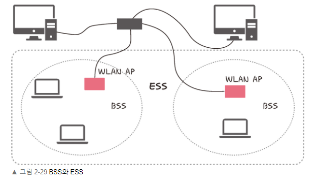

**이더넷 프레임**

- 이더넷 : 근거리 통신망(LAN) 환경에서 활용되는 네트워크 구성 방식 (IEEE802.3)

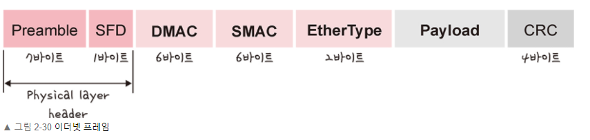

- 상위 계층에서 내려온 프레임을 상대 호스트에 전송하기 위해서는 정의된 프레임 구조에 맞게 포장해야 함 (캡슐화)
- 이더넷 프레임 구조
    
    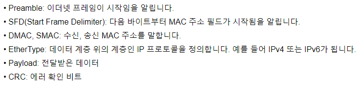
    
    +) MAC 주소 : 각 장치의 네트워크 연결 장치인 LAN카드를 구별하기 위한 식별번호
    

**계층 간 데이터 송수신 과정**

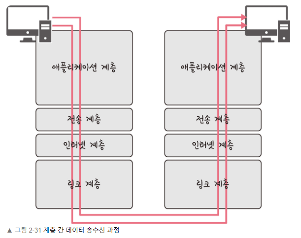

- 송신 호스트가 보낸 request 데이터에 대해 각 계층에서 캡슐화 과정을 거치고 링크 계층에서 물리적으로 전송 후 비캡슐화 과정을 통해 원래의 데이터로 복구하여 수신 호스트에게 전송됨

- 캡슐화 과정 (송신 호스트 → 서버 : 데이터 송신)
    
    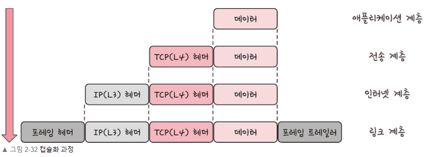
    
- 비캡슐화 과정 (서버→ 수신 호스트 : 데이터 수신)
    
    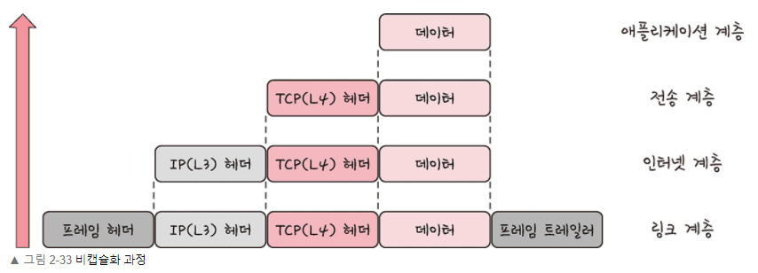
    

## 2.2.2 PDU (Protocol Data Unit)

- 네트워크의 어떠한 계층에서 계층으로 데이터가 전달될 때 **한 덩어리의 ‘단위’**
    - ex) 책을 한 ‘권’ 이라고 부르듯이 데이터를 각 계층에서 부르는 단위
- 제어 관련 정보들이 포함된 ‘**헤더**’, 데이터를 의미하는 ‘**페이로드**’로 구성 (계층마다 다르게 부름)
    - 애플리케이션 계층 : 메시지
    - 전송 계층 : 세그먼트(TCP), 데이터그램(UDP)
    - 인터넷 계층 : 패킷
    - 링크 계층 : 프레임(데이터 링크 계층), 비트(물리 계층)

