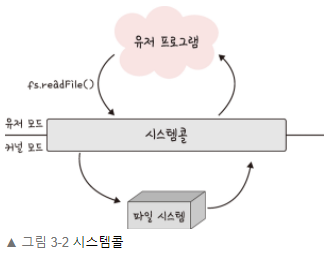
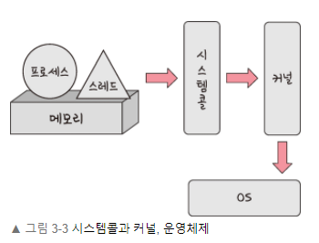
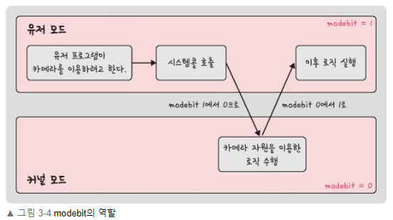

# 3.1 운영체제와 컴퓨터

## 3.1.1 운영체제의 역할과 구조

<aside>
💡 **운영체제(Operating System)**

사용자에게 편리한 인터페이스 환경을 제공하고 컴퓨터 시스템의 자원을 효율적으로 관리하는 소프트웨어

</aside>

### 운영체제의 역할

**인터페이스 환경 제공 + 자원관리**

| CPU 스케줄링과 프로세스 관리 | CPU 소유권을 어떤 프로세스에 할당할지, 프로세스의 생성&삭제, 자원 할당 및 반환 관리 |
| ---------------------------- | ----------------------------------------------------------------------------------- |
| 메모리 관리                  | 한정된 메모리를 어떤 프로세스에 얼만큼 할당해야 하는지 관리                         |
| 디스크 파일 관리             | 디스크 파일을 어떠한 방법으로 보관할지 관리                                         |
| I/O 디바이스 관리            | 입출력 디바이스 (마우스, 키보드) ↔ 컴퓨터 간 데이터 송수신 관리                     |

**프로세스 관리**

- 여러 개의 프로세스가 충돌 없이 원활하게 수행할 수 있도록 관리
- 프로세스가 정보를 공유 & 교환 가능하도록 함
- 각 프로세스 자원을 다른 프로세스로부터 보호
- 프로세스 간 동기화
- 프로세스 생성 및 제거
- 프로세스 중지 및 재시작

**기억장치(메모리) 관리**

- 한정된 용량의 주기억 장치에서 여러 개의 프로그램을 효율적으로 사용할 수 있도록 관리

  - **반입 전략** : 보조기억장치의 프로그램/데이터를 주기억장치에 **언제 적재**할 것인지 결정
  - **배치 전략** : 새로 반입되는프로그램/데이터를 주기억장치의 **어디에** **위치**시킬 것인지 결정
  - **교체 전략** : 주기억장치의 모든 영역이 이미 사용 중일 때, 새롭게 배치하기 위해 **삭제하고 사용할 영역 결정**

- **적재(loading)** : 주기억장치에 프로그램을 가져다 놓는 것
- **저장(saving)** : 보조기억장치에 프로그램/데이터 보관하는 것

**자원 관리**

- 파일 시스템 기능 : 파일 관리
- 디스크 관리 기능 : 보조기억장치 관리
- 컴퓨터 자료는 모두 파일 형태로 저장됨 (파일은 확장자를 사용하여 구분함)
- 디렉터리(폴더) : 관련있는 파일끼리 모아 보관
- 파일 시스템 기능 : 디렉터리 생성, 복사, 이동, 검색, 삭제 등
- 디스크 관리 기능: 디스크 포멧, 디스크 정리, 디스크 조각 모음

**I/O 디바이스 관리**

- 컴퓨터에 연결된 입출력 장치 및 주변 장치 관리 및 제어
- 입출력 장치 상태 파악
- 주변 장치 자동 인식 기능(PnP, Plug and Play)을 통해 컴퓨터에 장치를 추가할 때, 별도의 물리적 설정 없이 사용 가능

[[OS] 운영체제란 무엇인가?](https://coding-factory.tistory.com/300)

---

### 운영체제의 구조

**GUI, 시스템콜, 커널, 드라이버**가 운영체제

- GUI
  - 사용자가 전자장치와 상호 작용할 수 있는 UI의 한 형태
  - cmd 창이 아닌, 아이콘으로 마우스를 클릭하는 등의 동작 가능
- 드라이버
  - 하드웨어를 제어하기 위한 소프트웨어
- CUI
  - 그래픽이 아닌 명령어로 처리하는 인터페이스
  - 리눅스 서버의 경우 CUI 만 존재하는 것도 있음

**시스템콜**

- 운영체제가 커널에 접근하기 위한 인터페이스 (추상화 계층)
- 유저 프로그램이 운영체제의 서비스를 받기 위해 커널 함수 호출 시 사용
- 작동 방식

  1. 유저 프로그램 I/O 요청으로 트랩 발동
  2. 올바른 I/O 요청인지확인
  3. 유저모드 - (시스템콜) → 커널 모드 (modebit 사용)

     1. 유저 모드에서 파일을 읽지 않고 커널모드로 들어감

     2. 커널 모드에서 파일을 읽음

     3. 유저 모드로 돌아가 유저 프로그램의 로직 수행
        → 컴퓨터 자원에 대한 직접 접근 차단 가능
        → 프로그램을 타 프로그램으로부터 보호 가능
        

**modebit**

- 시스템 콜 작동 시 modebit을 참고하여 유저 모드 / 커널 모드 구분
- 1 or 0 값을 가지는 프래그 변수 (0 : 커널모드 / 1 : 유저모드)
- I/O 디바이스 운영체제를 통해서만 작동

**유저 모드**

- 유저가 접근할 수 있는 영역을 제한적으로 두며 컴퓨터 자원에 함부로 침범 X

**커널 모드**

- 모든 컴퓨터 자원에 접근 가능한 모드

**커널과 인터페이스**

운영체제는 크게 인터페이스와 커널 두 부분으로 나뉨

- **커널**
  - 프로세스 관리, 메모리 관리, 저장장치 관리와 같은 운영체제의 핵심적인 기능을 모아놓은 것
  - 운영체제의 성능 좌우
- **인터페이스**
  - 커널에 사용자의 명령을 전달하고 실행 결과를 사용자에게 알려주는 역할

**커널의 구성**

기능 구현 방식에 따라 구분

- 단일형 구조 커널 (monolithic architecture)
  - 초창기의 운영체제 구조로, 커널의 핵심 기능을 구현하는 모듈들이 구분 없이 하나로 구성되어 있다.
  - ex) 함수가 거의 없이 main()에 모든 기능을 구현한 것과 같다.
- 계층형 구조 커널 (layered architecture)
  - 계층형 구조 커널은 비슷한 기능을 가진 모듈을 묶어서 하나의 계층으로 만들고, 계층 간의 통신을 통해 운영체제를 구현하는 방식
  - 단일형 구조보다 버그나 오류를 쉽게 처리할 수 있고, 디버깅도 쉽다.
- 마이크로 구조 커널(micro architecture)
  - 마이크로 구조 커널은 가장 기본적인 기능만 제공
  - 다른 커널에 비해 운영체제의 많은 부분이 사용자 영역에 구현되어 있다.
  - 각 모듈은 세분화되어 존재하고 모듈 간의 정보 교환은 프로세스 간 통신을 이용하여 이루어진다.

[[Operating System] 운영체제의 구조](https://math-coding.tistory.com/80)
