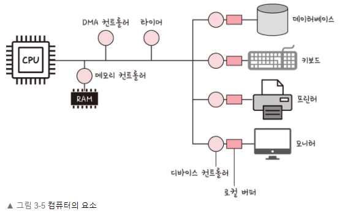
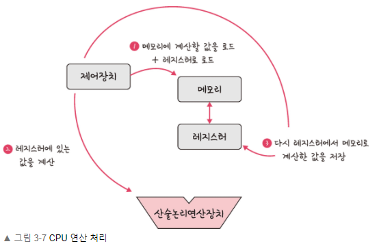
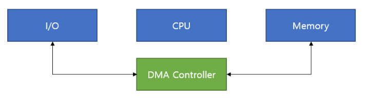

# 3.1 운영체제와 컴퓨터

## 3.1.2 컴퓨터의 요소

### CPU (Central Processing Unit)

**중앙처리장치**

- **산술논리연산장치, 제어장치, 레지스터** 로 구성
- 인터럽트에 의해 단순히 메모리에 존재하는 명령어를 해석해서 실행함
- 커널이 프로그램을 메모리에 올려 프로세스로 만들면 CPU가 이를 처리함
- 일꾼

**제어장치(CU, Control Unit)**

- 프로세스 조작을 지시하는 CPU의 부품
- 입출력장치 간 통신 제어 및 명령어를 읽고 해석하여 데이터 처리 순서 결정

**레지스터**

- CPU 안에 있는 매우 빠른 임시기억장치
- CPU와 직접연결되어 있으므로 연산 속도가 메모리보다 수십배 이상 빠름
- CPU는 자체적으로 데이터를 저장할 방법이 없으므로 레지스터를 거쳐 데이터 전달

**산술논리연산장치(ALU, Arithmetic Logic Unit)**

- 두 숫자의 산술 연산, 배타적 논리합, 논리곱 등의 논리 연산을 계산하는 디지털회로
  

**인터럽트**

- 프로그램을 실행하는 도중에 예기치 않은 상황이 발생할 경우 현재 실행 중인 작업을 즉시 중단하고, 발생된 상황에 대한 우선 처리가 필요함을 CPU에게 알리는 것
- 지금 수행 중인 일보다 더 중요한 일(ex. 입출력, 우선 순위 연산 등)이 발생하면 그 일을 먼저 처리하고 나서 하던 일을 계속 처리함
- 하드웨어 인터럽트
  - 키보드 연결, 마우스 연결 등 I/O 디바이스에서 발생하는 인터럽트
  - 운영체제의 처리를 요하는 상황을 알리기 위해 전기적인 신호를 사용해 구현됨
    - 기계검사 인터럽트 : 프로그램 실행 중 정전 등의 문제 발생
    - 외부 인터럽트 : 오퍼레이터/타이머 등에 의해 의도적 프로그램 중단
    - 입출력 인터럽트 : 입출력 종료/입출력 오류에 의해 CPU의 기능이 요청된 경우
    - 프로그램검사 인터럽트 : 프로그램 실행 중 보호된 기억공간 내에 접근/불법적 명령 수행 발생 등
- 소프트웨어 인터럽트
  - 트랩(trap), 예외(exception) 라 부름
  - 프로세스 오류 등으로 프로세스가 시스템콜 호출 시 발동
  - CPU 내부에서 자신이 실행한 명령/CPU 명령 실행에 관련된 모듈이 변화하는 경우 발생

---

### **DMA 컨트롤러**

- **Programmed I/O (Polling) 방식**

  

  - 시스템 버스를 통해 ‘하드디스크에서 → CPU 레지스터에 → 메모리’ 데이터 이동 방식
  - CPU를 거쳐가기 때문에 입출력 시간 동안 CPU가 idle 상태로 대기하게 됨
  - I/O 디바이스에 비해 CPU는 고속이기 때문에 시간 낭비임(비효율적)
  - 단점 DMA로 해결

- **DMA** (**Direct Memory Access) 방식**

  

  - 입출력장치-메모리 사이 데이터 흐름에서 **CPU를 배제**하기 위해 사용하는 입출력 제어 방식
  - **입출력장치가 메모리에 직접 접근**
  - CPU는 제어신호만 주고받을 뿐 데이터 전송에서 제외시킴
  - CPU는 제어를 위해 데이터 전송 시작/완료에만 할당되어 CPU 자원 낭비 제거됨

- **DMA 컨트롤러**

  - I/O 디바이스가 메모리에 직접 접근할 수 있도록 하는 하드웨어 장치
  - CPU 부하를 막하주며 CPU의 일을 함께 부담
  - 하나의 작업을 CPU와 DMA컨트롤러가 동시에 하는 것 방지

- **DMA 동작 순서**
  1. 입출력장치가 CPU에게 입출력 요청
  2. CPU가 DMA 컨트롤러에 명령 송신
  3. DMA가 CPU에게 시스템 버스 사용 요청
  4. CPU가 버스 사용 허가(CPU가 버스 사용 포기)
  5. DMA 컨트롤러가 입출력장치에서 데이터 읽은 후 메모리로 전송
  6. 전송 완료 후 CPU에게 완료 신호 송신

[DMA(Direct Memory Access) 뜻과 장점](https://hydroponicglass.tistory.com/283)
