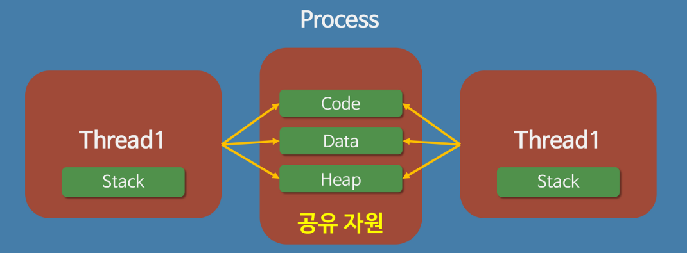
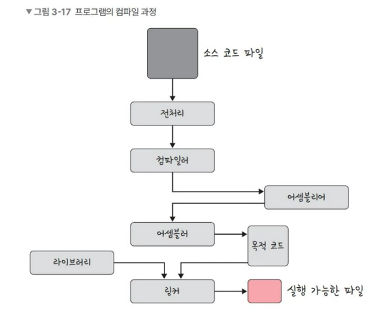
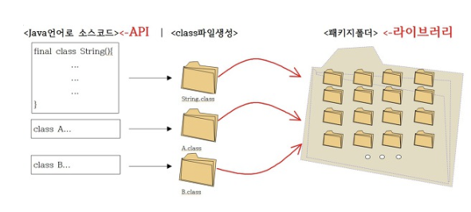

# 프로세스와 컴파일 과정 Process Compile

### 프로세스(Process)란?

- 컴퓨터의 메모리에 올라와 실행되고 있는 독립적인 개체
- 운영체제로부터 시스템 자원을 할당받은 작업 task 의 단위
- 프로그램을 실행할 수 있는 인스턴스

**프로세스의 특징**

- 프로세스는 각각 독립된 메모리 영역(Code, Data, Stack, Heap)을 할당 받는다.
- 프로세스당 최소 1개의 스레드(메인 스레드)를 가지고 있다.
- 각 프로세스는 별도의 주소 공간에서 실행되며, 각각의 프로세스는 다른 프로세스에 접근 할 수 없다.

### 스레드(Thread)란?

- 프로세스 내에서 실행되는 작업의 단위
- 프로세스가 할당받은 자원을 이용하는 작업의 단위

**스레드의 특징**

- 스레드는 프로세스 내에서 각각 Stack만 할당받으며 프로세스의 Code, Data, Heap 메모리 영역은 공유한다.(위 그림 참조)
- 스레드는 하나의 프로세스 내에서 동작되는 여러 실행의 흐름으로, 프로세스 내의 주소 공간이나 자원들을 동일 한 프로세스의 스레드끼리 공유한다.
- 같은 프로세스 내에 있는 여러 스레드는 같은 힙 공간을 공유한다. (프로세스는 다른 프로세스의 메모리 접근할 수 없다.)

### 자바스레드(Java Thread)란?

- 자바스레드 또한 일반 스레드와 거의 차이가 없다. 다만 자바에서는 JVM이 운영체제의 역할을 한다.
- 자바에는 프로세스가 존재하지 않고 스레드만 존재, 자바 스레드는 JVM에 의해 스케쥴되는 실행 단위 코드 블록이다.
- 자바에서 스레드 스케줄링은 전적으로 JVM에 의해 이루어진다.
- 개발자는 JVM위에서 작동할 스레드 코드를 작성하고, 스레드 코드가 동작할 수 있도록 JVM에 요청하게 된다.(Java Application의 main() 메서드가 메인스레드 역할을 한다.)

위의 그림처럼 프로그램이 메모리에 올라가면 프로세스가 됨(인스턴스화)

→ 예를 들어, chrome.exe는 프로그램이고, 이를 더블클릭하면 구글크롬 프로세스가 시작

이후 운영체제의 CPU 스케줄러에 따라 CPU가 프로세스를 실행

## 프로세스와 컴파일 과정

**프로그램**은 컴파일러가 컴파일 과정을 거쳐 컴퓨터가 이해할 수 있는 기계어로 번역되어 실행할 수 있는 파일을 의미한다.

**C언어 기반**의 컴파일 과정 도식은 위의 그림과 같다. (파이썬 등의 인터프리터 언어와는 다름)

1. **전처리 과정**에서 소스코드의 주석을 제거하고  #include 등 헤더 파일을 병합하여 매크로를 치환한다.
2. **컴파일러**는 오류처리 및 코드 최적화 작업을 수행하며 어셈블리어(명령 기능을 쉽게 연상할 수 있는 기호를 기계어와 1:1 대응시켜 코드화한 기호 언어)로 변환한다.
3. **어셈블리어**는 목적코드로 변환된다. 이 때 확장자는 운영체제마다 다른데, 리눅스의 경우 .o이다.
4. **링커**는 프로그램 내에 있는 라이브러리 함수 또는 다른 파일들과 목적코드를 결합하여 실행 파일을 만든다. 실행 파일의 확장자는 .exe 또는 . out이라는 확장자를 갖는다.

### 정적 라이브러리와 동적 라이브러리

**라이브러리**란 특정한 코드(함수 혹은 클래스)를 포함한 미리 컴파일된 파일을 의미한다. 

각 라이브러리는 본 프로젝트에 로드되는 시점에 따라 구분할 수 있다.

- **정적 라이브러리 (Static Library)**
    - 프로그램 빌드 시에 라이브러리가 제공하는 코드를 실행 파일에 넣는 방식의 라이브러리를 의미한다. 완성된 프로그램을 **실행할 때** 포함시킨다.
    - 정적 라이브러리의 확장자명은 .lib 이다. 그런데 동적 라이브러리 파일에도 .lib 파일이 있다.
    - 정적 라이브러리는 본 프로그램 빌드 시 라이브러리가 제공하는 코드를 실행 파일(.exe)에 포함한다. (따라서 별도의 라이브러리 파일을 실행파일과 같은 디렉토리에 복사해둘 필요가 없다.)
    - 정적 라이브러리는 본 프로그램의 컴파일 중 링커 단계에서 실행 파일(.exe)에 링크 된다.
    - 정적 라이브러리의 코드가 이를 사용하는 본 프로그램의 실행 바이너리에 포함된다.
    - 정적 라이브러리를 사용할 때는, 본 프로그램에서 컴파일 시 링커가 프로그램에서 사용하는 부분을 찾아서 실행파일에 복사한다.
    - 정적 라이브러리의 코드가 본 프로그램의 실행 파일에 결합되기 때문에, 실행 파일 용량이 커진다.
    - 정적 라이브러리가 업데이트 되면, 본 프로그램을 재 빌드해야 한다.
    - 정적 라이브러리는 다른 라이브러리 대비 속도가 빠르다. (외부 참조를 하지 않기 때문)
    - 시스템 환경 등 외부 의존도가 낮다는 장점이 있다.
    - 코드 중복 등 메모리 효율성이 떨어진다는 단점이 있다.
    

- **동적 라이브러리 (Dynamic Library)**
    - 프로그램을 **컴파일하는 과정**에서 포함시키는 **오브젝트 파일들**의 모임
    - 동적 라이브러리의 확장자 명은 .dll 이나,  .lib 파일 또한 생성된다.
    - 동적 라이브러리 컴파일 시 생성된 .lib 파일은 .dll 이 제공하는 함수 명을 가진 정보 파일이다.
    - 동적 라이브러리는 프로그램 실행 중 호출될때만 DLL 파일에서 함수가 참조된다.
    - 본 프로그램의 컴파일 중 링크 단계에서 실행 바이너리의 .obj 파일들과 DLL의 .lib파일이 함께 링크되어, 이를 기반으로 본 프로그램 실행 중 .dll 파일의 함수 코드를 참조하게 된다.
    - .lib 파일은 본 프로그램 컴파일 중 링크 과정에서, .dll 파일은 실행 과정에서 필요하다.
    - 동적 라이브러리 업데이트 시, 본 프로그램은 별도의 빌드를 하지 않아도 된다.
    - 동적 라이브러리는 외부 참조를 하므로 정적 라이브러리에 비해 시간이 느릴 수 있다.
    - 실행 파일 배포 시 동적 라이브러리를 함께 배포해야 한다.
    - 동적 라이브러리를 사용하면 실행 파일의 용량이 줄어든다. 즉 메모리 효율성에서 장점이 있다.
    - 외부 의존도가 높아진다는 단점이 있다.