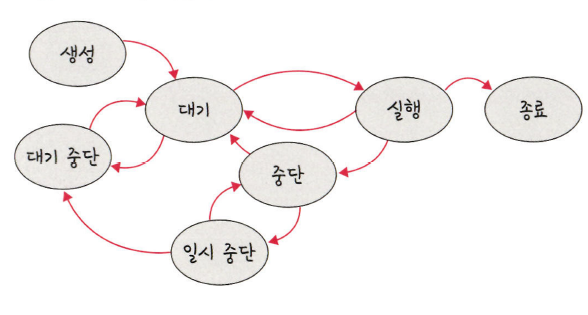

# 프로세스의 상태 Process Status

## 프로세스의 상태

1. **생성 상태(create)** 는 프로세스가 생성된 상태를 의미하며  fork() 또는 exec()함수를 통해 생성한다. 이 때  PCB(프로세스의 상태정보를 저장하는 구조체)가 할당된다.
    - fork() : 부모프로세스의 주소 공간을 그대로 복사하며, 새로운 자식 프로세스를 생성하는 함수이다. 주소 공간만 복사할 뿐이지 부모 프로세스의 비동기 작업 등을 상속하지는 않는다.
    - exec() : 새롭게 프로세스를 생성하는 함수
    
2. **대기 상태(ready)** 는 메모리 공간이 충분하면 메모리를 할당받고, 아니면 아닌 상태로 대기하고 있으며  CPU 스케줄러로부터 CPU 소유권이 넘어오기를 기다리는 상태이다.

3. **대기 중단 상태(ready suspended)**는 메모리 부족으로 일시 중단된 상태이다.

4. **실행 상태(running)** 는 CPU소유권과 메모리를 할당받고 인스트럭션을 수행 중인 상태를 의미한다. 이를 CPU burst가 일어났다고도 표현한다.

5. **중단 상태(blocked)** 는 어떤 이벤트가 발생한 이후 대기 중에 프로세스가 차단된 상태이다. I/O디바이스에 의한 인터럽트로 이런 현상이 종종 발생하기도 한다. 예를 들어 프린트 인쇄 버튼을 눌렀을 때 프로세스가 잠깐 중단된 상태가 있다.

6. **일시 중단 상태(blocked suspended)** 는 대기 중단과 유사하다. 중단된 상태에서 프로세스가 실행되려고 하나 메모리 부족으로 일시 중단된 상태이다.

7. **종료 상태(terminated)** 는 메모리와 CPU소유권을 모두 놓고 가는 상태를 말한다. 종료에는 자연스러운 종료도 있지만 부모 프로세스가 자식 프로세스를 강제시키는 비자발적 종료(abort) 도 있다. 자식 프로세스에 할당된 자원의 한계치를 넘어서거나 부모 프로세스가 종료되거나 사용자가 process.kill 등 여러 명령어로 프로세스를 종료할 때 발생한다.