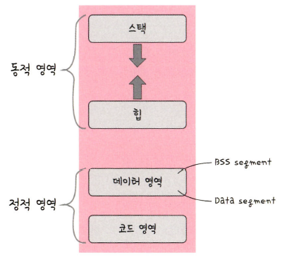

# 프로세스의 메모리 구조 Process Memory

운영체제는 프로세스에 적절한 메모리를 할당하는데, 위와 같은 구조를 기반으로 할당이 이루어진다.

스택과 힙은 동적 영역, 데이터와 코드 영역은 정적 영역이다.

stack은 위의 주소로부터, heap은 아래의 주소로부터 할당된다.

### 스택(Stack)

- 스택에는 지역변수, 매개변수, 함수가 저장되며 컴파일 시 크기가 결정된다.
- 동적인 특징을 갖는다.
- 스택 영역은 함수가 재귀호출될시 동적으로 크기가 늘어날 수 있다. 이 때 힙과 스택의 메모리 영역이 겹치면 안되기 때문에 힙과 스택 사이의 공간을 비워놓는다.

### 힙(Heap)

- 힙은 동적 할당이 이루어질 때사용되며, 런타임시 크기가 결정된다.
- 예를 들어 벡터와 같은 동적 배열은 힙에 동적 할당된다.
- 동적인 특징을 갖는다.

### 데이터 영역(BSS segment + Data segment)

- 데이터 영역은 전역변수와 정적변수가 저장되고, 정적인 프로그램이 종료되면 사라지는 변수가 들어 있는 영역이다.
- 데이터 영역은 BSS 영역과 Data영역으로 나뉜다.
- BSS영역은 초기화되지 않은 변수가 0으로 초기화되어 저장된다.
- Data영역(Data segment)에는 0이 아닌 다른 값으로 할당된 변수들이 저장된다.

### 코드 영역(Code segment)

- 코드 영역은 프로그램에 내장되어 있는 소스코드가 들어가는 영역이다.
- 이 영역은 수정 불가능한 기계어로 저장되어 있으며, 정적인 특징을 가진다.