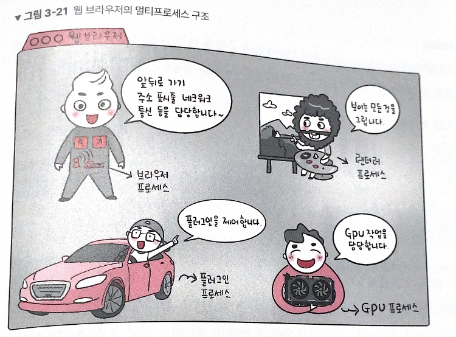

## 3.3.5 멀티프로세싱

<aside>
💡 여러 개의 ‘프로세스’, 즉 멀티프로세스를 통해 동시에 두 가지 이상의 일을 수행할 수 있는 것

</aside>

하나 이상의 일을 병렬로 처리

### 장점

- 여러 개의 단일 프로세싱보다 비용 절약: 프로세서가 주변장치, 대용량 저장 장치, 전원공급장치를 하나의 프로세서(CPU)에서 공유
- 기능들이 여러 개의 프로세서에 분산 → 특정 프로세스의 메모리, 프로세스 중 일부에 문제가 발생되더라도 다른프로세스를 이용해서 처리: **독립성 → 신뢰성이 높음**

### 단점

- 독립된 메모리 영역이기 때문에 작업량이 많을수록( `Context Switching`이 자주 일어나서 주소 공간의 공유가 잦을 경우) 오버헤드가 발생하여 성능저하가 발생
- `Context Switching` 과정에서 캐시 메모리 초기화 등 무거운 작업이 진행되고 시간이 소모되는 등 오버헤드가 발생

### 종류

- **대칭형 멀티 프로세싱(SMP, Symmetric Multi-processing)**
    - 운영체계와 메모리를 공유하는 여러 프로세서가 프로그램을 수행
    - 프로세서가 메모리와 입출력 버스 및 데이터 path를 공유
    - 하나의 운영체계가 모든 프로세서를 관리
- **비대칭형 멀티 프로세싱(AMP, Asymmetric Multi-processing)**
    - 각 프로세서가 특정된 일을 맡아서 한다
    - 주 프로세서가 전체 시스템 통제, 다른 프로세서들은 주인의 명령을 따르거나 미리 정해진 일을 수행
    - 주-종속(master-slave) 시스템의 형태로서 주 프로세서가 종속 프로세서들을 스케쥴, 일을 할당

### 웹 브라우저

- 브라우저 프로세스: 주소 표시줄, 북마크 막대, 뒤로 가기 버튼, 앞으로 가기 버튼 등을 담당, 네트워크 요청이나 파일 접근 같은 **권한 담당**
- 렌더러 프로세스: 웹 사이트가 **‘보이는’ 부분**의 모든 것을 제어
- 플러그인 프로세스: 웹 사이트가 사용하는 **플러그인**을 제어
- GPU 프로세스: GPU(그래픽 처리 장치)를 이용해서 화면을 그리는 부분을 제어

### IPC(Inter Process Communication)

IPC: 프로세스끼리 데이터를 주고받고 공유 데이터를 관리하는 메커니즘

ex. 클라이언트가 데이터 요청, 서버가 클라이언트 요청에 응답

IPC는 스레드(메모리가 완전히 공유)보다 속도가 떨어짐

**2. IPC 별 사용 시기 및 특징**

| IPC 종류 | PIPE | Named PIPE | Mesage Queue | Shared Memory | Memory Map | Socket |
| --- | --- | --- | --- | --- | --- | --- |
| 사용 시기 | 부모 자식 간 단 방향 통신 시 | 다른 프로세스와 단 방향 통신 시 | 다른 프로세스와 단 방향 통신 시 | 다른 프로세스와 양 방향 통신 시 | 다른 프로세스와 양 방향 통신 시 | 다른 시스템간 양 방향 통신 시 |
| 공유 매개체 | 파일 | 파일 | 메모리 | 메모리 | 파일+메모리 | 소켓 |
| 통신 단위 | Stream | Stream | 구조체 | 구조체 | 페이지 | Stream |
| 통신 방향 | 단 방향 | 당 방향 | 단 방향 | 양 방향 | 양 방향 | 양 방향 |
| 통신 가능 범위 | 동일 시스템 | 동일 시스템 | 동일 시스템 | 동일 시스템 | 동일 시스템 | 동일 + 외부 시스템 |
- **종류**
    - **공유 메모리**
        
        
        
        - 여러 프로세스에 동일한 메모리 블록에 대한 접근 권한이 부여
        - 프로세스가 서로 통신할 수 있도록 공유 버퍼를 생성
        - 공유 메모리를 통해 여러 프로세스가 하나의 메모리를 공유
        - 메모리 자체를 공유 → 불필요한 데이터 복사의 오버헤드x, 가장 빠르다
        - 동기화 필요
        - 하드웨어 관점에서 RAM을 가리키기도 한다
    - **파일**
        - 디스크에 저장된 데이터 또는 파일 서버에서 제공한 데이터를 기반으로 프로세스 간 통신
    - **소켓(socket)**
        
        
        
        - 동일한 컴퓨터의 다른 프로세스나 네트워크의 다른 컴퓨터로 네트워크 인터페이스를 통해 전송하는 데이터
        - TCP, UDP
    - **익명 파이프(unnamed pipe)**
        
        
        
        - 익명의 PIPE를 통해서 동일한 PPID를 가진 프로세스들 간에 단방향 통신을 지원
        - FIFO 구조- 생성된 PIPE에 대하여 Write 또는 Read만 가능
        - 단방향 방식의 읽기 전용, 쓰기 전용 파이프를 만들어 작동
        - 부모 자식 프로세스간 통신 할때 사용
    - **명명된 파이프(named pipe)**
        
        
        
        - 이름을 가진 PIPE를 통해서 프로세스들 간에 단방향 통신을 지원
        - 서로 다른 프로세스들이 PIPE의 이름만 알면 통신이 가능하다.
        - FIFO 구조 - 생성된 PIPE에 대하여 Write 또는 Read만 가능
        - 연관이 전혀 없는 프로세스간에 통신을 할때 사용
        - 보통 서버용 파이프와 클라이언트용 파이프로 구분해서 작동
    - **메시지 큐(message que)**
        
        
        
        - 메모리를 사용한 PIPE
        - 큐 데이터 구조 형태로 관리
        - 커널에서 전역적으로 관리
        - 다른 방식에 비해 사용 방법이 직관적이고 간단
        - 다른 코드의 수정 없이 간단히 메시지 큐에 접근 가능

---

[https://donghoson.tistory.com/15](https://donghoson.tistory.com/15)

[https://jwprogramming.tistory.com/54](https://jwprogramming.tistory.com/54)

[https://doitnow-man.tistory.com/110](https://doitnow-man.tistory.com/110)
